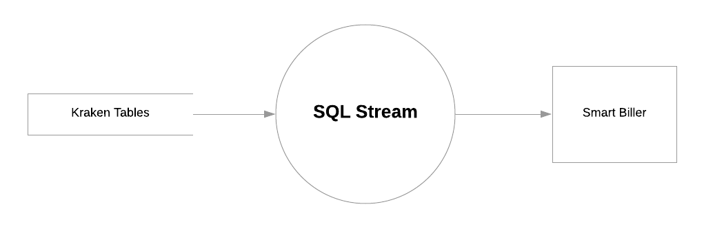
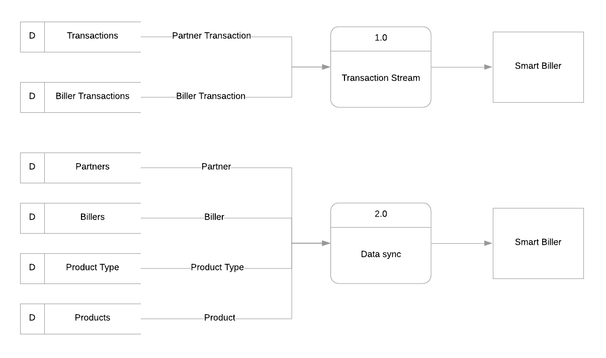
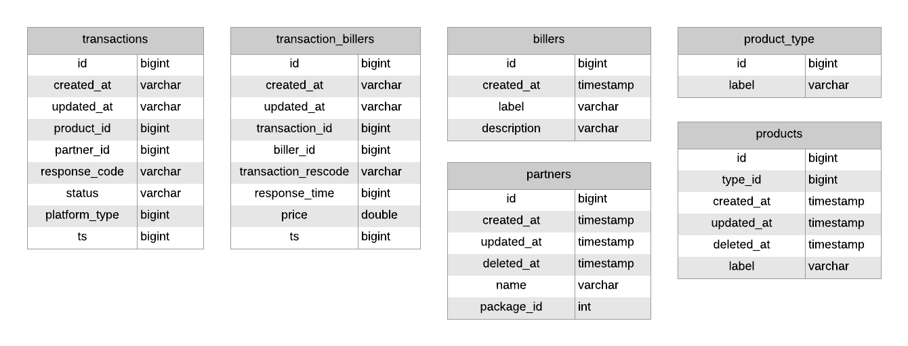

= Smart Biller dan Kraken 2

Korelasi antara Kraken 2 dan Smart Biller

== Versi 1

Pada Smart Biller versi 1, _subsystem_ Smart Biller melakukan _streaming database_ menggunakan SQL Streaming milik Kafka dengan detail dapat dilihat pada halaman Lucidchart berikut:

=== Data Flow Diagram (DFD) Kraken V2

DFD Level 0 di atas secara sederhana menerangkan mengenai proses SQL _streaming_ yang dilakukan oleh Kafka menggunakan _add-on_ KSQL dari beberapa tabel Database Kraken 2.

Pada gambar DFD Level 1 diatas menerangkan 2 _action_ yang dilakukan oleh Smart Biller pada saat _streaming database_ Kraken 2.

1.  `Table Transactions` dan `Biller Transactions` digunakan untuk _streaming_ transaksi yang terjadi secara _realtime_ dengan membaca _field_ `timestamp` pada kedua tabel.
2.  Sedangkan `table partners`, `table billers`, `table product_type`, `table_products` digunakan sebagai sumber data utama untuk mengenali _biller_, _partner_, dan _product_ terkait, pada transaksi yang terjadi.

=== Consumed Field and Table from Kraken V2 Slave DB

Berikut ini adalah gambar tabel dan _field data_ pada _database_ Kraken 2 yang digunakan oleh Smart Biller:

=== API Used for Integration Kraken V2

Information not available yet.

== Versi 2

Diharapkan kraken akan menjadi produser untuk Kafka yang akan di-_consumed_ oleh Smart Biller.