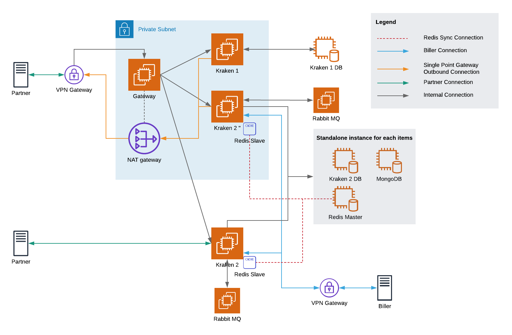

= Single Point Migration Kraken 

Sebagai upaya untuk memindahkan seluruh _partner_ dari Kraken 1 ke Kraken 2, dan agar bisa lebih cepat dilakukan penyesuaian terhadap arsitektur infrastruktur dari Sistem Kraken.

Gambar di atas adalah rencana penyesuaian arsitektur infrastruktur Kraken untuk _Single Point Migration_.

* Daftar Partner yang akan dimigrasikan https://docs.google.com/spreadsheets/d/1HE9IBt3dAFDlNPfe5FaM424sNMvZ7AdcQ7xHQALxbwA/edit#gid=802159954[]
* _Checklist_ Tim Infra https://docs.google.com/spreadsheets/d/1WyqDn5dNmvLiCZaxJFpeLngUkx2LGpLB1spcrs5o288/edit#gid=0[]
* _Checklist_ Tim _Onboarding_
 .. Memindahkan _Package_ dan _Product_ dari Kraken 1 ke Kraken 2
 .. Memastikan bahwa:
  ... _Assesment_ ke _partner_, jika ada _behavior_ khusus
  ... Jika sistem _partner_ masih mengarah ke IP, maka disarankan memindahkan ke domain http://kraken.sepulsa.id/[kraken.sepulsa.id] karena IP _inbound request_ (_gateway_) yang baru berbeda dari sebelumnya
 .. Mengirimkan _email_ informasi ke _partner_ bahwa akan ada pembaharuan sistem (_maintenance_)
 .. Migrasi dilakukan:
  ... Migrasi Deposit
  ... Migrasi Elisian
  ... Setting konfigurasi _gateway_ [NATS]
 .. Informasi migrasi telah selesai dan _monitoring_
* *Follow with Deposit*
 .. Deposit akan dipindahkan setelah migrasi _partner_ selesai dengan cara implementasi _hybrid deposit_ dengan catatan:
  ... Elisian harus bisa membaca saldo secara benar, ketika deposit ada di 2 (dua) sumber (PR)
  ... Transaksi akan menggunakan deposit dari K1 dan _refund_ ke K2.
  ... Merubah _callback virtual account_ Canopus ke Kraken 2 `pada sistem canopus`
  ... Pada titik tertentu terdapat sisa deposit yang tidak bisa digunakan, harus dipindahkan secara manual
   .... _Reduce_ K1 deposit
   .... Add K2 deposit, dan dilakukan melalui API
