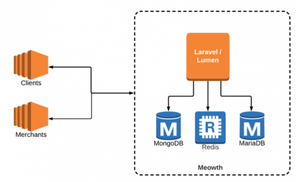
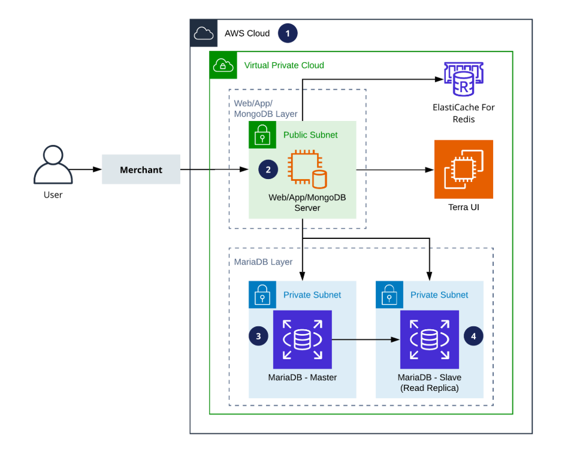

= Architecture Meowth

== Network Architecture

Berikut adalah gambar dari _High Level Architecture_ Meowth:

Gambar 1. Network Architecture Meowth

== Infrastructure Architecture

Gambar 2. Infrastructure Architecture Meowth

Keterangan:

. Sistem Meowth di-_host_ oleh AWS.
. Terdapat satu (1) EC2 _instance_ yang berisikan:
 ** NGINX (web server)
 ** Laravel Lumen
 ** MongoDB
. Amazon RDS MariaDB berfungsi sebagai master database.
. Data dari master _database_ direplikasi menggunakan fitur _"Amazon RDS Read Replica"_.
Replika ini berfungsi sebagai _slave database_.

== Related System

|===
| *System Name* | *Description*

| Pronghorn
| Klien pertama Kraken untuk  tes produk dan merupakan tampilan depan dari Sepulsa

| Yapulsa V2 (Gajah Mada)
| Backend System  atau Middleware untuk    Yapulsa V2 (API & DB)
|===
