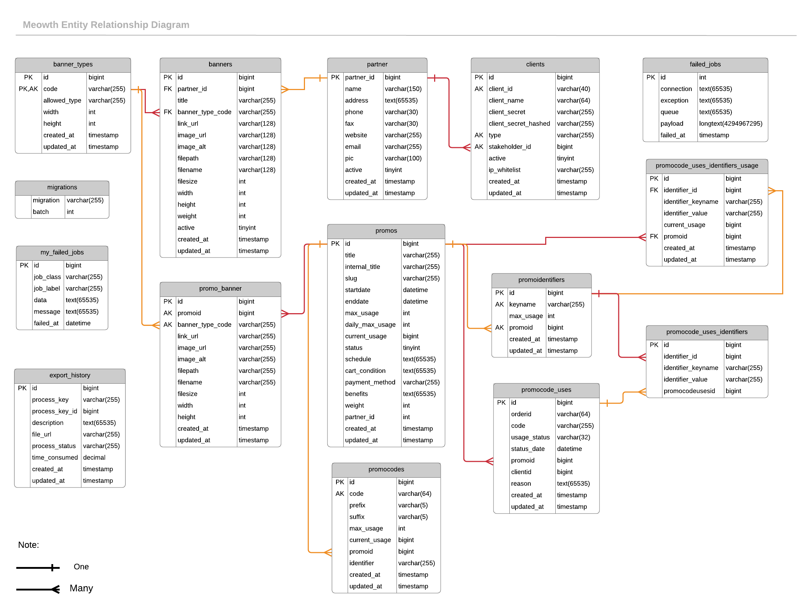

= Database Documentation Meowth

Berikut adalah gambar ERD dari Meowth 

== Database Table

Di bawah ini adalah tabel transaksi yang digunakan untuk _database_ Meowth:

|===
| *Table* | *Description*

| Clients
| Clients

| Promos
| Promo and rules

| Promocodes
| Promo codes

| Promo_banner
| Available promo banners

| Promocode_uses
| Code usage data

| Promocode_uses_identifiers
| Related identifiers from pormocode_uses

| Promo_contents (mongoDB)
| Promo content data (How To, T&C, Call to action)
|===
