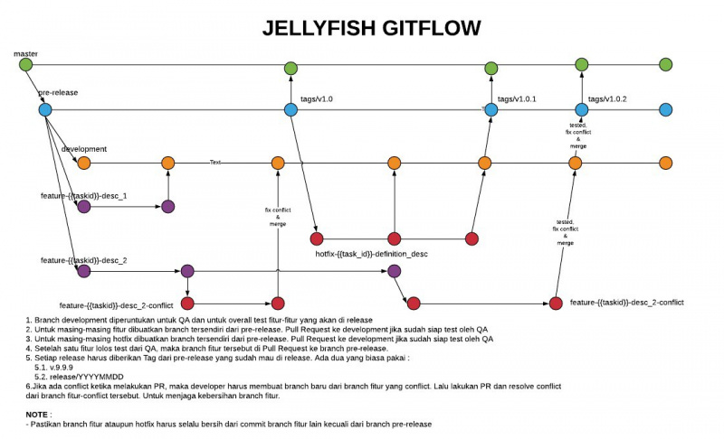

= Development Meowth

. Meowth https://github.com/sepulsa/meowth[https://github.com/sepulsa/meowth]
. Meowth (Golang) https://github.com/sepulsa/meowth2go[https://github.com/sepulsa/meowth2go]

== Langkah-langkah Resolve Conflict Merge

. Keluar dari _branch_
. Buat dan keluar ke _branch_ baru untuk menyelesaikan konflik
. _Fetch_ dari _branch_ yang akan dituju
. _Merge_ pada _branch_ tujuan dengan  `git merge <origin/destination_branch> —no-commit —no-ff`
. Menyelesaikan konflik.
[arabic]
 .. Gunakan _tools_ apa saja untuk menyelesaikannya, dalam contoh kasus ini kita menggunakan MELD.
 .. http://meldmerge.org/
 .. https://gist.github.com/p1nox/6102015
. lakukan pengujian
[arabic]
 .. Jika tetap terjadi kesalahan segera temukan alasan terjadinya konflik.
 .. lakukan pengujian bersama
. _Commit_ perubahan dan berikan keterangan untuk menandai perubahan.
. _Push_ perubahan yang telah di-_commit_ ke _branch_
. lakukan _Pull Request_ ke _branch_ kamu
. lakukan pengecekan pada _origin Pull Request_, setelah berhasil tutup _merge conflict branch_ ke _branch_ tujuan.

=== Jangan Lakukan hal-hal berikut ini

. Menyelesaikan konflik dari halaman GitHub.
. Menyelesaikan konflik di-_branch_ sendiri

== Langkah-langkan _Development_

. Buat _branch_ baru dengan nama `<pivotal_type>_<Pivotal_Title>` (contoh : `feature_159485500_avoid_deadloack`, `bug_159815016_backup_level)` dari branch terakhir yang kamu gunakan
+
. Mulai _Pivotal Story_
. _Push_ ke _branch_ dengan keterangan _commit_ `[FINISH#]` untuk menyelesaikan _story_
. Buat _Pull Request_ ke _branch development_
. Jika konflik maka lakukan _resolve merge_ instruksi di atas
. Terima _Pull Request_ dengan pesan `[DELIVER#]`
. Lakukan pengecekan pada Travis di https://travis-ci.com/sepulsa/repo-name[https://travis-ci.com/sepulsa/repo-name]

== Jangan lakukan hal-hal berikut ini

. Membuat _branch_ dari _development branch_.
. Memberikan nama _branch_ yang tidak sesuai.
. Memberikan pesan pada saat _commit_
. Mencampur banyak _task_ ke dalam satu _branch_.
