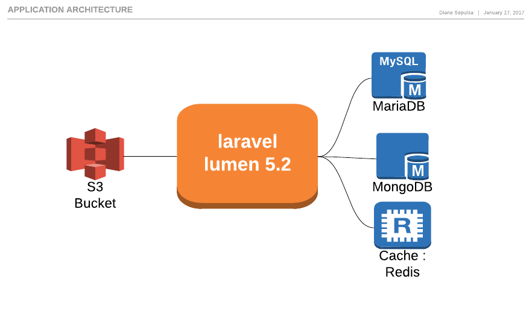

= System Feature Meowth

== Application Architecture

=== Validasi Promo

Validasi promo dikatakan valid jika semua peraturan utama telah valid

=== Kode Promo

* Kode promo dibutuhkan untuk validasi
* Penukaran tidak bisa dilakukan tanpa menggunakan kode promo

=== Promo Without Code a.k.a Codeless Promo (v1.2)

. https://meowth-uat.sumpahpalapa.com/apidoc/#api-Promo_Usage-01_Promo_Inquiry[_Inquiry_] / https://meowth-uat.sumpahpalapa.com/apidoc/#api-Promo_Usage-02_Promo_Redeem[_Redeem_] tidak diizinkan tanpa kode
. Promo dapat diidentifikasi sebagai _codeless_ (tanpa promo) jika tidak memiliki kode promo
. Validation hanya berdasarkan aturan dan bisa tumpang tindih (_overlapped_) pada https://meowth-uat.sumpahpalapa.com/apidoc/#api-Promo_Usage-01_Promo_Inquiry[_Inquiry_] dan https://meowth-uat.sumpahpalapa.com/apidoc/#api-Promo_Usage-02_Promo_Redeem[_Redeem_]
. _Codeless_ https://meowth-uat.sumpahpalapa.com/apidoc/#api-Promo_Usage-01_Promo_Inquiry[Inquiry] /(https://meowth-uat.sumpahpalapa.com/apidoc/#api-Promo_Usage-02_Promo_Redeem)[_Redeem_] : hanya mengembalikan _codeless_ promo

=== Avoiding Overlap Promo

Untuk menghindari tumpang tindih (_overlap_) promo, Meowth menggunakan mekanisme ini :

. _Promo Weight_ terendah akan diprioritaskan jika ada promo yang tumpang tindih (_overlap_)
. Jika ada promo tumpang tindih (_overlap_) yang diaplikasikan sebelumnya, promo tersebut akan dihapus jika tersedia dan yang di atas akan diterapkan
. Jika ada overlap promo dengan `equal weight`, _first promo by id_ akan diprioritaskan

=== Promo Status

. Promo bisa punya waktu _start_ dan _end_ dalam _datetime_ format
. Promo punya _forced status_ untuk secara paksa menghentikan promo
. Promo punya _max_usage_ untuk membatasi penggunaan maksimum dari promo yang sedang berlangsung

=== Promo Identifiers

. Untuk mengakomodasi batasan (_limitation_) berdasarkan Identifier terdaftar
. Anda bisa _set_ satu atau lebih Identifier untuk Promo
. Setiap Identifier hanya diizinkan untuk melakukan _first redeem_.
Tidak bisa _redeem_ dalam waktu yang sama dengan Identifier yang sama
. Layanan akan mencari matched key di dalam Identifier Param di https://meowth-uat.sumpahpalapa.com/apidoc/#api-Promo_Usage-01_Promo_Inquiry[Inquiry] dan https://meowth-uat.sumpahpalapa.com/apidoc/#api-Promo_Usage-02_Promo_Redeem[Redeem].
Pastikan Anda tidak memiliki Key Identifier yang serupa pada kedua permintaan, atau yang pertama akan dievaluasi

=== Promo Schedule

. Anda dapat memilih jika promo dapat berjalan setiap hari, satu hari yang sudah ditentukan, atau beberapa hari yang ditentukan
. Anda dapat memilih jika promo berjalan sepanjang hari atau hanya rentang beberapa jam

=== Promo Cart Conditions

. Anda dapat menetapkan ketentuan _cart_ yang _valid_ untuk Promo
. _Setting key_ dalam Pronghorn https://navigation.sepulsa.com/admin/config/services/meowth/extra[]
. Key value harus dinyatakan dalam https://meowth-uat.sumpahpalapa.com/apidoc/#api-Promo_Usage-01_Promo_Inquiry[Inquiry] dan https://meowth-uat.sumpahpalapa.com/apidoc/#api-Promo_Usage-02_Promo_Redeem[Redeem] _request format_.
Ini termasuk parameter di dalam order_info dan products
. Value akan dicocokkan dengan Key terkait dengan nilai dari kedua parameter di atas
. Operand dapat digunakan untuk memiliki fungsionalitas yang lebih logis.
Ini daftar yang https://meowth-uat.sumpahpalapa.com/apidoc/#api-Promo-03_Add_New[tersedia]

=== Related Rules

. `max_usage` ada di kode promosi, _identifiers_, dan _promo level._ Semua atribut ini harus diteruskan (max_usage > usage) menjadi promo yang valid.

=== PROMO BENEFITS

. Anda dapat menetapkan satu atau lebih manfaat untuk promo
. Punya type tertentu seperti yang terdaftar https://meowth-uat.sumpahpalapa.com/apidoc/#api-Promo-06_List_Of_benefits[di sini]
. Label adalah untuk deskripsi sangat kecil yang dapat menjelaskan _benefit_ Anda
. Value adalah _mixed value_ tergantung jenis.
Yaitu: untuk diskon Anda perlu mengaturnya dalam jumlah, untuk _item_ gratis Anda perlu mengaturnya dalam _string_
. _Max_value_allow_ adalah _maksimum value_ yang diizinkan untuk keuntungan saat ini.
Ini hanya digunakan dalam jenis _disc_percentage_
. _Max_value_allow_ untuk _presentase_ diskon berkisar antara 5.000 - 100.000
. _Currency_ (mata uang) adalah opsional, belum berfungsi, hanya untuk menyimpan simbol mata uang jika diperlukan
. Jika nilai _Percentage discount_ dalam desimal, itu akan menjadi _round_down_

== Benefits : Order Fix Discount

. Harus mengurangi Order total _amount_
. _The value is fix_ (Nilai sudah diperbaiki)

== Benefits : Order Percent Discount

. Harus mengurangi Order total _amount_
. Value dihitung dari Order total _amount_ dikalikan dengan _presentase_

== Benefits : Item Fix Discount

`ITEM_PRICE = 100.000 QTY = 2 ITEM_DISC = 10.000 VALUE DISC = ITEM_DISC`

. _The value is fix_ (Nilai sudah diperbaiki)
. Harus dan hanya satu SKU yang harus dimasukkan dalam Cart Condition
. Tidak dihitung dari kuantitas

== Benefits : Item Percent Discount

`ITEM_PRICE = 100.000 QTY = 2 ITEM_DISC = 10% VALUE DISC = ITEM_PRICE x ITEM_DISC = 10.000`

. Harus mengurangi Item 'single price' dalam troli (_cart_) dan dalam SKU terkait
. Harus dan hanya satu SKU yang harus dimasukkan dalam Cart Condition

== Benefits : Cashback (Order Based)

. _Fix value_
. Ditujukan untuk Sepulsa Credit
. Nilainya dalam nilai uang (_The value is in money value_)

== Benefits : Cashback (Order Based) in Percentage (v1.2)

. _Percentage value_ (nilai presentase)
. Nilai tersebut dihitung dari presentase `total order`

== Benefits : Cashback (Item Based) in Percentage (v1.2)

. _Percentage value_ (nilai presentase)
. Nilai tersebut dihitung dari presentase `item price` pada item yang terkait

== Benefits : Free Item

. Nilai harus merujuk ke SKU atau ID Produk dari produk _free item_

== Benefits : Free Pulsa (v1.2)

* Nilai harus terkait dengan ID Produk Kraken
* Ini untuk mengakomodasi manfaat pulsa gratis tanpa terdaftar sebagai SKU di _client_
* _Client_ harus langsung _order the value_ ke Kraken

== PROMO CODES

* Promo dapat memiliki kode
* Semua kode harus unik
* Dapat memiliki _prefix_ atau _sufix_ atau keduanya
* Dapat dihasilkan atau dimasukkan secara manual

== Simple Codes

* Kode dapat digunakan beberapa kali
* Kode dapat dimasukkan secara manual sekali per kode

== Unique Codes (v1.2)

* Kode hanya dapat digunakan satu kali
* Kode dapat dimasukkan secara manual dalam jumlah besar (_inserted in bulk_) melalui unggah file CSV

== PROMO CONTENT

Daftar konten yang dikelola oleh Meowth terkait dengan _landing page_ *Banner* dan *Promo*

== BANNER

Spesifikasi Banner disediakan dalam Jenis Banner, pengguna dapat menambahkan lebih banyak spesifikasi (_spec_) jika diperlukan.
Di bawah ini adalah _default_ spesifikasi (_spec_)dari persyaratan.
Untuk daftar lebih _up to date_, silakan checkout di https://meowth.sepulsa.co.id/apidoc/#api-CRUD_Banner_Type-List[Banner Type API].

|===
| Banner Type | Weight (px) | Height (px)

| banner_phoenix_large
| 1140
| 400

| banner_phoenix_medium
| 680
| 330

| banner_phoenix_small
| 325
| 330

| banner_frigate
| 450
| 240

| banner_app_480
| 480
| 256

| banner_app_300
| 300
| 160

| banner_app_270
| 270
| 144

| landing_image_dekstop
| 1140
| 400

| landing_image_mobile
| 360
| 192
|===

Untuk benar-benar menambahkan konten spanduk ke promo terkait, Anda dapat menggunakan https://meowth.sepulsa.co.id/apidoc/#api-Promo_Banner[Banner Content API].
Untuk `Analytic Tracking`, Anda dapat memasukkan _query string_ dalam `link_url` di Banner API.

== Banner List API

* Hanya 9 _active promo_ pertama yang akan ditampilkan
* _Promo order_  `weight`, nilai terendah akan ditampilkan dalam urutan pertama

== HOW TO

Konten ini untuk segmen _How To's_ di dalam Sepulsa _promo landing page_.
Konten dalam format daftar dengan _image_ _upload support_ untuk setiap daftar.
_Image dimension is restricted_, di bawah ini adalah spesifikasi gambar.
Berikut adalah contoh halaman _How To List_, https://promo.sepulsa.com/spl60/#collapseOne["Cara Menggunakan Kode Promosi"]

|===
| *Orientation* | *Weight (px)* | *Height (px)*

| Landscape
| 525
| 313

| Potrait
| 684
| 1222
|===

== TERMS & CONDITION

Konten ini untuk T&C di halaman promo.
Lihat di segmen "Syarat & Ketentuan" halaman https://promo.sepulsa.com/spl60/#collapseOne[ini]

== CALL TO ACTION

Konten untuk menampilkan kotak kanan tengah pada halaman Promo.
Referensi:

* https://promo.sepulsa.com/spl60/#collapseOne
* https://promo.sepulsa.com/kredivo50/
* https://promo.sepulsa.com/hsbc50/

== PROMO LANDING PAGE

* Ini adalah fitur Non-API
* Meowth memiliki _landing page_ sendiri untuk setiap promo
* _Page Content_ tergantung pada _Promo Content Page_
* Anda bisa mengakses laman ini dari `+{BASE_URL}/promo/{promoid}+`
