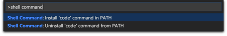

= IDE Oknurt

____
Integrated Development Environment (IDE) which you can used to build Oknurt
____

Setiap _software engineers_ memiliki pilihan IDE tersendiri. Anda dapat memilih salah satu dari IDE ini untuk memulai _development_ Oknurt.

== Visual Code

Visual Studio Code adalah editor kode gratis yang dikelola oleh Microsoft.

Berikut adalah langkah pengaturan untuk Kode VS:

1. https://code.visualstudio.com/[Download Visual Studio Code]
2. Ikuti langkah instalasi untuk setiap OS (Windows, Mac, Linux)

** Klik dua kali pada arsip yang diunduh untuk memperluas konten.
** Tarik *Visual Studio Code.app* ke folder Application, membuatnya tersedia di Launchpad.
** Tambah VS Code ke Dock Anda dengan mengklik kanan ikon dan memilih Options, Keep in Dock.

3. Jangan lupa untuk mengintegrasikan konsol anda dengan menginstal path sebagai _console command_
+
**Install via VS Code Shell Command**

** Launch VS Code
** Buka Command Palette (⇧⌘P) dan ketik `shell Command` untuk menemukan shell command `Command: Install 'code' command in PATH`.
+

+
____
Command Palette showing path install options
____
+
** Restart terminal agar nilai di $ PATH yang baru bisa diterapkan. Anda akan dapat mengetik 'kode'. di folder mana saja untuk mulai mengedit file di folder itu.

+
**Manual Install from .bash profile (Unix Based)**

    cat << EOF >> ~/.bash_profile
    # Add Visual Studio Code (code)
    export PATH="\$PATH:/Applications/Visual Studio Code.app/Contents/Resources/app/bin"
    EOF

4. Setup Plugins dan Extension
+
VS Code extensions memungkinkan Anda menambahkan bahasa, _debuggers_, dan _tools_ ke instalasi Anda untuk mendukung alur kerja _development_ Anda.
Anda dapat menelusuri dan menginstal ekstensi dari dalam VS Code.
+
**Install Extension on VS Code**

** Buka tampilan Extensions dengan mengklik ikon Extensions di **Activity Bar** di samping VS Code atau **`View: Extensions`** command (⇧⌘X). +
+

Ini akan menampilkan daftar ekstensi VS Code paling populer di Internet https://marketplace.visualstudio.com/VSCode[VS Code Marketplace]
** Pilih ekstensi yang ingin Anda instal
** Lalu klik tombol **Install** dan setelah instalasi berhasil, Anda akan melihat tombol **Reload**. Mengklik ini akan memulai ulang VS Code untuk mengaktifkan ekstensi baru.

+
**Extension List for Oknurt**

* https://github.com/microsoft/vscode-docker[Docker] - Adds syntax highlighting, commands, hover tips, and linting for Dockerfile and docker-compose files.
* https://github.com/Microsoft/vscode-go[Go] - Rich Go language support
* https://github.com/vuejs/vetur[Vetur] - Vue tooling
* https://github.com/Microsoft/vscode-eslint[Eslint] - Integrates ESLint JavaScript into VS Code
Integrates ESLint JavaScript into VS Code

== Sublime Text

Sublime Text adalah editor dasar untuk _software engineer_, Anda dapat menambahkan alat atau ekstensi melalui manajer paketnya.

https://www.sublimetext.com/3[Download Sublime Text]

== GoLand

GoLand adalah IDE komersial baru oleh JetBrains yang bertujuan menyediakan _ergonomic environment_ untuk GO _development_.
IDE baru memperluas platform IntelliJ dengan bantuan pengkodean dan integrasi alat khusus untuk bahasa Go.

https://www.jetbrains.com/go/download/[Download GoLand]
