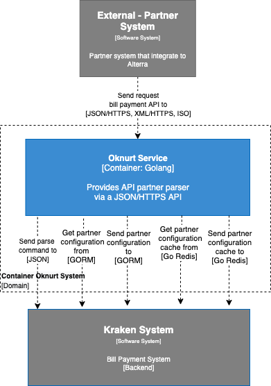

= Architecture Oknurt

Berikut ini adalah diagram C2 sistem Gaharu : 

Sistem ini merupakan bagian dari BPA. Untuk lebih detail terkait hubungan Oknurt dengan sistem BPA lainnya, silakan mengakses <<../../../../../Divisions/Meet-Our-Divisions/Technology/Engineering/Alterra-Systems-C1-Diagram/BPA-C1-Diagram.adoc#,BPA C1 Diagram>> berikut. 

== Related System

Berikut adalah daftar sistem yang berhubungan dengan sistem Oknurt:

[cols="10%,30%,30%,30%",frame=all, grid=all]
|===
^.^h| *System Name* 
^.^h| *Description* 
^.^h| *Depends on* 
^.^h| *Be a Dependencies to*

| Oknurt
| Partner Management System for BPA
a| - link:../Kraken/index.adoc[Kraken] - As Bill Payment Aggreagator
a| - Partner (External) - As Partner Management
|===