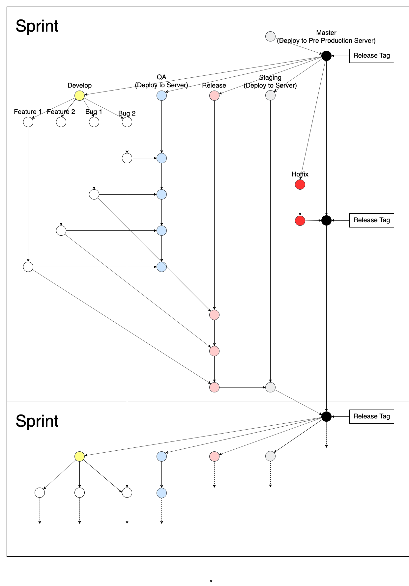

= Development Oknurt

== Gitflow

. _Branch_ *Master* hanya digunakan untuk kode produksi akhir dan untuk melakukan _hot-fix_
. Untuk setiap rilis baru akan memiliki _branch_ sendiri, idealnya ini akan dibuat setelah setiap rilis dilakukan
. Semua Pengujian pada fitur dan perbaikan bug akan dilakukan pada _branch_ QE, untuk diterima atau ditolak kemudian
. Setelah melewati semua tes, _branch_ QE akan di-_merge_ ke _release branch_.
. _Regression test_ dijalankan pada _release branch_ sebelum di-_merge ke _branch develop_, kemudian ke _branch master_.

== _Development Step_

. Buat Branch baru dengan nama `<jira_type>/<Jira_Key>-<Jira_Title>` dari branch **develop**
. Mulai _development_ Jira _Story/Task/Bug_.
. Lakukan _commit_ dengan _commit subject_ `[Jira_Key] commit message`.
. _Push_ branch untuk menyelesaikan story.
. Buat _Pull Request_ untuk branch *qa*. _Update jira workflow_ ke _testing_.
. Jika mengalami _conflict_, ikuti instruksi <<panduan-resolve-conflict-merge,_Resolve Conflict Merge_>>
. Minta review, approval dan merge dari team member yang lain atau lead SE.
. Jika _branch merged, update jira workflow_ ke _QCR Schedulling_.
. Lakukan koordinasi dengan QE ketika proses QCR sampai jira state _Deploying_.
. Selesaikan Jira _story/task/bug_ ke state _Done_

== Panduan _Resolve Conflict Merge_

JANGAN _merge_ branch *qa* ke dalam BRANCH ANDA. Jangan _resolve conflict_ dari  Github, karena akan _merge_ *qa* ke dalam branch tersebut.

. _checkout_ ke _branch_ *qa*
. _git pull origin_ *qa* untuk memastikan _local branch_ ter-_update_
. _git pull origin_ `<branch to merge>`
. _git status_ untuk mengetahui file yang mengalami _conflict_
. _resolve conflict_
. _git commit_ -m `"[Jira_Key] commit message"`
. _git push origin_ *qa*
. Periksa https://github.com/sepulsa/oknurt/network  dan pastikan tidak _commit_ "_merge_ *qa* ke dalam

== Panduan _Hotfix Development_

. Buatlah _Chore Story_ di Pivotal dengan judul "Hotfix xxx xxx xxx xxx"
. Buatlah Branch baru dengan nama `hotfix/<Jira_Key>-<Jira_Title>` dari branch **master** yang terbaru
. _Push branch_ dengan _commit message_ `[Jira_Key]<JiraTitle>` untuk menyelesaikan *story*.
. Buatlah _Pull Request_ ke branch *master*
. Jika terdapat _conflict_, silakan lakukan instruksi _Resolve Conflict Merge_ di atas ke branch *master*
. Anda dapat melakukan _Release Step_.
