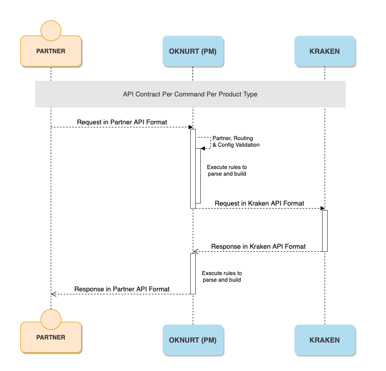

= Workflow Oknurt

Di bawah adalah _sequence diagram_ yang menjelaskan bagaimana Oknurt bekerja dari Partner ke Kraken.

Oknurt menerima _request_ partner untuk kemudian melakukan _apply rules_ dan _parser_ untuk dapat meneruskan _request_ tersebut ke Kraken. _Response_ yang didapat dari Kraken juga diteruskan ke partner dengan melakukan _apply rules_ dan _parser_ terlebih dahulu. Sehingga partner dapat melakukan komunikasi dengan Kraken menggunakan API spec mereka.

_Rules_ dan _parser_ API partner diatur per _command request_ dan per _product type_. Berikut adalah daftar dari _Kraken Command_ yang dapat diatur oleh Oknurt:

* PRODUCT
* INQUIRY
* PURCHASE
* ADVICE
* REVERSAL
* CALLBACK

