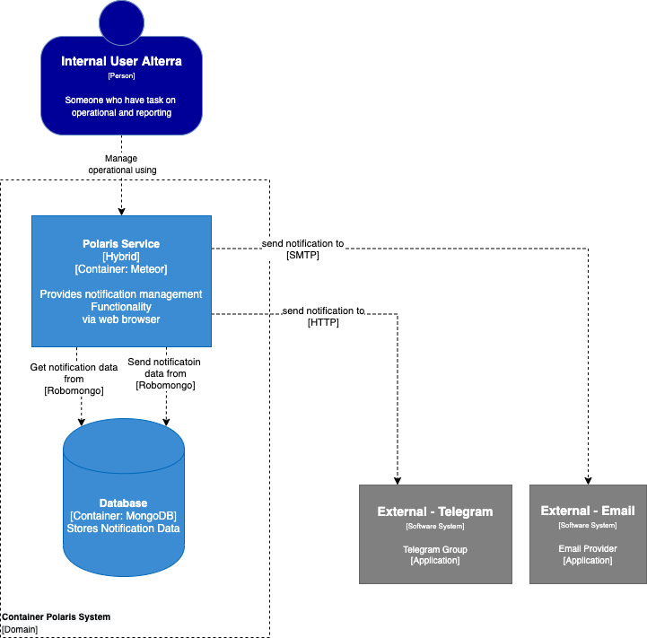

= Architecture Polaris

Berikut adalah gambar diagram C2 sistem Polaris:

Sistem ini merupakan bagian dari BPA. Untuk lebih detail terkait hubungan Polaris dengan sistem BPA lainnya, silakan mengakses <<../../../../../Divisions/Meet-Our-Divisions/Technology/Engineering/Alterra-Systems-C1-Diagram/BPA-C1-Diagram.adoc#,BPA C1 Diagram>> berikut.

== Related Systems

[cols="10%,30%,30%,30%",frame=all, grid=all]
|===
^.^h| *System Name* 
^.^h| *Description* 
^.^h| *Depends on* 
^.^h| *Be a Dependencies to*

|Polaris
|Alterra notification system
a| 1. Elasticsearch (External) - As Data Log Provider
2. Telegram (External) - As Group Notification
3. Email (External) - As Email Notification
| - 

|===
