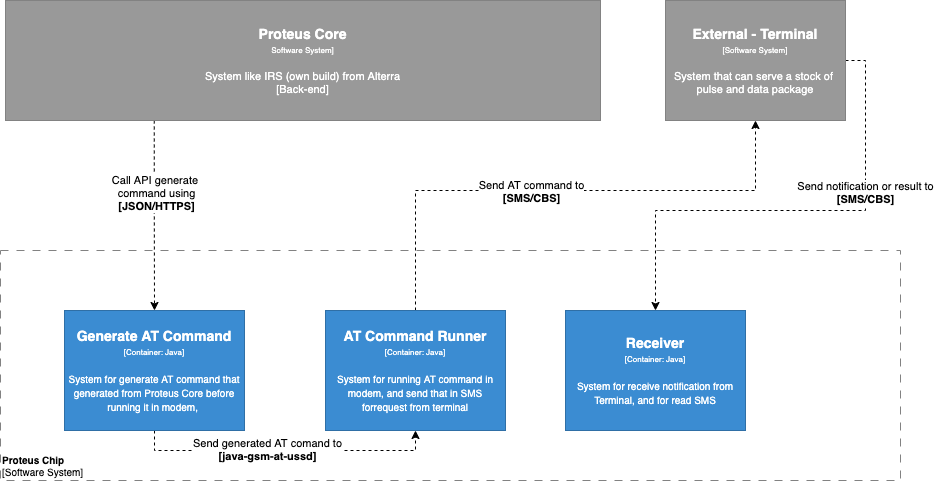

= Architecture Proteus Chip

== High Level Architecture

Berikut adalah gambar diagram C2 sistem Proteus Chip:

Sistem Proteus Chip merupakan bagian dari Serpul. Untuk lebih detail terkait hubungan Proteus Chip dengan sistem Serpul lainnya, silakan mengakses <<../../../../Divisions/Meet-Our-Divisions/Technology/Engineering/Alterra-Systems-C1-Diagram/Serpul-C1-Diagram.adoc#,Serpul C1 Diagram>> berikut.

== Related Systems

[cols="10%,30%,30%,30%",frame=all, grid=all]
|===
^.^h| *System Name* 
^.^h| *Description* 
^.^h| *Depends on* 
^.^h| *Be a Dependencies to*

| *Proteus Chip*
| Sistem yang digunakan untuk mengambil stok pulsa, paket data, dll dari Terminal penyedia (melalui AT command)
a|1. Terminal (External) - As *Biller*
a|1. Proteus Core - As *AT Command Process*
|===
