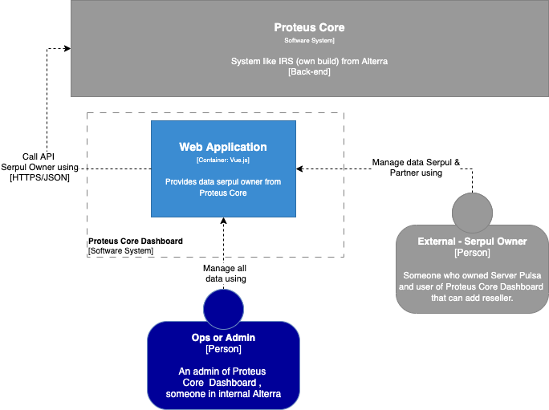

= Architecture Proteus Core Dashboard

== High Level Architecture

Berikut adalah gambar diagram C2 sistem Proteus Core Dashboard:

Sistem Proteus Core Dashboard merupakan bagian dari Serpul. Untuk lebih detail terkait hubungan Proteus Core Dashboard dengan sistem Serpul lainnya, silakan mengakses <<../../../../Divisions/Meet-Our-Divisions/Technology/Engineering/Alterra-Systems-C1-Diagram/Serpul-C1-Diagram.adoc#,Serpul C1 Diagram>> berikut.

== Related Systems

[cols="10%,30%,30%,30%",frame=all, grid=all]
|===
^.^h| *System Name* 
^.^h| *Description* 
^.^h| *Depends on* 
^.^h| *Be a Dependencies to*

| *Proteus Core Dashboard*
| Dashboard Proteus Core untuk admin (internal) dan Serpul Owner untuk membuat Serpul sendiri, dan menambahkan Partner
a| 1. Proteus Core - As *BE API*
|
|===