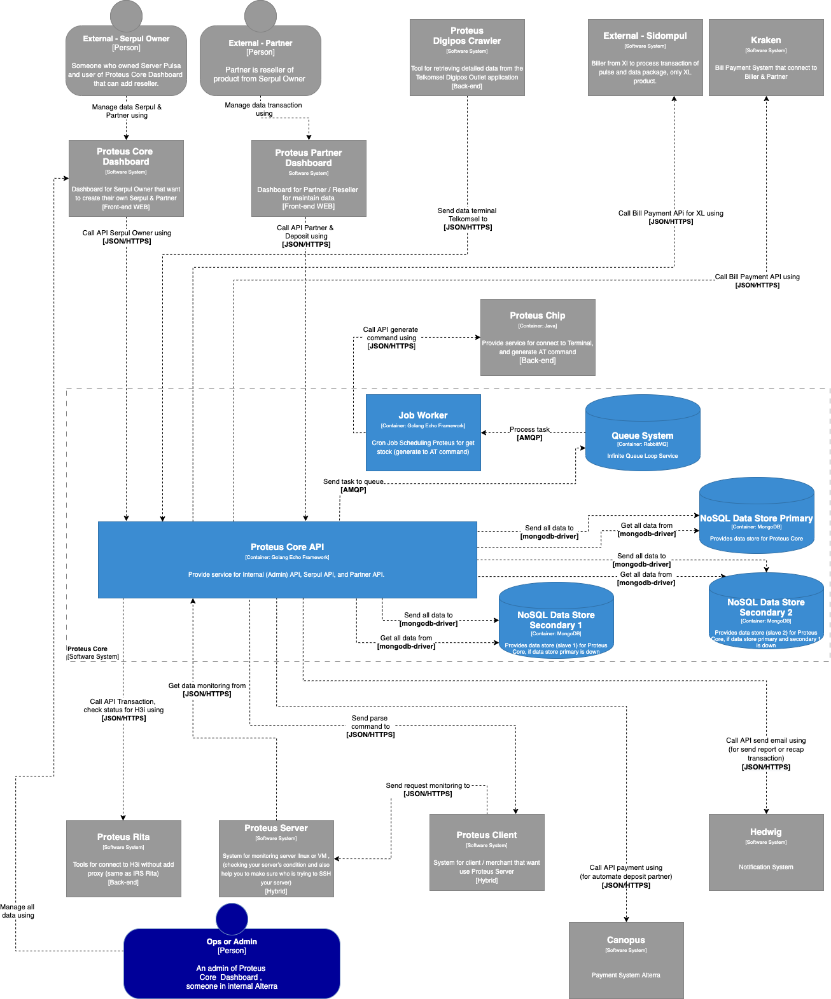

=  Architecture Proteus Core

== High Level Architecture

Berikut adalah gambar diagram C2 sistem Proteus Core:

Sistem ini merupakan bagian dari Serpul. Untuk lebih detail terkait hubungan Proteus Core dengan sistem Serpul lainnya, silakan mengakses <<../../../../Divisions/Meet-Our-Divisions/Technology/Engineering/Alterra-Systems-C1-Diagram/Serpul-C1-Diagram.adoc#,Serpul C1 Diagram>> berikut.

== Related Systems

[cols="10%,30%,30%,30%",frame=all, grid=all]
|===
^.^h| *System Name* 
^.^h| *Description* 
^.^h| *Depends on* 
^.^h| *Be a Dependencies to*

| Proteus Core
| Sistem yang berfungsi sebagai _software_ serpul, seperti IRS 7, IRS 8, Otomax, Tiger, dll (own build)
a| 1. Proteus Chip - As AT Command Process
2. Proteus Rita - As H3i Provider
3. Kraken - As Bill Payment Aggregator
4. Sidompul (External) - As Biller from XL
3. Canopus - As Payment Gateway Aggregator
4. Hedwig - As Notification
a|1. Kraken - As Biller
2. Proteus Core Dashboard - As BE API
3. Proteus Partner Dashboard - As BE API
4. Proteus Digipos Crawler - As Telkomsel Digipos Outlet Data Store
5. Proteus Server - As Monitorized system

|===