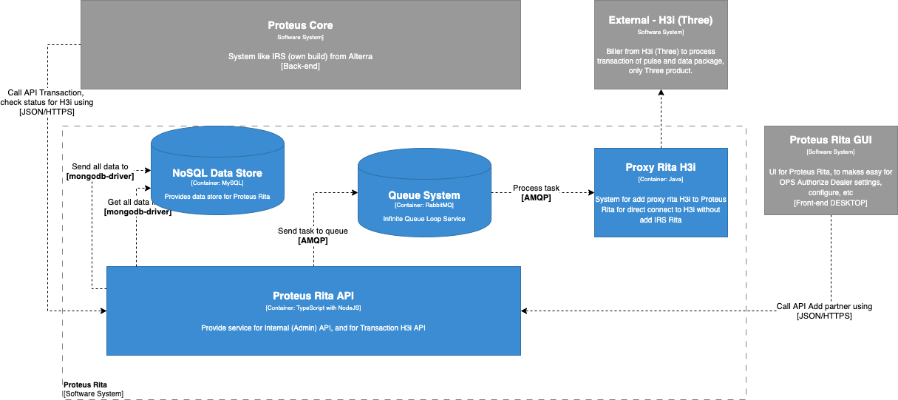

= Architecture Proteus Rita

== High Level Architecture

Berikut adalah gambar diagram C2 sistem Proteus Rita:

Sistem ini merupakan bagian dari Serpul. Untuk lebih detail terkait hubungan Proteus Rita dengan sistem Serpul lainnya, silakan mengakses <<../../../../Divisions/Meet-Our-Divisions/Technology/Engineering/Alterra-Systems-C1-Diagram/Serpul-C1-Diagram.adoc#,Serpul C1 Diagram>> berikut.

== Related Systems

[cols="10%,30%,30%,30%",frame=all, grid=all]
|===
^.^h| *System Name* 
^.^h| *Description* 
^.^h| *Depends on* 
^.^h| *Be a Dependencies to*

| *Proteus Rita*
| Sistem yang digunakan untuk connect ke H3i (Tri), dibuat agar memudahkan Proteus Out untuk connect tanpa harus menambahkan lagi IRS Rita (yang berisi proxy)
| H3i (External) - As Biller
a| 1. Proteus Core - As H3i Provider
2. Proteus Rita GUI - As BE API
|===