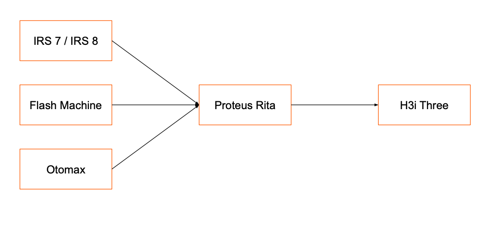

= Proteus Rita
:keywords: gst, traditional,proteus-rita

== Overview

Proteus Rita adalah aplikasi yang menggantikan IRS Rita. Sistem ini berfungsi untuk membantu menyambungkan ke _authorize distributor_ resmi tiga _provider_.

Proteus Rita dibuat karena IRS Rita _price_ adalah 8 juta untuk setiap _cluster_ yang dimiliki.

== Team Involved

[cols="35%,35%,30",frame=all, grid=all]
|===
^.^h| *Name* 
^.^h| *Role* 
^.^h| *Email*

| Kevin Setiawan Tanzil
| Lead Software Engineer
| kevin@alterra.id

| Evan Sujanto
| Development Manager
| evan@alterra.id

| Anandhi Tristiaratri
| Quality Engineer
| anandhi@alterra.id

| Moehammad Oki Putra Samudra
| Software Engineer
| oki@alterra.id

| Doni Hadiyansyah
| Software Engineer
| dhadiansyah@alterra.id
|===

== Technical Information

<<./architecture-proteus-rita.adoc#, Architecture Proteus Rita>>

<<./technology-proteus-rita.adoc#, Technology Proteus Rita>>

== Onboarding Information

<<./dev-onboarding-proteus-rita.adoc#, Developer Onboarding Proteus Rita>>

<<./development-proteus-rita.adoc#, Development Proteus Rita>>

== Documentation

<<./api-doc-proteus-rita.adoc#, API Documentation Proteus Rita>>