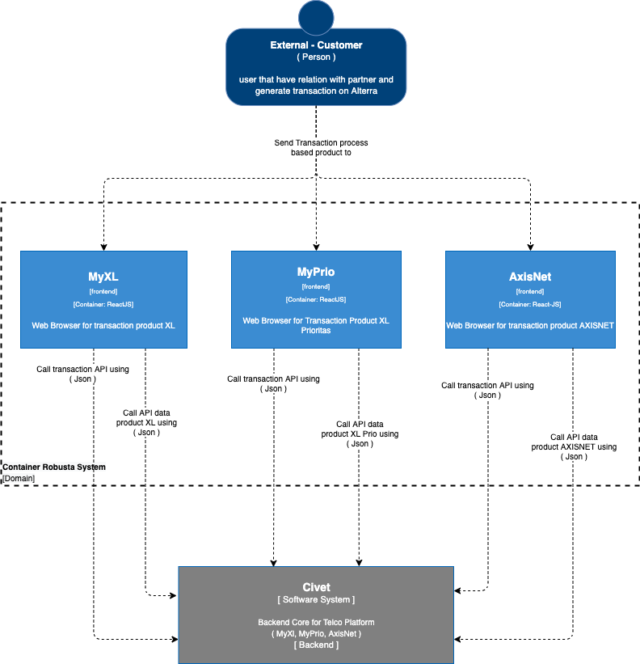
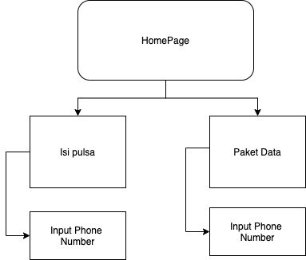

= Architecture Robusta (Axis)

== High Level Architecture

Berikut adalah gambar diagram C2 sistem Robusta (Axis):

Sistem ini merupakan bagian dari Telco. Untuk lebih detail terkait hubungan Robusta (Axis) dengan sistem Telco lainnya, silakan mengakses diagram C1 berikut.

== Related Systems

|===

| *System Name* | *Description* | *Depends on* | *Be a Dependencies to*

|Robusta V2
|Frontend dari system Civet untuk tiap partner yang berbeda-beda.
a|1. Civet - As BE API
|-

|===

== Sitemaps

Berikut adalah arsitektur sistem dari Robusta (Axis):

* Sitemap Myxl
+
image::images-robusta-axis/Robusta-Axis-MyXl.png[Sitemap Robusta V2]

* Sitemap MyAxis
+

* Sitemap MyPrio
+
image::images-robusta-axis/Robusta-Axis-MyPrio.png[Sitemap Robusta V2]
