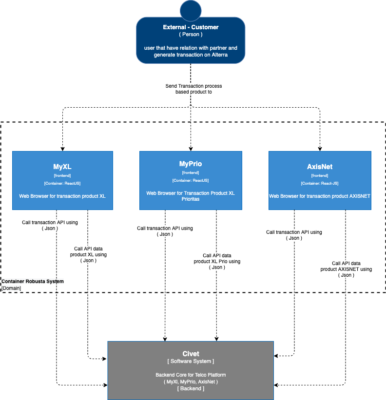
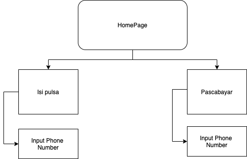

= Architecture Robusta V2

== High Level Architecture

Berikut adalah gambar diagram C2 sistem Robusta V2:

Sistem ini merupakan bagian dari Telco. Untuk lebih detail terkait hubungan Robusta V2 dengan sistem Telco lainnya, silakan mengakses <<../../../../../Divisions/Meet-Our-Divisions/Technology/Engineering/Alterra-Systems-C1-Diagram/Telco-C1-Diagram.adoc#,Telco C1 Diagram>> berikut.

== Related Systems

|===

| *System Name* | *Description* | *Depends on* | *Be a Dependencies to*

|Robusta V2
|Frontend dari system Civet untuk tiap partner yang berbeda-beda.
a|1. Civet - As BE API
|-

|===

== Sitemaps

Berikut adalah arsitektur sistem dari Robusta V2:

* Sitemap Myxl
+
image::images-robusta-v2/Robusta-V2-MyXl.png[Sitemap Robusta V2]

* Sitemap MyAxis
+
image::images-robusta-v2/Robusta-V2-MyAxis.png[Sitemap Robusta V2]

* Sitemap MyPrio
+

