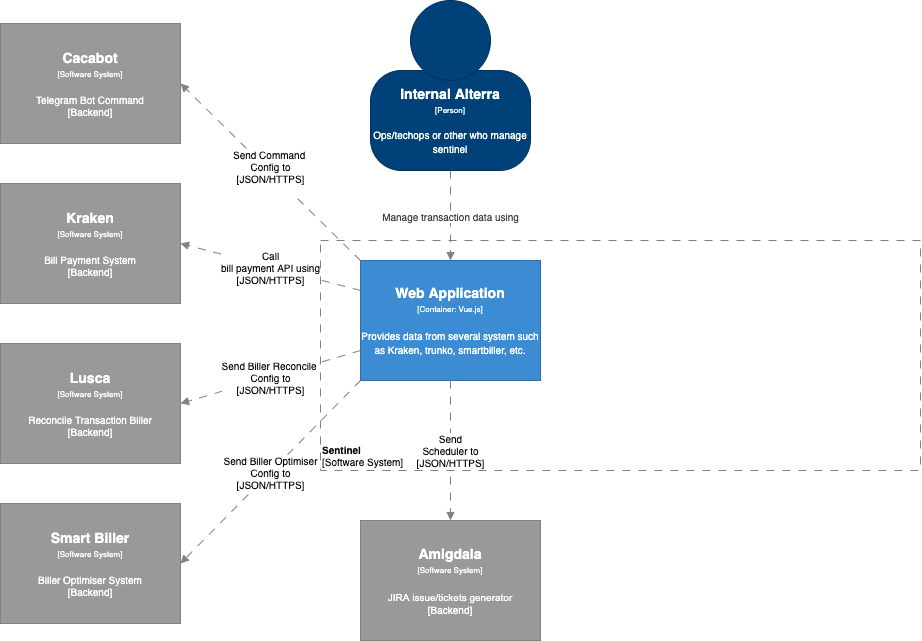

= Architecture Sentinel

== High Level Architecture

Berikut adalah gambar diagram C2 sistem Sentinel:

Sistem ini merupakan bagian dari BPA. Untuk lebih detail terkait hubungan Sentinel dengan sistem BPA lainnya, silakan mengakses <<../../../../../Divisions/Meet-Our-Divisions/Technology/Engineering/Alterra-Systems-C1-Diagram/BPA-C1-Diagram.adoc#,BPA C1 Diagram>> berikut.

== Related Systems

[cols="10%,30%,30%,30%",frame=all, grid=all]
|===
^.^h| *System Name* 
^.^h| *Description* 
^.^h| *Depends on* 
^.^h| *Be a Dependencies to*

|Sentinel
a|Dashboard system. Dashboard for kraken, smartbiller, cacabot, amigdala,lusca
a|1. link:../Kraken/index.adoc[Kraken] - *As BE API*
2. link:../Smartbiller/index.adoc[Smartbiller] - *As Automation Open/Close Biller*
3. link:../Cacabot/index.adoc[Cacabot] - *As Chatbot for Ops and Partner*
4. link:../Amigdala/index.adoc[Amigdala] - *As JIRA Issue Generator*
5. Lusca Core - *As Reconcile Data Biller*
| -
|===