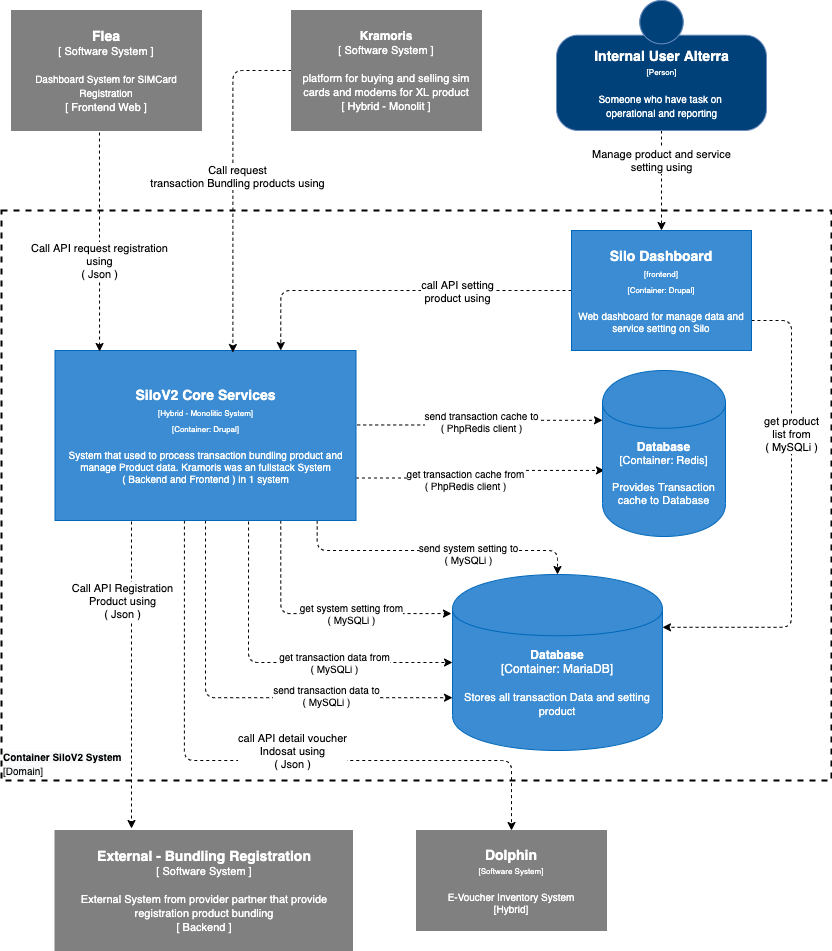

= Architecture Silo V2

== High Level Architecture

Berikut adalah gambar diagram C2 sistem Silo V2:

Sistem ini merupakan bagian dari Telco. Untuk lebih detail terkait hubungan Silo V2 dengan sistem Telco lainnya, silakan mengakses <<../../../../../Divisions/Meet-Our-Divisions/Technology/Engineering/Alterra-Systems-C1-Diagram/Telco-C1-Diagram.adoc#,Telco C1 Diagram>> berikut.

== Related Systems

|===

| *System Name* | *Description* | *Depends on* | *Be a Dependencies to*

|Silo V2
|System that used to process sale of physical products such as Starterpack / Bundling
a|1. link:../Dolphin/index.adoc[Dolphin] - As Voucher Inventory
2. Bundling Registration (External) - As Product Bundling Registration
|-

|===