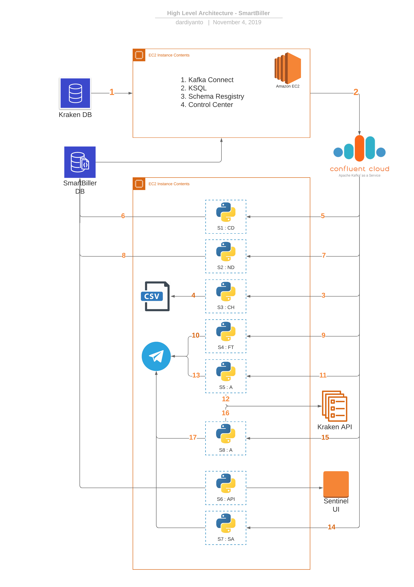

= Architecture Smart Biller

Berikut High Level Diagram dari sistem Smart Biller

*Keterangan*

. *_Kraken DB_* ⇒ sebagai sumber data Smart Biller menggunakan tabel transaksi, transaksi Biller, produk, Mitra, Jenis Produk, dan Biller untuk menghitung data.
. *_Kafka Connect_* ⇒ sebagai _Streamer_ yang mengirim data ke _confluent cloud broker_ dan diproses oleh KSQL untuk memfilter dan _peristing_ agregasi.
_Output_ dari proses KSQL ini adalah data yang siap dikonsumsi oleh _service_ 1: CD.
Data tersebut berisi tabel transaksi dan transaksi _biller_.
. *_S3 : CH_* ⇒ S3 adalah singkatan dari _service_ 3 dan *CH* adalah singkatan dari  csv_history.
Singkatan ini mengacu pada file dan layanan yang digunakan.
csv_history adalah layanan yang digunakan untuk menyimpan riwayat transaksi setiap product_biller.
Data ini dibutuhkan sebagai inisiasi product_biller yang digunakan untuk kalkulasi oleh *S1: CD*
. *_CSV_* ⇒ ini adalah _output_ produk dari _service_ 3.
File CSV ini mempunyai standar untuk penamaannya dengan cara `<product_id><biller_id>.csv<biller_id></product_id>`
. *_S1: CD_* ⇒ *S1* singkatan dari _Service_ 1 dan *CD* singkatan dari consumer_dataframe.
Consumer_Dataframe adalah layanan yang digunakan untuk menghitung 5 transaksi gagal dan performa _biller_ (_success_rate, latency_).
Jika product_biller yang ditemukan memenuhi kriteria untuk 5 kegagalan berturut-turut, layanan ini akan mencatat product_biller dalam _database_.
Layanan ini juga akan mencatat perubahan dalam kinerja _biller_ ke _database_.
. *_DB: biller_performance_* ⇒  Proses memasukkan ke dalam database dilakukan oleh layanan _** S1: CD **_.
Ketika ada pembaruan kinerja, tabel dalam database akan memicu untuk melakukan perhitungan peringkat.
Proses ini akan menghasilkan updated_at baru yang dibaca oleh Kafka Connect sebagai pesan baru.
. *_S2: ND_* ⇒ *S2* singkatan dari _Service_ 2 dan *ND* singkatan dari notification_dataframe.
Notifications_dataframe adalah layanan yang digunakan untuk memproses data peringkat _biller_.
Ketika ada perubahan urutan peringkat 1 di setiap layanan product_biller, itu akan memberikan respons untuk membuat pesan yang akan dimasukkan ke dalam tabel message_action.
Ketika ada pesan tetapi urutan perubahan peringkat tetap sama, proses akan dilewati.
. *_DB: message_action_* ⇒ Proses memasukkan ke dalam basis data dilakukan oleh layanan *_S2: ND_*.
Informasi yang dimasukkan ke dalam _database_ adalah teks yang akan dikirim oleh Telegram.
Product_id dan Partner_id juga dimasukkan sebagai informasi untuk penggantian paket di Kraken.
Baris ini akan dikonsumsi oleh Kafka _connect_ menjadi pesan di message_action.
. *_S4: FT_* ⇒ *S4* singkatan dari Service 4 dan *FT* adalah singkatan dari failure_transactions.
Failed_transactions adalah layanan yang digunakan untuk mengirim pesan berisi informasi kegagalan tagihan selama 5 kali berturut-turut.
Fitur ini akan berjalan jika konfigurasi ENV fail_message diatur ke 1.
Selain itu, juga akan mengubah status product_biller dalam _database_ menjadi 0 (tidak aktif).
Untuk mengaktifkan kembali product_biller yang tidak aktif diatur secara manual oleh ops melalui Sentinel.
. *_Telegram: failed_action_* ⇒ Telegram API akan mengirim pesan ke grup tertentu.
. *_S5: A_* ⇒ *S5* singkatan dari _Service_ 5 dan *A* adalah singkatan dari _Action_.
_Action_ adalah layanan yang digunakan untuk mengirim pesan tentang perubahan peringkat _biller_.
Fitur ini akan berfungsi jika konfigurasi aksi ENV diatur ke 1 dan kemudian akan mengubah _biller_ dalam paket melalui Kraken API.
Fitur ini juga dapat dinonaktifkan melalui konfigurasi pada ENV.
. *_Hit Kraken API_* ⇒ Tujuan dari proses penembakan ke API Kraken adalah untuk mendapatkan token untuk _login_, kemudian mencari paket dan produk yang akan diubah.
Proses ini dilakukan maksimal 5 kali.
Jika setelah 5 kali respons masih gagal mengubah paket, proses perubahan akan dilewati.
. *_Telegram: Biller Change_* \=> Prosesnya akan mengirim informasi ke grup telegram untuk menemukan detail perubahan peringkat.
. *_S7: SA_* ⇒ *S7* singkatan dari _Service_ 7 dan S**A** singkatan dari _Summary Action_.
_Summary Action_ adalah layanan yang digunakan untuk mengirim pesan tentang rangkuman _billers switched_.
Lebih detailnya, kita dapat mengetahui partner mana yang akan terpengaruh oleh layanan tersebut.
. *_S8: A_* ⇒ *S8* singkatan dari  _Service 8_ dan *A* singkatan dari _Action_.
Fungsi  *_Action_* pada _service_ 8 yang akan mengirimkan pesan tentang _enable / disable_ produk yang berubah otomatis melalui sistem Smart Biller.
. *_Hit Kraken API_* ⇒ tujuan dari menembak API Kraken adalah untuk mendapatkan token _login_, kemudian dilanjutkan dengan proses pencarian produk yang akan diubah.
Proses ini dilakukan maksimal 5 kali.
Jika setelah 5 kali, responnya masih gagal untuk mengubah _package_, proses perubahan akan dilewati.
. *_Telegram: enable / disable product_* \=> prosesnya berupa pengiriman informasi ke grup telegram untuk menemukan detail produk yang diubah (_able / disable_) oleh sistem Smart Biller.