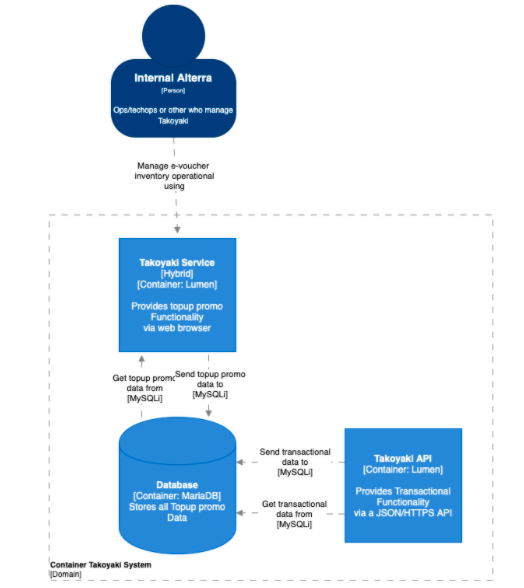

= Architecture Takoyaki V2

== High Level Architecture

Berikut ini adalah diagram C2 sistem Takoyaki V2:

Sistem ini merupakan bagian dari BPA. Untuk lebih detail terkait hubungan Takoyaki V2 dengan sistem BPA lainnya, silakan mengakses <<../../../../../Divisions/Meet-Our-Divisions/Technology/Engineering/Alterra-Systems-C1-Diagram/BPA-C1-Diagram.adoc#,BPA C1 Diagram>> berikut.

== Related System

Berikut adalah daftar sistem yang berhubungan dengan Takoyaki V2:

|===
| *System Name* | *Description* | *Depends on* | *Be a Dependencies to*

|Takoyaki V2
|Top Up Promo System. Promo & SMS Worker for Kraken, Scan Transaction to get a promo for customer
a|-

a|
. link:../Kraken/index.adoc[Kraken] - As Promo Checker
|===