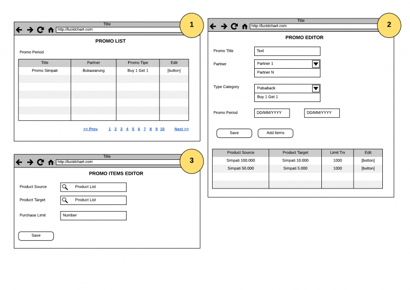

= Flow and Wireframe Takoyaki V2

== Flow

Berikut adalah _flow_ Takoyaki V2: 

|===
|*No* |*Feature* |*Type* |*Diagram*
| | | |

|===

== Wireframe

Berikut adalah _wireframe_ dari Takoyaki V2:

*Promo Editor*

