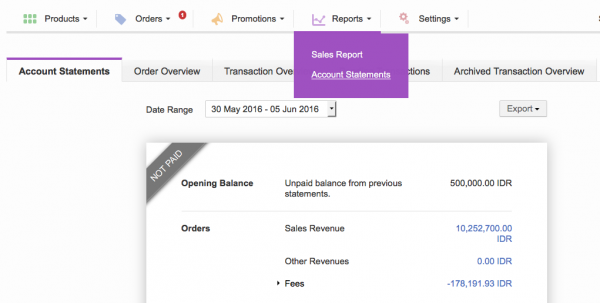
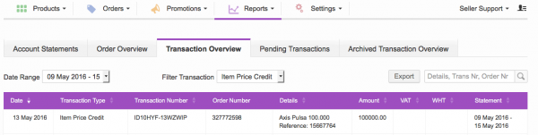
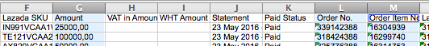
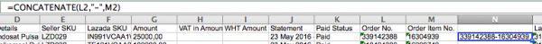
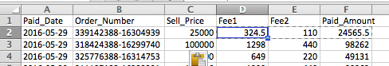
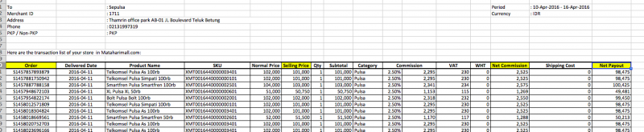
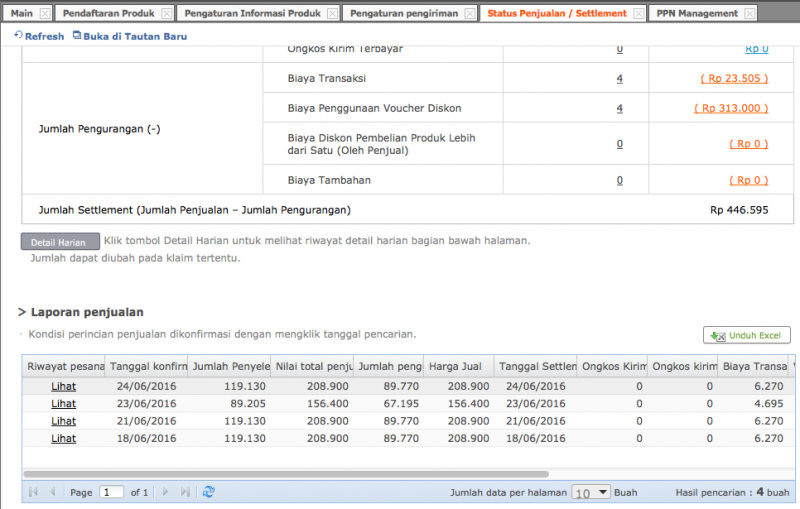
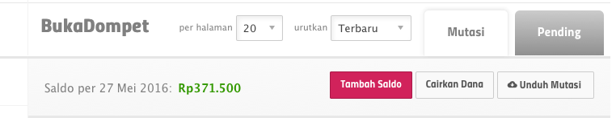
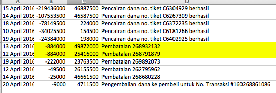
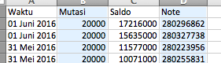

= AR Marketplaces Terra

== Auto AR

=== Lazada

Every Friday transfered by Lazada

*Get Payment Data* : <<./partner-lazada.adoc#, Partner Lazada>> 

*Contact* : partnersupport@lazada.co.id, junaidi.junaidi@lazada.co.id

*Fees* : 1.298% & 0.44% from Sell Price

*How to upload settlement to Flash*

Cek _paid orders_ oleh Lazada di https://sellercenter.lazada.co.id/seller/login?redirect_url=https%3A%2F%2Fsellercenter.lazada.co.id%2Freport%2Ftransaction%2Fcurrent-statement[Account Settlement]

*_Payment Status per Period_*

- _Get the paid period_, lalu akses ke https://sellercenter.lazada.co.id/seller/login?redirect_url=https%3A%2F%2Fsellercenter.lazada.co.id%2Freport%2Ftransaction%2Findex%2FfilteredType%2F0%2FfilteredRange%2F0[Transactions Overview]

- Select Date Range and Filter Transaction to Item Price Credit.

- Click Export button and Download link at the bottom.

*_Download Transactions_*

- What columns needed are Amount, Order No and Order Item No

 

*_Columns needed_*

- Gunakan formula ini untuk mendapatkan Order_Number =CONCATENATE(L2,"-",M2) and Paste Special (Values Only) when copy to Settlement_Template.csv file

 

*_Format the Order Number_*

- Format tanggal pembayaran adalah YYYY-MM-DD, so atur format kolom jadi _text_ Replace ,00 in Amount columns before copy paste into Sell_Price column of Settlement_Template.csv file Give formula to calculate Fee1, Fee2 and Paid_Amount :

    Column Fee1 = 1.298/100__[Sell_Price]    Column Fee2 = 0.44/100__[Sell_Price]    Column Paid_Amount = [Sell_Price] - [Fee1] - [Fee2]

 

*_Settlement Template Calculation_*

- Bulk this Settlement_Template.csv file to https://flash.sepulsa.id/admin/upload/settlement[Flash Settlement Upload]

=== Matahari Mall

Twice a Month

*Get Payment Data* : request

*Contact* : Seller Support Finance [sellersupport.finance@mataharimall.com], sellersupport@mataharimall.com, sellersupport.esc@mataharimall.com, diyah.kusuma@mataharimall.com, adithya.putro@mataharimall.com (bisnis)

*Total Fees* : 2.5% from Sell Price

*How to upload settlement to Flash* 

- Order be Order_Number, Selling Price be Sell_Price, Net Commission be Fee1, and Net Payout be Paid_Amount

 

*_Settlement Report from Matahari Mall_*

=== Elevenia

*Fee* : 5% from Sell Price Click "Detail Harian" to get detail settlement
+
 

*_Get Detail Settlement_*

== Manual AR

=== Tokopedia

Every Monday by Invoice https://flash.sepulsa.id/admin/warehouse/recap_weekly[Recap Business]

*Get payment data* : regarding invoice email

*Contact* : Paria [paria.lestari@tokopedia.com], Indri Yuanita [indri@tokopedia.com], Devy Pranowo [devy.pranowo@tokopedia.com]

*No Fee*

== Withdrawable AR

== Blanja

*Settlement and Withdraw* : <<./partner-blanja.adoc#, Partner Blanja>> 

*Get Payment Data* : request

*Contact* : Alifa Agustiana Putri [alifa.putri@metraplasa.co.id], Elfrido [elfrido.elfrido@metraplasa.co.id], Vicky Ariesca Merliana [vicky.merliana@metraplasa.co.id], Tutupolij Andika Nursep [tutupolij.nursep@metraplasa.co.id]

*No Fee*

=== Bukalapak

*Settlement and Withdraw* : <<./partner-bukalapak.adoc#, Partner Bukalapak>> 

*Get Payment Data* : https://www.bukalapak.com/login?comeback=http%3A%2F%2Fwww.bukalapak.com%2Fdompet[Dompet] 

- click "Unduh Mutasi" button 
+
 

*Contact* : Marina Deby [marina.deby@bukalapak.com], Satyabudi Suryaputra [satya@bukalapak.com]\

*No Fee*

*_How to upload settlement to Flash_*

- Pay attention for these description (note column) and take out from the main list.

- "Dibatalkan" should be NoPaid status, but shall be ensured in Bukalapak dashboard.
Replace "Remit untuk transaksi #160257204922" with this filter "Remit untuk transaksi #160" statement.
This replacement be Order_Number values.

- Note be Order_Number, Mutasi be Sell_Price and Paid_Amount is equal to Sell_Price (Paid_Amount = Sell_Price)

== Related Partner

<<./partner-lazada.adoc#, Partner Lazada>>

<<./partner-rakuten.adoc#, Partner Rakuten>>

<<./partner-blanja.adoc#, Partner Blanja>>

<<./partner-elevenia.adoc#, Partner Elevenia>>

<<./partner-matahari-mall.adoc#, Partner Matahari Mall>>

<<./partner-bukalapak.adoc#, Partner Bukalapak>>
