= Partner Blanja

== Seller Center

https://member.blanja.com/member/login?redirectURL=http%253A%252F%252Fseller.blanja.com%252F[Seller Center]

*Akses Admin* 

Email    : **

Password : **

*Tambah Produk*

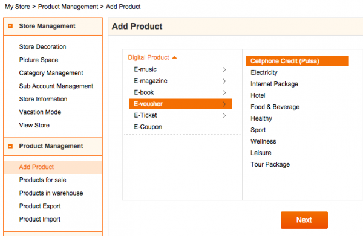 

. Digital Product>> E-voucher>> Cellphone Credit (Pulsa)

. Untuk menambah produk, pilih E-voucher untuk kategori Digital Product dan sub kategori Cellphone Credit (Pulsa).
Ikuti langkah berikutnya.
+
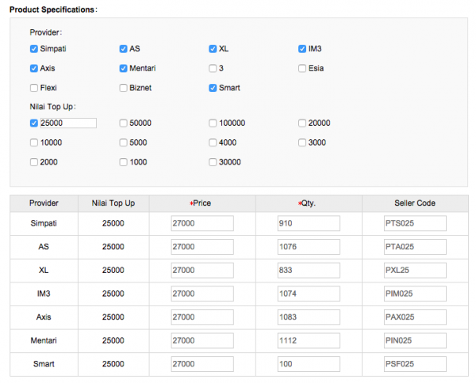 

. Satu produk dapat memiliki banyak varian sesuai dengan denomnya.
Misalkan, judul produk adalah pulsa 25rb.
Maka, dapat dipilih provider mana saja yang dijual untuk denom 25rb tersebut.
Setiap varian produk tersebut memiliki stok masing-masing.

*Produk Promo* 

Khusus untuk produk promo, penjualan produk dibatasi oleh 1 (satu) qty setiap ordernya.
Saat ini, Outlander hanya memproses 1 (satu) order dan 1 (satu) qty.
Oleh sebab itu, setiap produk yang dijual melalui Blanja.com harus dalam bentuk promo.

*Ubah Stok*

Untuk mengubah stok, ubah produk dan masukkan qty untuk setiap varian dari produk tersebut.

*Status Order* 

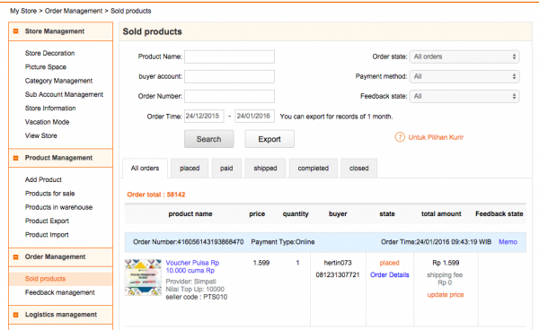

Terdapat 6 (enam) status Order di Blanja yaitu : Placed, Paid, Shipped, Completed, Closed dan Refund

. Placed : order dari Rakuten yang belum terkonfirmasi pembayarannya (UNPAID)

. Paid : order telah terkonfirmasi pembayarannya (PAID) dan siap untuk di-top up

. Shipped : order telah berhasil ter-_top up_ dan jika 3 (hari) tidak ada kesepakatan _refund_ dari pihak Seller dan Buyer, otomatis akan diubah statusnya menjadi Completed

. Completed : order komplit dan masuk daftar _settlement_

. Closed : _order_ dinyatakan selesai

. Succcessfully Refunded : order dibatalkan dan _refund_ ke pihak _customer_

. Refund Closed : sistem menolak proses _refund_ dikarenakan pengisian pulsa telah sukses

*Shipped Order* 

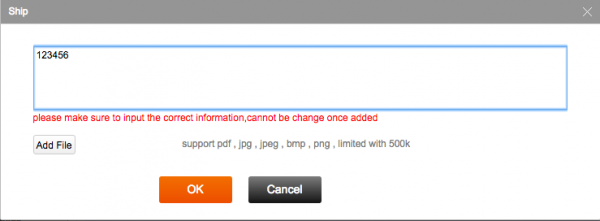

Ketika _order_ berhasil ter-_top up_, ubah status dari di Seller Center Blanja dari Paid menjadi Shipped.
Klik tombol Ship dan masukkan Informasi dengan data Remote trx ID dari Kraken.

https://partner.sepulsa.id/blanja_ship_bulk[Bulk Shipped] 

Perubahan status menjadi Shipped dapat dilakukan secara serentak melalui Outlander dengan format kolom orderNumber, LogisticCompany, InvoiceNumber dalam bentuk file .csv.

image:::../images-terra/terra-46.png[]

*Cancel Order* 

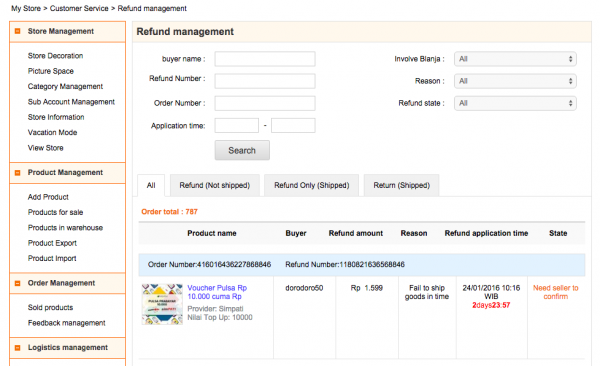

*Settlement dan Withdraw* 

https://member.blanja.com/member/login?redirectURL=https%253A%252F%252Fmember.blanja.com%252FbalanceAndWithdraw[Withdraw]

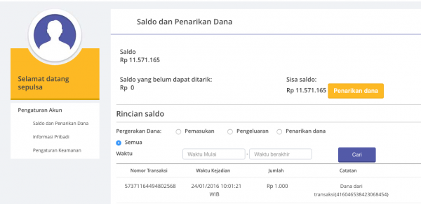 

Nama Bank      : BCA

Cabang         : KCU Thamrin

Nama Akun      : PT Sepulsa Teknologi Indonesia 

Nomor Rekening : 2063070***

Password : * Kode OTP akan dikirim ke nomor HP Sepulsa yang terdaftar : 08121941*** ( HP Mito )

== Outlander

*Mapping SKU*
 { Blanja  - Kraken    "5732483": "26",  // Simpati 25rb     "5732484": "26",  // As 25rb    "5732486": "24",  // IM3 25rb    "5732488": "24",  // Mentari 25rb    "6157282": "62",  // Mentari 150rb    "6157281": "62",  // IM3 150rb    "5732485": "27",  // XL 25rb    "5732487": "23",  // Axis 25rb    "5732515": "56",   // Simpati 10rb    "5732516": "56",   // As 10rb    "6160513": "25"   // Smartfren 25rb }

*Orders* 

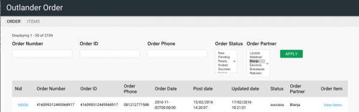 

*Items Order* 

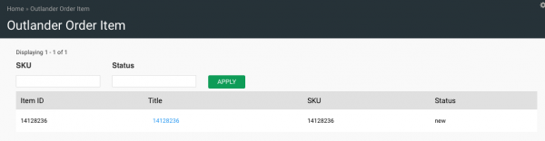 

*Reprocess Order* 

Jika terjadi gagal _top up_ dikarenakan nomor _handphone_ tidak valid/pasca bayar/tidak aktif provider tidak sama dapat diproses ulang melalui Outlander dengan cara :

- mengubah status Order di _field_ Order Status menjadi pending mengubah nomor handphone di _field_ Order Phone 
+
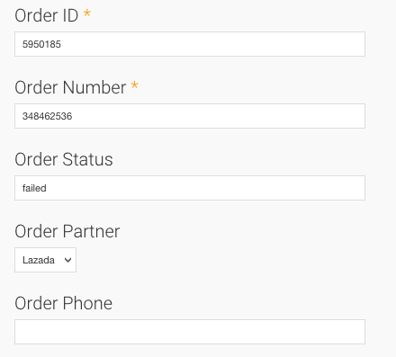 

- Mengubah status Item di _field_ Order Item Status menjadi New
+
image::../images-terra/terra-52.png[] 

*Catatan* Perlu dipastikan terlebih dahulu apakah status transaksi di Kraken telah menjadi Canceled.
Tidak perlu mengubah nomor handphone di order seller center Blanja.
Cukup mengubahnya di order Outlander.
Jika gagal _top up_ terjadi di Kraken, cukup lakukan Reprocess di Kraken dan jangan membuat transaksi baru di Kraken.
Karena biller Bakoel tidak melakukan verifikasi nomor handphone apakah sesuai dengan provider-nya, segera ubah status Failed di Kraken menjadi Canceled.
Jika ternyata sudah Success, order tersebut tidak dapat dibatalkan ataupun _refund_.

== API Integration

*Documentation*

https://drive.google.com/open?id=1iPFOZvYA8rjm0U-Vg2wdd_uXTLXDYOWM[API Documentation]

https://drive.google.com/open?id=1Ov93NwXsYk4MgQ79fUbQFMmvKqn_qHp4[Lastest Updated API Documentation]

*Akses API*

  API Key = **
 
  API ID  = **
  
  URL     = http://103.228.248.**/api

== CRON

Working lists

== Flexible Blanja Promotion Module

Karena promo-promo yang dilakukan oleh Blanja.com bersifat fleksibel (mudah dan cepat disesuaikan), maka kita buatkan sebuah module yang membuat semua nya berjalan lebih baik, cepat dan terukur, adapun fitur dari modul order yang baru adalah sbb:

Mengaktifkan dan menon-aktifkan promo Mapping Periode Untuk pengecekan double transaksi yang masuk ke outlander Filter Product Id(s) (Perhatian: bukan SKU Id) Filter Trade Source blanja.com Tipe Double Cek (None, Per day, By Mapping Period)

*URL* : admin/outlander/partner/blanja/promo_setting

*Berikut adalah _screenshot_ dari masing-masing Filter:*

. Mapping Periode & Double Check Type
+
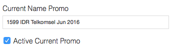

. Mapping Product Ids & Tradesource
+
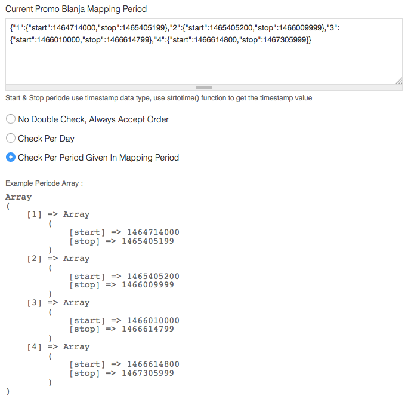  

. Create Mapping With Drupal Devel Module
+
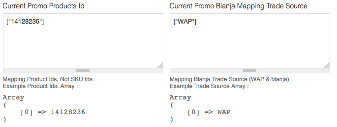

. Create the array code & copy the string!!!
Example Code Below : 
+
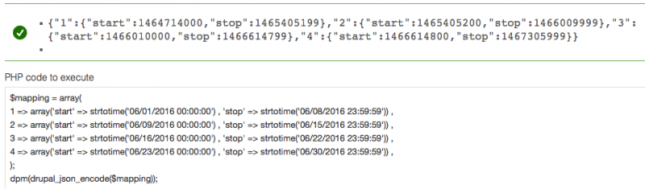
 
    $mapping = array( 1 \=> array('start' \=> strtotime('06/01/2016 00:00:00') , 'stop' \=> strtotime('06/08/2016 23:59:59')) ,  2 \=> array('start' \=> strtotime('06/09/2016 00:00:00') , 'stop' \=> strtotime('06/15/2016 23:59:59')) ,  3 \=> array('start' \=> strtotime('06/16/2016 00:00:00') , 'stop' \=> strtotime('06/22/2016 23:59:59')) ,  4 \=> array('start' \=> strtotime('06/23/2016 00:00:00') , 'stop' \=> strtotime('06/30/2016 23:59:59')) ,  );
dpm(drupal_json_encode($mapping));
