= Partner Bukalapak

== Seller Center

*Bukalapak Indosat Official Store*

https://www.bukalapak.com/[Bukalapak]

Email  : **@sepulsa.com 

Username  : **

Passwordnya : **

*Bukalapak - Jurangan SP*

Email  : **@sepulsa.com 

Username  : **

Passwordnya : **

*Bukalapak - Default*

Username  : **

Password  : **

*Bukalapak XL*

Username  : **

Password  : **

== Catatan Pelapak

https://www.bukalapak.com/users/6491179/store_settings[Catatan Pelapak]

Berikan catatan yang berisi T&C Sepulsa agar ditampilkan di setiap halaman detil produk.

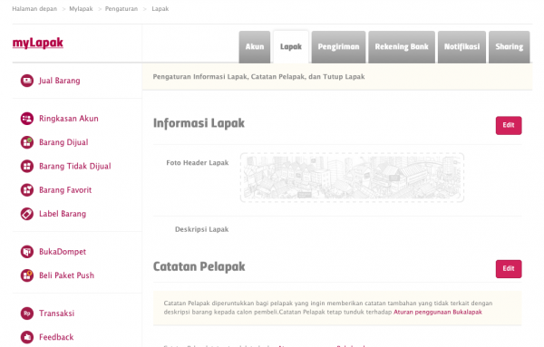

== *Tambah Produk*

https://www.bukalapak.com/products/new?from=mylapak[Tambah Produk] 

Kategori produk : *Handphone -> Pulsa*

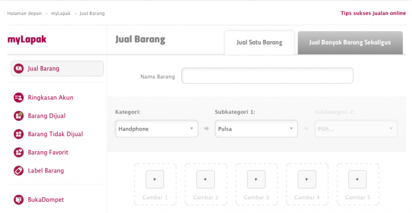

- Jika stok diisi 0, produk akan diset menjadi Produk Tidak Dijual.
- Jika ada stoknya, otomatis, produk akan diset menjadi Produk Dijual.
- Pastikan mencentang Gratis Ongkos Kirim ke seluruh Indonesia

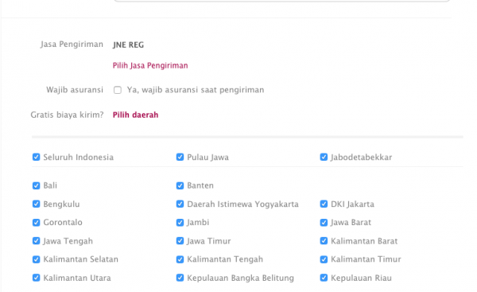

== Produk Tidak Dijual

https://www.bukalapak.com/my_products?from=user_dashboard&not_for_sale_only=1[Produk Tidak Dijual]

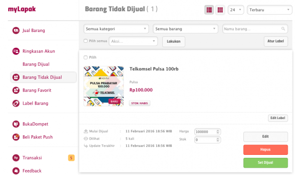

== Produk Dijual

https://www.bukalapak.com/my_products?from=user_dashboard&not_for_sale_only=0[Produk Dijual]

. left Produk Dijual/Diaktifkan di Bukalapak
+
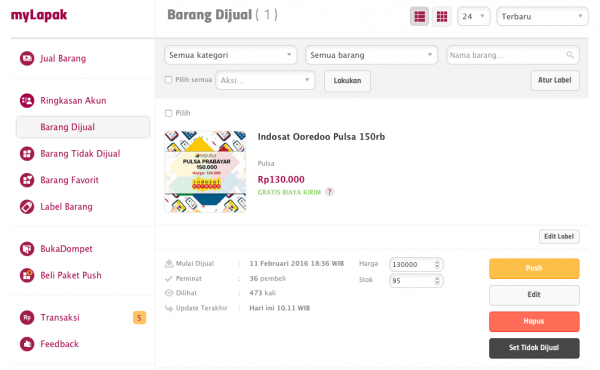

. Sistem akan mengaktifkan produk menjadi Produk Dijual secara otomatis jika stok lebih dari 0 (nol).
+
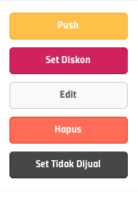

- Push : digunakan untuk melakukan promosi di Bukalapak dan akan dikenakan biaya 
- Set Diskon : digunakan untuk mengatur harga diskon 
- Edit : digunakan untuk mengubah data produk 
- Hapus : digunakan untuk menghapus produk 
- Set Tidak Dijual : digunakan untuk mengubah status produk menjadi tidak dijual atau berarti stok sama dengan 0 (nol).

== Transactions

https://www.bukalapak.com/payment/transactions?from=user_dashboard 

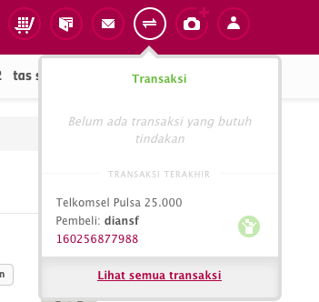

Klik tautan untuk melihat seluruh transaksi di Bukalapak

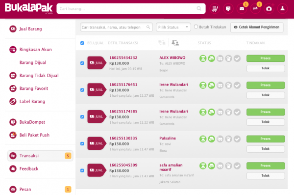

== Pembatalan Order

*Settlement*

. Klik tombol https://www.bukalapak.com/login?comeback=http%3A%2F%2Fwww.bukalapak.com%2Fdompet%3Ffrom%3Duser_dashboard[Buka Dompet] 
+
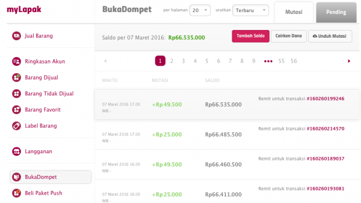 

. Klik tab https://www.bukalapak.com/[Cairkan Dana] dan isikan jumlah dana yang akan dicairkan.
+
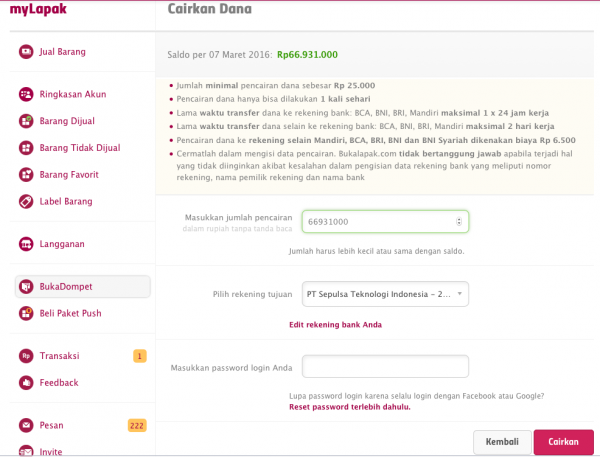

Nama Bank      : BCA

Cabang         : KCU Thamrin

Nama Akun      : PT Sepulsa Teknologi Indonesia 

Nomor Rekening : 2063070*** 

Reprocess Order jika terjadi gagal _top up_ dikarenakan :

. Nomor handphone tidak valid/pasca bayar/tidak aktif provider tidak sama dapat diproses ulang melalui Outlander dengan cara :

. Mengubah status Order di _field_ Order Status menjadi Ready mengubah nomor _handphone_ di _field_ Order Phone
+
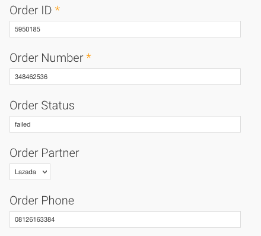 _Ubah status ready di Order_

. Mengubah status Item di _field_ Order Item Status menjadi New
+
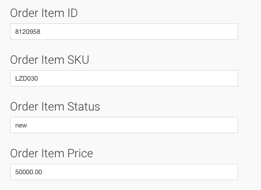 _Ubah status New di Item Order_

*Catatan*

Perlu dipastikan terlebih dahulu apakah status transaksi di Kraken telah menjadi Canceled.
Tidak perlu mengubah nomor _handphone_ di Order Seller Center Bukalapak.
Cukup mengubahnya di order Outlander.
Jika gagal _top up_ terjadi di Kraken, cukup lakukan Reprocess di Kraken dan jangan membuat transaksi baru di Kraken.
Karena Biller Bakoel tidak melakukan verifikasi nomor handphone apakah sesuai dengan provider-nya, segera ubah status Failed di Kraken menjadi Canceled.
Jika ternyata sudah Success, order tersebut tidak dapat dibatalkan ataupun _refund_.

== API Integration

*Api Simple Documentation* https://github.com/ikeyzs/api_doc[Api Simple Dokumentasi]

Development - Staging http://www.blblbl.org/[]

Username : **

Password : **

== Setting Product SKU di Outlander

*Kode Produk di Kraken* 

http://kraken.sepulsa.id/admin/kraken/product[]
+
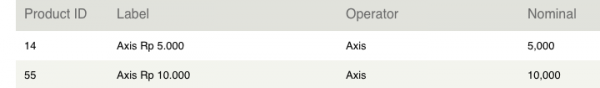 _Kode Produk di Kraken_

== SKU Produk di Bukalapak

Edit produk di Seller Center Bukalapak.

https://www.bukalapak.com/products/z9ge9-jual-smartfren-pulsa-100-000/edit

Kode _**_ adalah SKU produk di Bukalapak.

== Setting Produk di Outlander

https://partner.sepulsa.id/admin/outlander/partner/bukalapak/setting[]

Format = "SKU" : "Product ID"

    { "x2d9a":"62", //Smartfren "z9ge9":"8", "z9g43":"7", "z9fui":"71",  "z9f3c":"2",   // 3 "z8mdr":"1", "z8m19":"22", "z8lq6":"4",    //Axis "z8lg0":"3", "z8ekl":"23", "z8db0":"12",  // XL "z8cpf":"27", "z8cc9":"11", "z89ho":"6",    // Indosat "z895l":"5", "z88ec":"24", "z85d6":"26",  // Telkomsel "z85y9":"9", "z83w6":"10" }

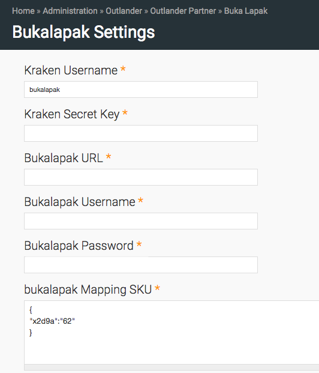

Setting SKU dan Kode Produk di Outlander

== CRON

*Bukalapak* 

Get Order, untuk mengambil order dan item setiap 5 menit sekali 

*Bukalapak* 

Push Kraken Order, untuk mengirimkan item order ke Kraken setiap 5 menit sekali
