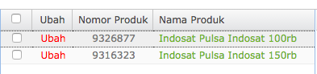

= Partner Elevenia

Seller Center http://soffice.elevenia.co.id/login.do[Seller Center] (112.215.119.**)

Username  : **

Password  : **

== Product

*_Terdapat 3 (tiga) tingkatan kategori_* 

- Kategori 1 : e-coupon & Layanan
- Kategori 2 : Pulsa & Paket Data
- Kategori 3 : Pulsa

== Get Orders
 
Untuk melihat seluruh order yang telah terbayar, ada di menu Pengaturan pesanan \=> Pengaturan pengiriman.

Order Paid Produk Elevenia

== Pembatalan Order

- Untuk melihat seluruh order yang dibatalkan, ada di menu Pengaturan pesanan => Pengaturan pembatalan 
+

+
_Pengaturan pembatalan order Elevenia_

- Klik tautan angka pada kolom pembatalan yang dikehendaki.
+
 
+
_Pengaturan pembatalan order Elevenia_

== Ubah Status Pengiriman

*Dalam Pengiriman -> Pengiriman Selesai*

. Klik tab Pengaturan Pengiriman

. Klik dropdown Status Pesanan -> pilih Dalam Pengiriman 

. Klik tombol Cari Data Dalam Pengiriman akan terlihat.

. Isi kolom Nomor Resi dengan nomor SN atau nomor handphone.

== Ubah Status Dalam Pengiriman menjadi Pengiriman Selesai

. Klik tab Pengaturan Pengiriman Klik dropdown Status Pesanan dan pilih Dalam Pengiriman
+

+
_Order Status Dalam Pengiriman Elevenia_

. Klik tautan Detail Pengiriman di list Order
+

+
_Detail Pengiriman di list Order Elevenia_

. Isikan form Detail Pengiriman untuk field Tanggal Pengiriman dan Nama Penerima.
+
 
+
_Form Detail Pengiriman Elevenia_

== Pengiriman Kartu Perdana / 4G Swap

. Tarik semua order yang ada di list "Order Sedang Diproses"
. Klik Unduh Excel, setelah itu akan di arahkan untuk pengambilan data apa saja yang di perlukan see picture below : 
+

+
_Unduh Excel sedang diproses_

. Setelah semua order di proses, segera lakukan pengisian nomor resi dan ubah status dari sedang di proses menjadi proses pengiriman.

== Ubah Status Order Sedang Diproses menjadi Dalam Pengiriman

. Klik tab Pengaturan Pengiriman

. Klik dropdown Status Pesanan dan pilih Order Sedang Diproses
+
 
+
_Order Status Order Sedang Diproses Elevenia_ 

. Masukkan nomor Resi, klik cek list box jika semua sudah di input nomor resi lalu klik Edit Nomor Resi Pengiriman dan ikuti perintah selanjutnya.
+
 
+
_Edit Nomor Resi Elevenia_

== Settlement

3 (tiga) hari setelah order status menjadi Pengiriman Selesai, Elevenia akan melakukan transfer ke rekening Sepulsa.

== Reprocess Order

Jika terjadi gagal top up dikarenakan :

nomor handphone tidak valid/pasca bayar/tidak aktif provider tidak sama dapat diproses ulang melalui Outlander dengan cara :

- mengubah status Order di field Order Status menjadi ready mengubah nomor handphone di field Order Phone 

- Ubah status ready di Order_ mengubah status Item di field Order Item Status menjadi new
+
image::../images-terra/terra-81.png[]
 
- Ubah status new di Item Order
+
image::../images-terra/terra-82.png[] 

== Catatan

- Perlu dipastikan terlebih dahulu apakah status transaksi di Kraken telah menjadi Canceled.
- Tidak perlu mengubah nomor handphone di order seller center Elevenia.
- Cukup mengubahnya di order Outlander.
- Jika gagal top up terjadi di Kraken, cukup lakukan Reprocess di Kraken dan jangan membuat transaksi baru di Kraken.
- Karena biller Bakoel tidak melakukan verifikasi nomor handphone apakah sesuai dengan provider-nya, segera ubah status Failed di Kraken menjadi Canceled.
- Jika ternyata sudah success, order tersebut tidak dapat dibatalkan ataupun refund.

== API Integration

*API Key* Live 

 

_API Key di Seller Center_

== Staging information

IP: 112.215.119.**  

Change your local DNS settings set to this IP:

    soffice.elevenia.co.id api.elevenia.co.id image.elevenia.co.id www.elevenia.co.id

Username    : **

Password    : **

Openapikey  : **

*Test Buyer* 

Member ID  : **

Password   : **

== VPN

Use Client  : https://zeroshell.org/openvpn-client/[OpenVPN Clients] 

Client Key  : https://sepulsa.slack.com/?redir=%2Ffiles%2Frawis%2FF0JRTR5HV%2Foutlander-client1.ovpn[Config File in Slack] 

== Setting Outlander

https://partner.sepulsa.id/admin/config/system/partner/elevenia[Configuration\->System\->Elevenia Setting]

 

_Nomor Produk (SKU) dari Seller Center Elevenia_

Elevenia Mapping SKU digunakan untuk memetakan produk dari Elevenia agar dikenali oleh Kraken.

*Contoh*

    "9326877":"6"    

9326877 adalah SKU produk dari Sepulsa di seller center Elevenia  

6 adalah kode produk (product id) di Kraken

