= Partner Lazada

== Seller Center

https://asc.sellercenter.lazada.co.id/[Seller Center]

== Akses Admin

Email : **

Password : **

https://lazadacb.formstack.com/forms/seller_registration_form

== Tambah Produk

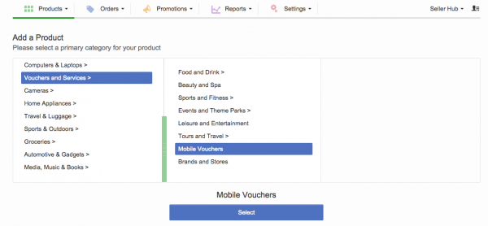

. Untuk menambah produk, pilih kategori Vouchers and Services dan sub kategori Mobile Vouchers.
. Ikuti langkah berikutnya.
. Setelah selesai, Lazada akan melakukan proses QA untuk lolos ke Live
 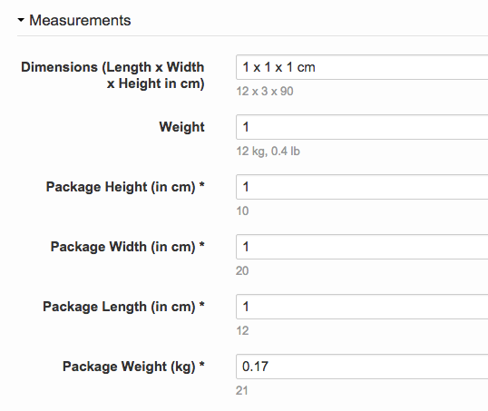

. Karena produk pulsa tidak dikenakan ongkos kirim, masukkan angka 0.17 di field Package Weight.

== Ubah Stok

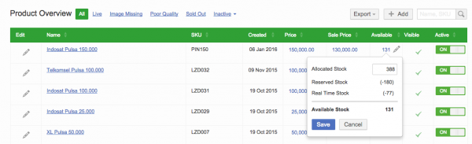

Untuk mengubah stok, klik kolom Available.
Tidak perlu melalui Manage Product karena harus melalui proses QA dari Lazada terlebih dahulu.

Terdapat dua unsur penghitungan stok yaitu :

- Reserved Stock : produk berada di shopping cart Lazada 
- Real Time Stock : stok saat ini Maka, isikan Allocated Stock lebih besar dari jumlah Reserved Stock dan Real Time Stock agar Available Stock menjadi lebih besar dari 0.

== Status Order

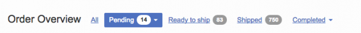

Terdapat 3 (tiga) status Order di Lazada yaitu : Pending, Ready to Ship, Shipped dan Completed.

- Pending : order dari Lazada yang telah terkonfirmasi pembayarannya (PAID)
- Ready to Ship : order telah masuk ke Outlander dan diproses top up ke Kraken 
- Shipped : order telah berhasil ter-top up Completed : order komplit dan masuk daftar settlement Outlander hanya memproses order dengan status Pending dan Ready to Ship.
Status Shipped dan Completed otomatis berubah dari pihak Lazada.

== Cancel Order

Proses Cancel order dapat dilakukan pada saat status masih Ready to Ship.

Di luar itu, perlu konfirmasi ke pihak PSC Lazada melalui email ke partnersupport@lazada.co.id.

== Settlement

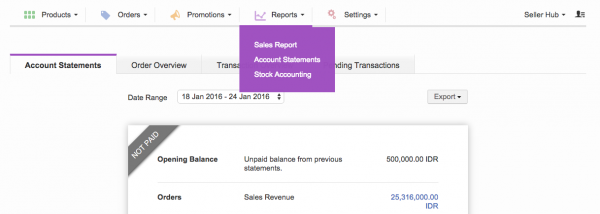

Setiap hari Jumat, Lazada akan men-transfer settlement untuk order periode mingguan ke rekening :

Nama Bank      : BCA 

Cabang         : KCU Thamrin 

Nama Akun      : PT Sepulsa Teknologi Indonesia 

Nomor Rekening : 2063070***

== Perubahan untuk Digital Goods dan New API

https://drive.google.com/open?id=1eD63oJpouuOnr4hXomSuwkfv2FAeagBe[DIGITAL GOODS]

== Outlander

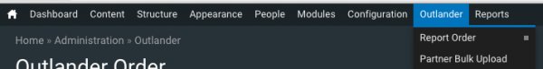

== Orders

https://partner.sepulsa.id/admin/reports/outlander/order[Reports - Report Orders]

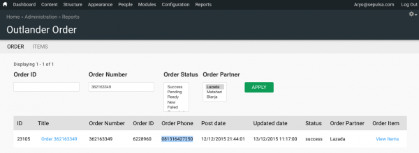 

Halaman ini memuat data seluruh order yang berhasil diambil dari seller center Lazada berstatus Pending.

. Klik tautan pada kolom Title untuk melihat detil dan mengubah order.
. Klik View Items pada kolom Order Item untuk melihat detil produk dari order tersebut.
 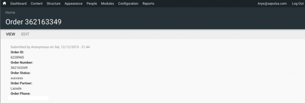 
. Klik tombol Edit untuk mengubah data order.

== Items Order

https://partner.sepulsa.id/admin/reports/outlander/order/items[Reports - Item]

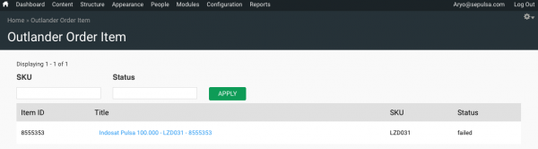

. Klik tautan pada kolom Title untuk melihat detil dan mengubah data item order.
+
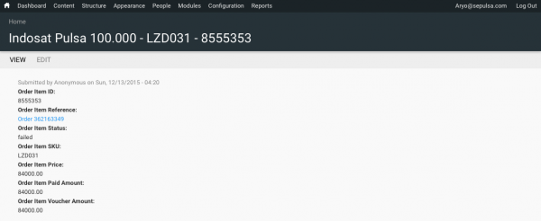
+
. Klik tombol Edit untuk mengubah data item order

== Reprocess Order

Jika terjadi gagal _top up_ dikarenakan nomor _handphone_ tidak valid provider tidak sama, dapat diproses ulang melalui Outlander dengan cara :

. Mengubah status Order di _field_ Order Status menjadi Ready 
+
. Mengubah nomor _handphone_ di _field_ Order Phone 
+
image:../images-terra/terra-28.png[]
+
. mengubah status Item di field Order Item Status menjadi new
+
image:../images-terra/terra-29.png[]

*Catatan*

- Perlu dipastikan terlebih dahulu apakah status transaksi di Kraken telah menjadi Canceled.
- Tidak perlu mengubah nomor handphone di order seller center Lazada.
Cukup mengubahnya di order Outlander.
- Jika gagal top up terjadi di Kraken, cukup lakukan Reprocess di Kraken dan jangan membuat transaksi baru di Kraken.
- Karena biller Bakoel tidak melakukan verifikasi nomor handphone apakah sesuai dengan provider-nya, segera ubah status Failed di Kraken menjadi Canceled.
- Jika ternyata sudah success, order tersebut tidak dapat dibatalkan ataupun refund.

== Comment

- Partner dapat melihat status masing-masing order melalui Outlander for Partner.
+
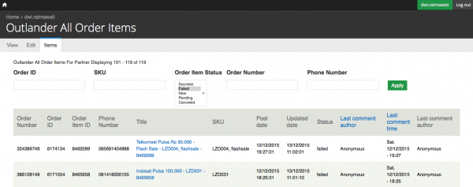
+
- Selain itu, partner dapat berkomunikasi dengan Sepulsa melalui fitur Comment di setiap item order dengan cara mengklik tautan di kolom Title.
+
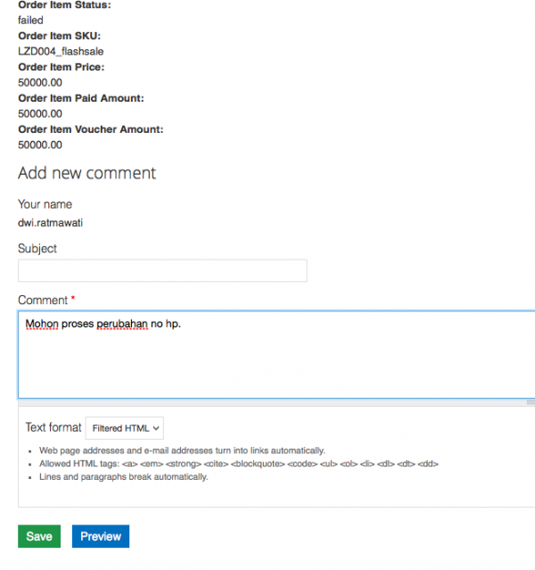 
+
- Sepulsa Customer Service dapat mengirim/membalas Comment dari/ke Lazada
+ 
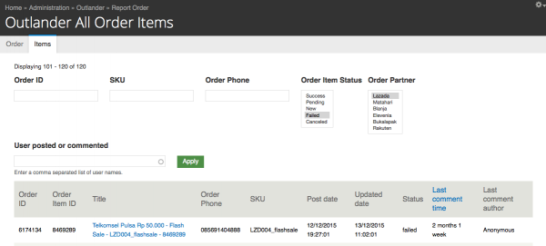

== API Integration

*Documentation*

https://sellercenter.readme.io/inactive[API Documentation] 

https://sellercenter.lazada.co.id/seller/login?redirect_url=https%3A%2F%2Fsellercenter.lazada.co.id%2Fproduct%2Fapi%2Fexplorer[API Explorer] 

untuk mencoba service yang disediakan Lazada https://drive.google.com/open?id=1am-fw7RaEvyvYO_OfopF7U0NLR5BM4Go[NEW API]

*Setting Outlander* 

https://partner.sepulsa.id/admin/config/system/partner/lazada[Configuration\->System\->Lazada Setting] 

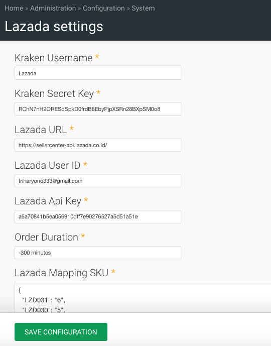

Lazada Mapping SKU digunakan untuk memetakan produk dari Lazada agar dikenali oleh Kraken.

*Contoh*  

 _"LZD031": "6"_   
_LZD031 adalah SKU produk dari Sepulsa di seller center Lazada_ 
_6 adalah kode produk (product id) di Kraken_ 

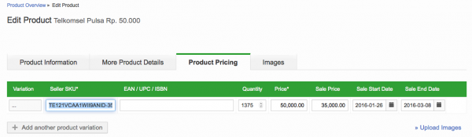

== Product ID Kraken

http://kraken.sepulsa.id/admin/kraken/product

== CRON

*Working lists* *Cron lazada_order* Get Order status *pending* dari Lazada dan insert data ke Outlander.
Order status Outlander diubah menjadi *new*.

*Cron lazada_order_item* Get Item Order dari Lazada berdasarkan Order di Outlander yang berstatus *new* dan insert ke Item Outlander.
Status Outlander diubah untuk Order menjadi *pending* dan Order Item menjadi *new*.

*Cron lazada update_status* Ubah status order di Lazada berdasarkan Order Outlander yang berstatus *pending*.
Jika mendapat return success dari Lazada, ubah status Order Outlander menjadi *ready*.

*Cron lazada* Get Item Order dari Outlander yang status Order *ready* dan Item Order new untuk diproses ke Kraken.
Jika sudah masuk antrian Kraken, status Item Order Outlander menjadi *pending*.
Outlander akan menerima return hasil dari proses top up Kraken (success/failed/refund) dari Kraken (*callback*) dan Outlander mengubah status Item Order-nya sesuai dengan return status dari Kraken tersebut.
Terakhir, status Order Outlander diubah menjadi success/failed.

== Handeling Bugs/Threads

*Pending Order >= 24 hours*

Secara default, order Lazada yang diambil adalah 40 order dari H - 300 menit yang lalu.
Jika ternyata terdapat banyak order yang belum masuk ke Outlander atau order pending lebih dari 6 jam, ubah Order Duration di https://partner.sepulsa.id/admin/config/system/partner/lazada[Configuration\->System\->Lazada Setting].

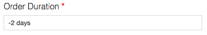 

Masukkan nilai menit/hari sebelum hari ini sebagai rentang waktu order yang akan diambil.
Contoh penulisan :

    -300 minutes, untuk mengambil order sebelum 300 menit -1 day, untuk ambil order sebelum 1 hari -1 month, untuk ambil order sebelum 1 bulan
