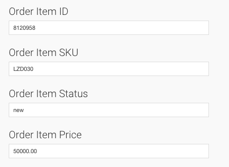

= Partner Matahari Mall

== Seller Center

https://seller.mataharimall.com/login[Seller Center]

== Akses Admin

Email    : **

Password : **

== Tambah Produk

 

_Tambah produk di seller center Matahari Mall_

. Untuk menambah produk, pilih kategori Pre Paid dan sub kategori Pulsa.
. Ikuti langkah berikutnya.
. Setiap penambahan atau perubahan produk akan dilakukan QC Passed oleh pihak Matahari Mall terlebih dahulu.

== Ubah Stok

 

_Ubah stok produk di seller center Matahari Mall_ 

Klik tautan pada kolom Allocated Stocks agar stok dapat langsung berubah tanpa melalui QC Passed dari pihak Matahari Mall terlebih dahulu.

== Status Order

 

_Pilihan/proses perubahan status order di seller center Matahari Mall_

Terdapat 6 (enam) status Order di Matahari Mall yaitu : Pending Shipment, Shipped, Canceled, Delivered, Return, Failed to Deliver.

. Pending Shipment : order dari Matahari Mall yang telah terkonfirmasi pembayarannya (PAID)
. Shipped : order telah berhasil di-top up 
. Canceled : order Matahari Mall dibatalkan
. Delivered  : order komplit dan masuk daftar settlement 
. Return : order yang dibatalkan dan telah dikembalikan 
. Failed to Deliver : order yang gagal dikirimkan

== Shipped Order

 

_Pilihan/proses perubahan status order di seller center Matahari Mall_ 

Ketika order berhasil ter-top up, ubah status dari di seller center Matahari Mall dari Not Shipped menjadi Shipped.

 

_Inputan perubahan status order di seller center Matahari Mall_

Pilih Self Delivery di kolom Select Shipping Provider dan masukkan Tracking Number dengan data Remote trx ID dari Kraken.

== Cancel Order

 

_Pilihan/proses perubahan status order di seller center Matahari Mall_ Pilih Canceled pada order untuk membatalkan order.

 

_Inputan perubahan status order di seller center Matahari Mall_ Pilih Other untuk alasan pembatalan dan masukkan Tracking Number dengan data Remote trx ID dari Kraken.

== Settlement

Pembayaran oleh Matahari Mall sesuai dengan invoice dari Sepulsa dan di-transfer ke :

Nama Bank      : BCA 

Cabang         : KCU Thamrin 

Nama Akun      : PT Sepulsa Teknologi Indonesia 

Nomor Rekening : 2063070***

== Outlander

*Orders* 

_Order Matahari Mall di Order Outlander_ Items Order

 

_Detil Order Matahari Mall di Item Order Outlander_ 

== Reprocess Order

Jika terjadi gagal top up dikarenakan nomor handphone tidak valid/pasca bayar/tidak aktif provider tidak sama dapat diproses ulang melalui Outlander dengan cara :

. mengubah status Order di field Order Status menjadi pending mengubah nomor handphone di field Order Phone
+

+
_Ubah status pending di Order_ 

. mengubah status Item di field Order Item Status menjadi new
+
 
+
_Ubah status new di Item Order_

*_Catatan_* 

. Perlu dipastikan terlebih dahulu apakah status transaksi di Kraken telah menjadi Canceled.
. Tidak perlu mengubah nomor handphone di order seller center Matahari Mall.
. Cukup mengubahnya di order Outlander.
. Jika gagal top up terjadi di Kraken, cukup lakukan Reprocess di Kraken dan jangan membuat transaksi baru di Kraken.
Karena biller Bakoel tidak melakukan verifikasi nomor handphone apakah sesuai dengan provider-nya, segera ubah status Failed di Kraken menjadi Canceled.
. Jika ternyata sudah Success, order tersebut tidak dapat dibatalkan ataupun Refund.

== Integrasi Sistem

*Robot*

- Jika tidak berjalan sebagaimana mestinya, gunakan Teamviewer untuk me-_restart_ Robot.

Partner ID : **

Password   : **

 

_Restart Robot_

- Mematikan robot : Ctrl + C

- Mengaktifkan robot untuk Get Orders : partner@partner:/var/www/partner_ruby$ ruby sepulsa/scheduler_download_mataharimall_order.rb minute 5 1

- Mengaktifkan robot untuk ubah status menjadi Shipped : partner@partner:/var/www/partner_ruby$ ruby sepulsa/scheduler_update_mataharimall_order.rb minute 3 1

- Mengaktifkan robot untuk ubah status menjadi Shipped :  partner@partner:/var/www/partner_ruby$ ruby sepulsa/scheduler_cancel_mataharimall_order.rb minute 5 1

- Mengaktifkan robot untuk Synchronize Product di Outlander :  partner@partner:/var/www/partner_ruby$ ruby sepulsa/scheduler_sync_mataharimall_stock.rb minute 720 1

- Robot hanya mengambil order di halaman pertama dari list Orders di Seller Center.
Maka, jika ternyata lebih dari satu halaman, harus dilakukan proses manual untuk halaman dua dan seterusnya.
Hal ini berlaku baik untuk get orders maupun ubah status order menjadi shipped.

== CRON

Working lists
