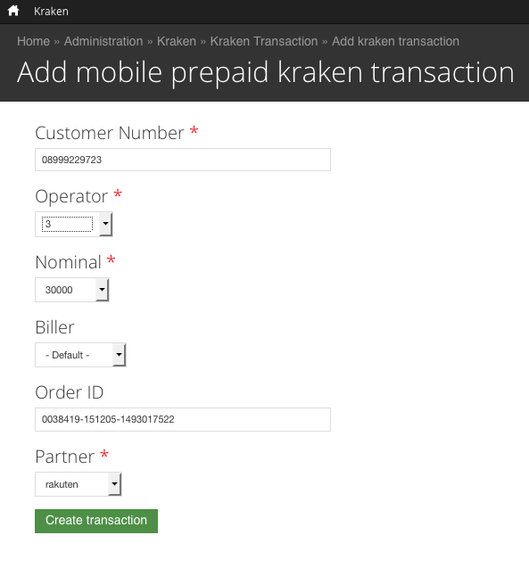

= Partner Rakuten

== Seller Center

https://rms.rakuten.co.id/[Seller Center]

== Akses Admin

Email    : **

Password : **

== Tambah Produk

image::../images-terra/terra-36.png[] 

_Tambah produk di Seller Center Rakuten_ 

- Untuk menambah produk, pilih kategori Gadget / Handphone & Aksesoris dan sub kategori Kartu Telepon.
- Ikuti langkah berikutnya.

== Ubah Stok

_Ubah stok produk di Seller Center Rakuten_

Terdapat 2 (dua) pilihan:

. Increase by : untuk menambahkan stok
. Decrease by : untuk mengurangi stok

== Status Order

 

_Pilihan/proses perubahan status order di Seller Center Rakuten_

Terdapat 5 (lima) status Order di Rakuten yaitu :
Awaiting Payment, Not Shipped, Awaiting Completion, Completed dan Cancelled.

. Awaiting Payment : order dari Rakuten yang belum terkonfirmasi pembayarannya (UNPAID)
. Not Shipped : order telah terkonfirmasi pembayarannya (PAID) dan siap untuk di-_top up_ 
. Awaiting Completion : order telah berhasil ter-top up dan diproses oleh Rakuten
. Completed : order komplit dan masuk daftar settlement Cancelled : order dibatalkan dan _refund_

== Shipped Order

 

_Pilihan/proses perubahan status order di seller center Rakuten_ 

- Ketika order berhasil ter-top up, ubah status dari di seller center Rakuten dari Not Shipped menjadi Shipped.
- Pilih Shipped di kolom Shipping Status dan masukkan Tracking Number dengan data Remote trx ID dari Kraken.

== Cancel Order

== Settlement

image::../images-terra/terra-40.png[] 

_Report settlement di seller center Rakuten_

Pembayaran oleh Rakuten akan dilakukan setiap bulan pada tanggal 7, 17 dan 27 dan di-transfer ke :

Nama Bank : BCA

Cabang : KCU Thamrin 

Nama Akun : PT Sepulsa Teknologi Indonesia 

Nomor Rekening : 2063070***

== Pengecekan Payment

  Username : *****
  Password : *****

== Top Up Manual

https://kraken.sepulsa.id/admin/kraken/transaction/add[Kraken Add Transaction] 

 

_Top up manual di Kraken_

== Outlander

*Orders* 

API REQUEST : 
 
  URL = $\{endpoint}/order/list

Required Parameter(s) :

. marketplaceIdentifier
. shopURL
. createdAfter
. createdBefore

Parameter yg mungkin akan digunakan :

. orderStatus <-- Untuk ambil yang statusnya "NotShipped"

*CONTOH API RESPONSE :*

  { "requestId": "310063be-c1c3-46c7-9820-d48a89d81fc9",  
   "timeStamp": "2016-02-02T10:18:21", 
     "marketplaceIdentifier": "id", 
       "totalCount": 7, 
         "orders": [   
             {    "orderNumber": "0038419-160202-0003796201",  
                  "orderStatus": "AwaitingCompletion",    
                "orderTotal": "130000",     
                  "orderDate": "2016-02-02T00:00:37.000Z",       "lastModifiedDate": "2016-02-02T08:33:21.000Z",      
                   "shipping": {       
                      "orderPackageId": "ff5433c6-c340-49b2-9d5d-c9279f2856c4",         "shippingAddress": { 
                                  "name": "amir",           "phoneNumber": "085752995**",           "postalCode": "74872",           "countryCode": "ID",           "stateCode": "ID-KT",           "city": "Kab.Pulang Pisau",         "address1": "Jl pasanan komp.sei **_ rt.4"         },                     
                        "shippingMethod": "Free Shipping",       
                        "shippingStatus": "Shipped",         "trackingNumber": "berhasil 02/02/2016 - 15:28 SN : 1430150423",      
                        "shippingDate": "2016-02-02T08:33:21.000Z"       },     
                             "payment": {   
                                     "orderPaymentId":"ec9c5844-59a8-4d9f-a698-7e444e20a521",  "paymentMethod":"KlikBCA",   "paymentStatus":"Paid",      "payAmount":"123500",        "pointAmount":"6500",        "paymentDate":"2016-02-02T00:03:14.000Z"       },      "buyerName": "amir",       "buyerEmail": "m.amir.*****@gmail.com",       "buyerPhone":"085752995*"     }   ] }

== Reprocess Order

Request API

URL =

   $\{endpoint}/order/updateShipmentStatus Required Parameter(s):

. marketplaceIdentifier
. orderNumber
. shopURL
. orderPackageId
. shippingStatus
. trackingNumber (optional - use order_item nid)
. shippingDate (optional)

== Cancel Order

URL : 

  $\{endpoint}/order/cancel

Parameter(s):

. marketplaceIdentifier
. orderNumber
. shopURL
. cancelReason (103 - Customer - Wrong Credentials)
. merchantMemo (optional) - Break T&C
. refundAccountInfo (optional) Object : 6.1 bankCode (Appendix B: Marketplace Bank Lists) - 002 6.2 accountName - r 6.3 accountNumber - 1

== API Integration

*Documentation*

https://dac.gen.xyz/cart.html?sld=academy.rakuten&tld=.uk.com&ref=slds[API Documentation - Rakuten Web Link]

 https://drive.google.com/open?id=1vQbNNeVoqxWw2PuOxo_tIHZ4M7oXTtFX[API Documentation PDF]

Akses API

STAGING End Point                 : https://api.rms.global.rakuten.com/1.0/ 

Demo shop URL                     : d-idp-sepulsa		 

Demo shop's RMS Sign-in Email     : ***sepulsa@mail.rakuten.com	

Demo shop's RMS Sign-in Password  : **

Demo shop's Authentication Key    : **

LIVE End Point                    : https://api.rms.global.rakuten.com/1.0/ 

Real Shop URL                    : **

Real shop's Authentication Key    : ** 

== CRON

Working lists
