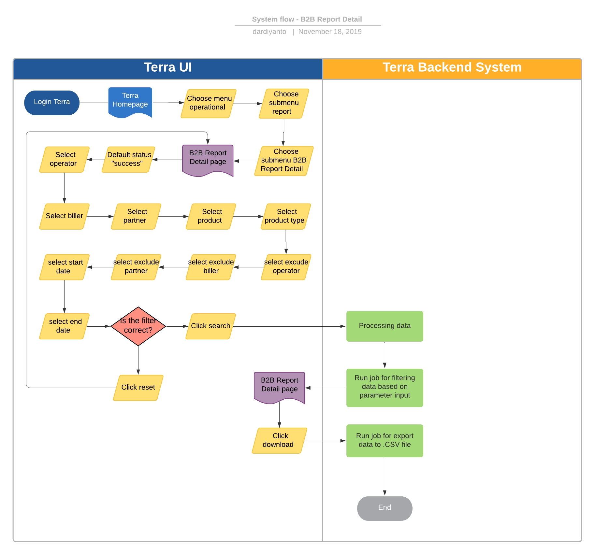

= B2B Detail Report Terra

== Overview

B2B detail report adalah sebuah fitur di Terra yang digunakan untuk melihat data transaksi yang sifatnya _business to business report_ per _biller_ atau per _partner_. 

== User Story

|===
| Nama |Actor| Business Problem | Goal 

| B2B Detail Report 
| OPS
| Pada waktu2 tertentu terkadang _biller_ atau _partner_ ingin update transaksi penjualan dan atau pembelian, OPS kesulitan untuk mebuat report secara manual 
| Bisa mendapatkan histori transaksi produk yang terjual per _biller_ atau per _partner_.
|===

== Development Team

|===
| Position | Tim | Nama

| Product Owner
| Saiyo
| Bayu Setiawan

| Lead Data Engineer
| Saiyo
| Bayu Setiawan

| Data Engineer
| Saiyo
|

| System Analyst
|
|

| Quality Engineer
|
|
|===

== Required Database and Table

Airavata Postgree 

|===
| Scheema | Table | Description 

| Datawarehouse 
| fact_bpa_biller_transaction
| Menyimpan detail data transaksi _partner_ dari semua platform (kraken1, krakenv2, dan krakenlite)

|===

== High Level Diagram

image::../images-terra/terra-Diagram_-_Merge_Biller.png[]

== Workflow System

=== Fitur Daily Report

*Frontend process :*

. Login Terra
. Choose menu 'Operational'
. Click sub menu _'Report'_
. Click sub menu _'B2B Detail Report'_
. Select status _'Success'_
. Select _'Operator'_
. Select _'Biller'_
. Select _'Partner'_
. Select _'Product'_
. Select _'Product Type'_
. Select _'Exclude Operator'_
. Select _'Exclude Biller'_
. Select _'Exclude Partner'_
. Select _'Start Date'_
. Select _'End Date'_
. Click _'Search'_
. Click _'Download'_

*Backend Process :*

. Ketika _user_ selesai memasukkan filter parameter dan klik Search maka akan menjalankan _function_ untuk mengeksekusi _data based on filter_ parameter, sebagai _source data_ transaksinya menggunakan tabel "`_fact_bpa_biller_transaction_`", dalam report ini aturan penyajian datanya adalah transaksi dalam seminggu sebelumnya akan di-_summary_ ke hari Senin(awal minggu selanjutnya).
. Setelah dataset yang kita inginkan selesai diproses maka pada UI Terra akan muncul notifikasi '`processing done`' dan bila user click link _'Download File'_ maka akan me-_triggered_ _function_ untuk menjalankan _job export dataset to csv file_.
