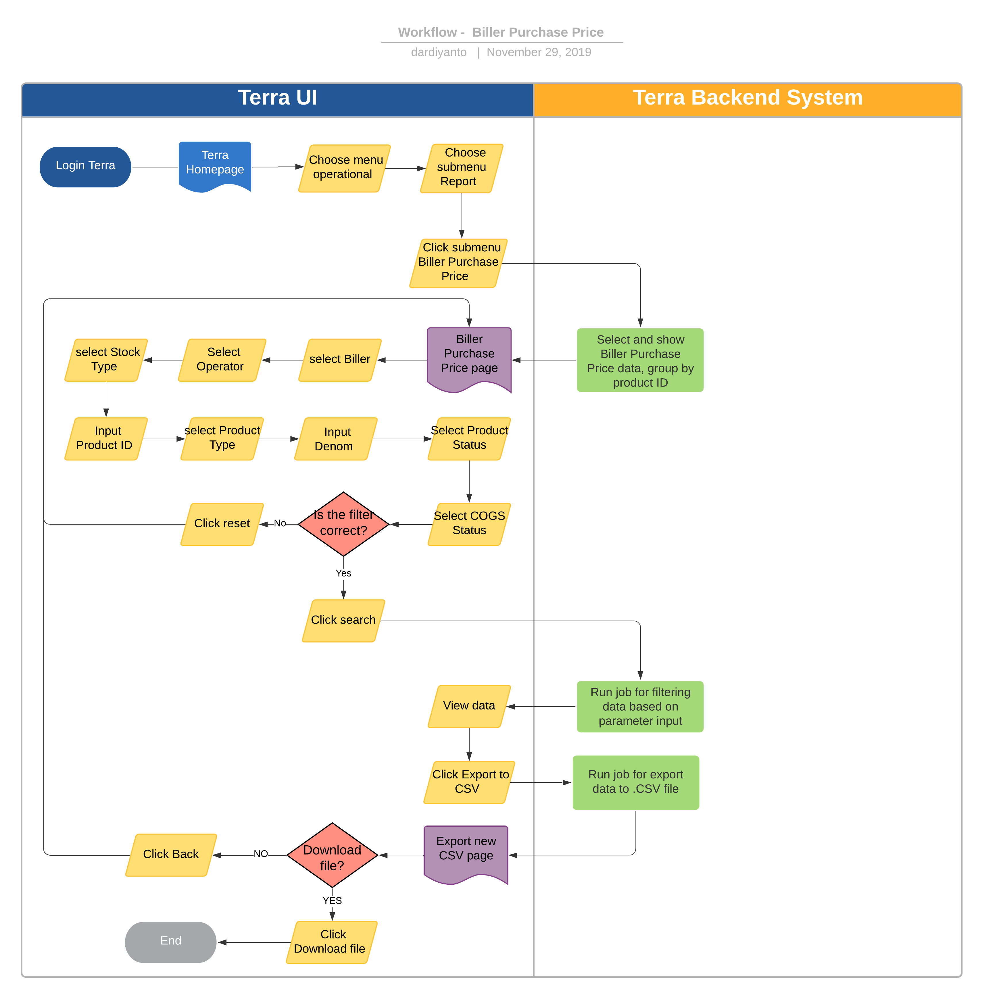

= Biller Purchase Price Terra

== Overview

Biller Purchase Price adalah salah satu fitur _reporting_ di Terra untuk mengetahui harga jual produk ter-_update_ dari _biller_ ke Alterra.
Fitur reporting ini juga mendukung untuk _comparing_ harga jual terendah dan tertinggi dari masing-masing _biller_ untuk semua produk.

== User Story

|===
| Nama | Actor | Business Problem | Goal

| Biller Purchase Price 
| OPS
| Ops kesulitan dalam _monitoring_ dan mendapatkan _reporting_ update harga jual _product_ dari _biller_ untuk Alterra
| 
|===

== Development Team

|===
| Position | Tim | Nama

| Product Owner
| Saiyo
| Bayu Setiawan

| Lead Data Engineer
| Saiyo
| Bayu Setiawan

| Data Engineer
| Saiyo
|

| System Analyst
|
|

| Quality engineer
|
|
|===

== Required Database and Table

Airavata Postgree 
|===
| Schema | Table | Description

| Krakenv2 
| vw_product
| Table View di Schema Krakenv2 yang menyimpan data _detail_ produk

| Krakenv2 
| vw_billers 
| Table View di Schema Krakenv2 yang menyimpan data _detail billers_

| Krakenv2 
| vw_product_biller
| Table View di Schema Krakenv2 yang menyimpan data produk apa saja yang dijual oleh _biller_ tertentu

| Krakenv2
| vw_product_package
| Table View di Schema Krakenv2 menyimpan _mapping product package_ apa saja yang dijual oleh _partner_ tertentu

|===

== High Level Diagram

image::../images-terra/terra-Diagram_-_Merge_Biller.png[Diagram Merge Biller]

== Workflow System

Fitur Biller Purchase Price

 

*Frontend process :*

. Login Terra
. Choose menu _'Operational'_
. Choose submenu _'Report'_
. Click sub menu _'Biller Purchase Price'_
. Select _'Biller'_
. Select _'Operator'_
. Select _'Stock Type'_
. Input _'Product ID'_
. Select _'Product Type'_
. Input _'Denom'_
. Select _'Product Status'_
. Select _'COGS Status'_
. Click _'Search'_
. Click _'Export to CSV'_
. Click _'Download File'_

*Backend Process :*

. Pada saat _user_ klik sub menu _Biller purchase price_ maka akan menjalankan _function_ untuk _select and show data biller purchase price_ di data _tables_ UI Terra _grouping by product ID_.
. Selanjutnya ketika _user_ selesai memasukkan filter parameter dan klik _search_, maka akan menjalankan _function_ untuk mengeksekusi _data based on_ filter parameter sebagai _source_ datanya menggunakan beberapa Table View di Schema Krakenv2 dari _datalake_ _Airavata Postgree.
Ada_ beberapa tambahan _flagging_ yang diinginkan oleh _user_ yaitu _denom status_ dan _COGS status._ Untuk _denom status_ memiliki aturan sebagai berikut:

    Denom ≤ 20.000 = Low denom
    Denom ≥ 20.000 = High denom

** Ada beberapa status dalam _COGS status :_

    Min. COGS = Nilai COGS terendah
    Mid. COGS = Nilai COGS sedang
    Max. COGS = Nilai COGS tertinggi

** Untuk menentukan _flagging COGS status_ akan ada _function_ yang mengelompokkan data by _product_id_ dan _comparing_ COGS berdasarkan _product_ ID tersebut.

    COGS Product dengan nilai tertinggi akan diberikan label 'Max.COGS'
    COGS Product dengan nilai terendah akan diberikan label 'Min. COGS'.
    COGS Product dengan nilai diantara keduanya maka akan diberikan label 'Mid. COGS'

. Setelah dataset yang kita inginkan selesai diproses, maka akan dimunculkan di UI Terra. Langkah berikutnya ketika _user_ klik tombol _export to CSV_, maka akan diarahkan oleh _backend system_ Terra ke _page export new CSV._
. Pada page _export new CSV_ user bisa mengunduh _file_ yang diinginkan dengan cara klik tautan _download file_ maka akan menjalankan _function_ untuk _export file_ ke perangkat _user_.
. Atau apabila _user_ tidak ingin mengunduh _file_ yang sudah diproses sebelumnya bisa klik link _back_ maka oleh _backend system_ Terra akan diarahkan kembali ke _page Biller purchase price_.
