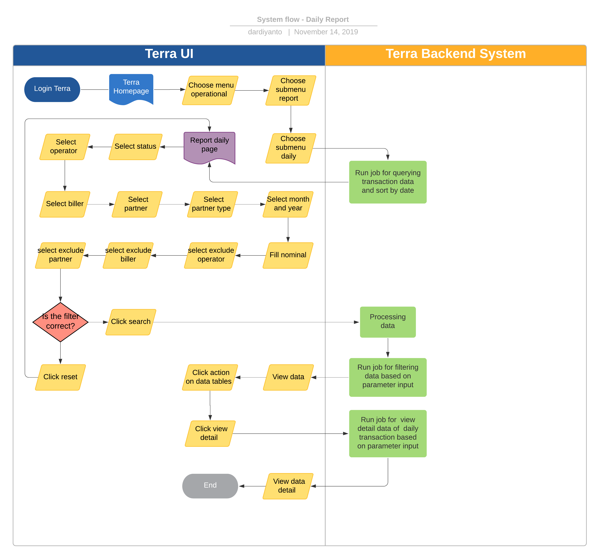

= Daily Report Terra

== Overview

Daily Report adalah sebuah fitur di Terra yang digunakan untuk melihat _summary_ penjualan harian _all product_ dan membaginya ke dalam _basket size_.
Informasi yang ada dalam _report_ ini antara lain:

* Tanggal transaksi
* Total transactions
* Unique number
* Total Denom
* GMV
* COGS
* Basket Size

System ini sangat berguna untuk me-review performa transaksi Alterra _day to day_nya, dan _report_ ini sifatnya _occational based on request_ Corpoorate Strategic atau C-Level.

== User Story

|===
| Nama |Actor| Business Problem | Goal 

| Daily Reports 
| OPS 
| C-level ingin _report summary_ transaksi per hari, dan _tracking basket size_.
Ops kesulitan untuk membuat _report_ tersebut secara manual
| Memenuhi kebutuhan _business_ untuk bisa me-_review summary_ transaksi per hari dan _tracking basket size_.

|===

== Development Team

|===
| Position | Tim | Nama

| Product Owner
| Saiyo
| Bayu Setiawan

| Lead Data Engineer
| Saiyo
| Bayu Setiawan

| Data Engineer
| Saiyo
|

| System Analyst
|
|

| Quality engineer
|
|
|===

== Required Database and Table

Airavata Postgree
|===

| Schema | Table | Description 
| Datawarehouse 
| fact_bpa_biller_transaction
| Menyimpan detail data transaksi _partner_ dari _all platform_ (kraken1, krakenv2, dan krakenlite)

|===

== High Level Diagram

image::../images-terra/terra-Diagram_-_Merge_Biller.png[Diagram Merge Biller]

== Workflow System

Fitur Daily Report

*Frontend Process :*

. Login Terra
. Choose menu _'Operational'_
. Click sub menu _'Report'_
. Click sub menu _'Daily'_
. Select _'Status'_
. Select _'Operator'_
. Select _'Biller'_
. Select _'Partner'_
. Select _'Partner Type'_
. Select _'Month and Year'_
. Fill nominal
. Select _'Exclude Operator'_
. Select _'Exclude Biller'_
. Select _'Exclude Partner'_
. Click _'Search'_
. Click _'Action'_ on data tables (for view detail)
. Click _'View detail'_

*Backend Process :*

. Saat _user_ klik sub menu _report_ '`daily`' akan menjalankan _funtion_  _querying transaction data_ untuk tiap data di tabel _fact_bpa_partner_transaction_ di Schema '`_datawarehouse_`' .
 ** Summary Total Transaction
 ** Summary Total Denom
 ** Summary GMV
 ** Summary COGS
 ** Calculate Basket Size ( _total transaction : price_ )
dan tampilkan hasilnya pada data tabel pada _page report_ harian, _sort by date_ berdasarkan tanggal pada bulan  dengan format _descending_.

. Setelah pengguna memilih filter yang diperlukan dan mengklik Search, sistem _backend_ akan menjalankan _job_ berdasarkan parameter yang dimasukkan menggunakan tabel _fact_bpa_partner_transaction_ , dan akan meng_update_ data tabel di UI Terra.
. Jika _user_ mengklik tombol melihat _detail_ pada data tabel, sistem _backend_ akan menjalankan fungsi untuk menampilkan _detail_ total transaksi semua _product package_ dan pengelompokan berdasarkan _partner_
