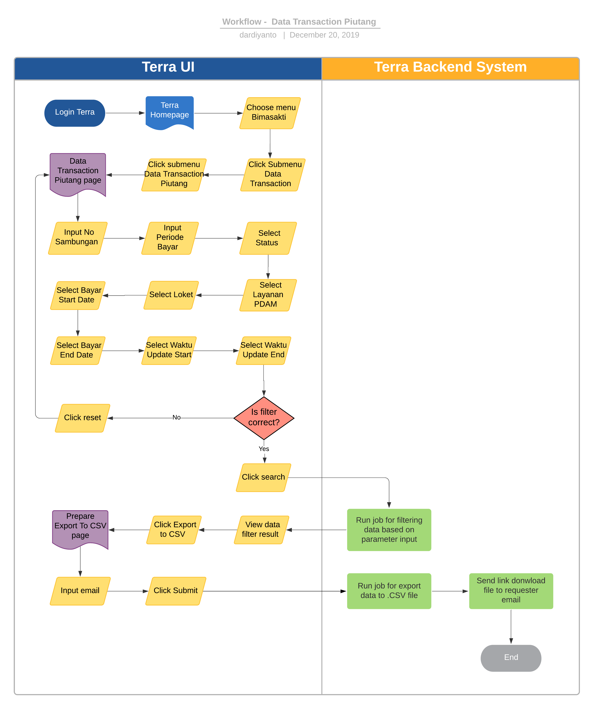

= Data Transaction Piutang Terra

== Overview

Data Transaction Piutang adalah sebuah fitur reporting historical transaksi piutang tagihan PDAM untuk initiative BSA, berikut beberapa informasi yang ada di dalam reporting  Data transaction piutang :

* No Sambungan
* Periode
* Stan lalu
* Stan Sekarang
* Stan Angkat
* Pakai
* Biaya Pemakaian
* Materai
* Rekair
* PPN	Persen
* PPN
* Total
* Tanggal Bayar
* Flag Angsur
* etc.

== User Story

|===
| Nama | Actor| Business Problem | Goal 

| Data transaction piutang
|
| Ada kebutuhan untuk tracking history transaction piutang tagihan PDAM dalam inisiatif BSA
| Bisa mengetahui history transaksi piutang tagihan PDAM untuk di analisa dan menjadi insight bagi team internal|
|===

== Development Team

|===
| Position | Tim | Nama

| Product Owner
| Saiyo
| Bayu Setiawan

| Lead Data Engineer
| Saiyo
| Bayu Setiawan

| Data Engineer
| Saiyo
| Andhika Restama

| System Analyst
|
|

| Quality engineer
|
|
|===

== Required Database and Table

Airavata Postgree 

|===
| Scheema | Table | Description 

| bimasakti 
| tbl_piutang
| 

| bimasakti
| master_loket
|

| bimasakti 
| master_source_db
|
|===

== High Level Diagram

image::../images-terra/terra-Diagram_-_Merge_Biller.png[Diagram Merge Biller]

== Workflow System

*Frontend process :*

. Login Terra
. Choose menu _'Bimasakti'_
. Click submenu _'Data Transaction'_
. Click sub menu _'Data Transaction Piutang'_
. Input _'No Sambungan'_
. Input _'Periode Bayar'_
. Select _'Status'_
. Select _'Layanan PDAM'_
. Select _'Loket'_
. Select _'Bayar Start Date'_
. Select _'Bayar End Date'_
. Select _'Waktu Update Start'_
. Select _'Waktu Update End'_
. Click _'Search'_
. Click _'Export to CSV'_
. Input Email
. Click '_Submit'_

*Backend process :*

. Pada saat _User_ klik sub menu _'Data Transaction Piutang'_ maka akan me-_trigger_ _function_ untuk _select_ transaksi terbaru di table _tbl_piutang_ dari schema bimasakti _*dan akan di show pada datatables di page *Data Transaction Piutang_.
. Selanjutnya ketika _User_ selesai input filter parameter dan klik _'Search'_ maka akan mentriggered function untuk mengexecute data based on filter parameter, sebagai source data transaksi nya menggunakan schema bimasakti table _tbl_piutang_ , _master_loket_, _master_source_db_ dari _datalake_ _airavata postgree_.
. Setelah dataset yang kita inginkan selesai di proses maka akan ditampilkan pada UI Terra, selanjutnya _User_ klik button _export to CSV_ maka akan diteruskan ke page _data transaction piutang prepare export data to CSV._
. Pada page _prepare export data transaction bayar prepare export data to CSV_ user harus menginput alamat email pribadi sepulsa untuk dikirimkan link hasil export data, dilanjutkan dengan klik button _submit_.
. Ketika _User_ menekan button _'Submit'_ akan me-_trigger_ function untuk menjalankan job export dataset to csv file dan akan di store di amazon S3.
Link download file nya akan dikirim ke email yang di-input oleh user.
