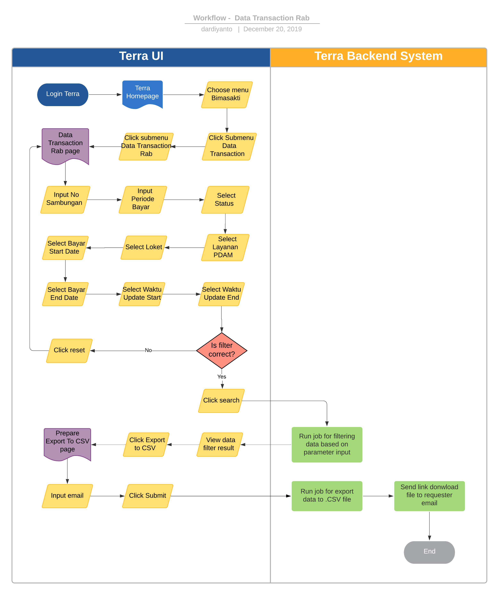

= Data Transaction Rab Terra

== Overview

Data Transaction Rab adalah sebuah fitur reporting historical transaksi pemasangan pelanggan baru PDAM untuk initiative BSA, contohnya seperti : biaya sambungan baru, buka segel, balik nama, perbaikan instalasi, dll.
Berikut beberapa informasi yang ada di dalam reporting  Data transaction piutang :

* No Rab
* No Register
* Nama
* Tanggal Rab
* Valid
* Flag Lunas
* Standart
* Tambahan
* Total
* waktu bayar
* Golongan
* Kepemilikan
* Mulai tagih
* PDAM
* etc.

== User Story

|===
| Nama | Actor| Business Problem | Goal 

| Data transaction Rab 
|
| Ada kebutuhan untuk tracking history transaction Rab pemasangan PDAM baru dalam inisiatif BSA 
| Bisa mengetahui history transaksi rab PDAM untuk di analisa dan menjadi insight bagi team internal

|===

== Development Team

|===
| Position | Tim | Nama

| Product Owner
| Saiyo
| Bayu Setiawan

| Lead Data Engineer
| Saiyo
| Bayu Setiawan

| Data Engineer
| Saiyo
| Andhika Restama

| System Analyst
|
|

| Quality engineer
|
|

|===

== Required Database and Table

Airavata Postgree

|===
| Scheema | Table | Description 

| bimasakti
| tbl_rab
|

| bimasakti 
| master_loket
|
 
| bimasakti 
| master_source_db 
|
|===

== High Level Diagram

image::../images-terra/terra-Diagram_-_Merge_Biller.png[Diagram Merge Biller]

== Workflow System

Fitur Data transaction Rab 

*Frontend process :*

. Login _'Terra_'
. Choose menu _'Bimasakti'_
. Click submenu _'Data Transaction'_
. Click sub menu _'Data transaction Rab'_
. Input _'No Sambungan'_
. Input _'Periode Bayar'_
. Select _'Status'_
. Select _'Layanan PDAM'_
. Select _'Loket'_
. Select _'Bayar Start Date'_
. Select _'Bayar End Date'_
. Select _'Waktu Update Start'_
. Select _'Waktu Update End'_
. Click _'Search_'
. Click _'Export to CSV'_
. Input email
. Click _'Submit'_

*Backend process *

. Pada saat _User_ klik sub menu _Data Transaction Rab_ maka akan me-_trigger_ _function_ untuk _select_ transaksi terbaru di table _tbl_rab_ dari schema bimasakti _*dan akan di show pada datatables di page *Data Transaction Rab_.
. Selanjutnya ketika _User_ selesai input filter parameter dan klik _search_ maka akan me-_trigger_ _function_ untuk meng-_execute_ data berdasarkan filter parameter, sebagai _source_ data transaksi nya menggunakan schema bimasakti table _tbl_rab_ , _master_loket_, _master_source_db_ dari _datalake_ _airavata postgree_.
. Setelah dataset yang kita inginkan selesai di proses maka akan ditampilkan pada UI Terra, selanjutnya user melakukan klik button _export to CSV_ maka akan diteruskan ke page _data transaction rab prepare export data to CSV._
. Pada page _prepare export data transaction bayar prepare export data to CSV_ _User_ harus menginput alamat email pribadi sepulsa untuk dikirimkan link hasil export data, dilanjutkan dengan klik button _submit_.
. Ketika _User_ melakuknan klik button _submit_ akan me-_trigger_ _function_ untuk menjalankan job export dataset to csv file dan akan di store di Amazon S3.
Link download file nya akan dikirim ke email yang di input oleh _User_.
