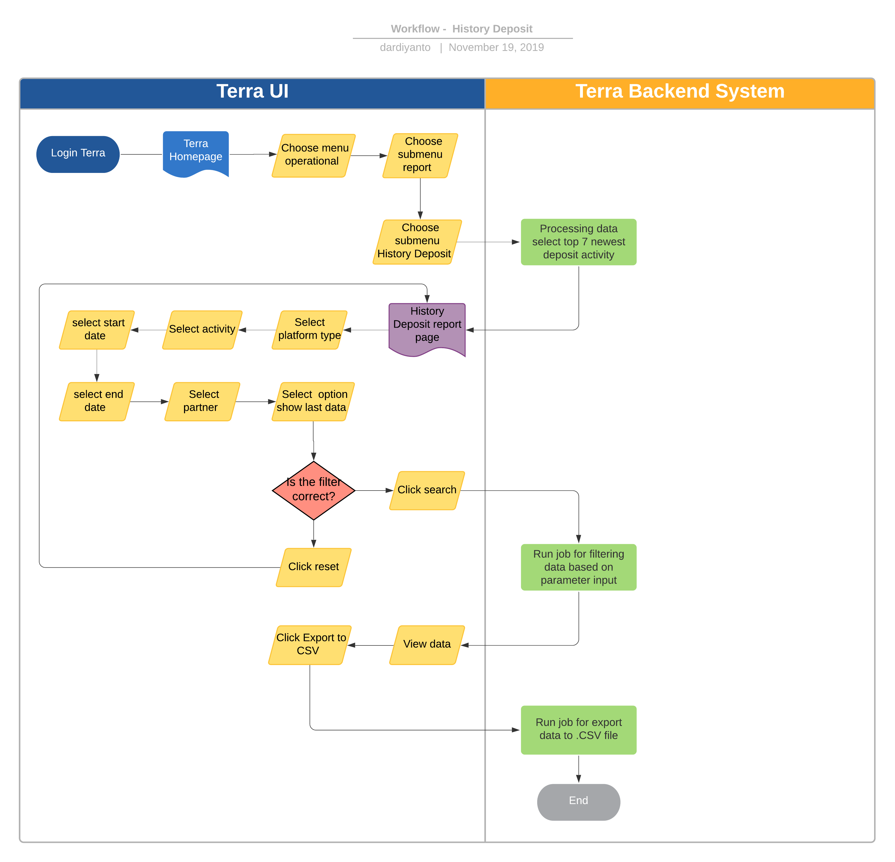

= History Deposit Terra

== Overview

History Deposit adalah satu satu fitur _reporting_ di Terra yang digunakan untuk mengetahui _update history deposit partner_ di Alterra.
Partner yang melakukan deposit ke Alterra disebut juga partner direct, Ada beberapa activity yang mempengaruhi nilai deposit yaitu :

. Transaksi yaitu ketika partner melakukan pembelian product maka akan mengurangi nilai deposit
. Deposit yaitu ketika partner melakukan deposito berupa sejumlah dana ke Alterra maka akan menambah nilai deposit
. Refund atau pengembalian dana deposit apabila transaksi gagal atau terdapat kondisi yang membatalkan transaksi.

== User Story

|===
| Nama | Actor| Business Problem | Goal

| History Deposit
| OPS 
| Kesulitan untuk _tracking_ historical deposit _partner_ ke Alterra 
| Bisa mengetahui history deposit dan last nominal deposit untuk insight team internal

|===

== Development Team

|===
| Position | Tim | Nama

| Product Owner
| Saiyo
| Bayu Setiawan

| Lead Data Engineer
| Saiyo
| Bayu Setiawan

| Data Engineer
| Saiyo
|

| System Analyst
|
|

| Quality engineer
|
|

|===

== Required Database and Table

Airavata Postgree 

|===
| Scheema | Table | Description
 
| Kraken 
| public_kraken deposit 
| Menyimpan data transaksi deposit dari platform kraken1

| Krakenv2 
| partner_balance_histories 
| Menyimpan data transaksi deposit dari platform kraken2

|===

== High Level Diagram

image::../images-terra/terra-Diagram_-_Merge_Biller.png[Diagram Merge Biller]

== Workflow System

=== Fitur History Deposit Report

*Frontend process :*

. Login Terra
. Choose menu _'Operational'_
. Click sub menu _'Report'_
. Click sub menu _'History Deposit'_
. Select _'Platform Type'_
. Select _'Activity Type'_
. Select _'Start Date'_
. Select _'End Date'_
. Select _'Partner'_
. Select option '_Show Last Data_'
. Click _'Search'_
. Click _'Export to CSV'_

*Backend process :*

. Pada saat _User_ klik sub menu _'History Deposit'_ maka akan me-_trigger_ function untuk _select_ 7 transaksi terbaru dan akan ditampilkan pada data tables di page _'History Deposit Report'_.
. Selanjutnya ketika _User_ selesai melakukan input filter parameter dan klik '_Search_' maka akan me-_triggered_ function untuk melakukan _execute_ data berdasarkan filter parameter, sebagai source data transaksi nya menggunakan 2 schema dari datalake airavata postgree
 ** Platform kraken 1 - Untuk transaksi dari platform kraken 1 sebagai source datanya menggunakan table _'public_kraken deposit'_ pada schema _'kraken'_
 ** Platform kraken 2 - Untuk transaksi dari platform kraken 2 sebagai source datanya menggunakan table _'partner_balance_histories'_ pada schema _'krakenv2'_
. Setelah dataset yang kita inginkan selesai di proses maka akan ditampilkan pada UI Terra, selanjutnya _User_ klik link _'download file'_ maka akan me-_trigger_ function untuk menjalankan job export dataset to csv file.
