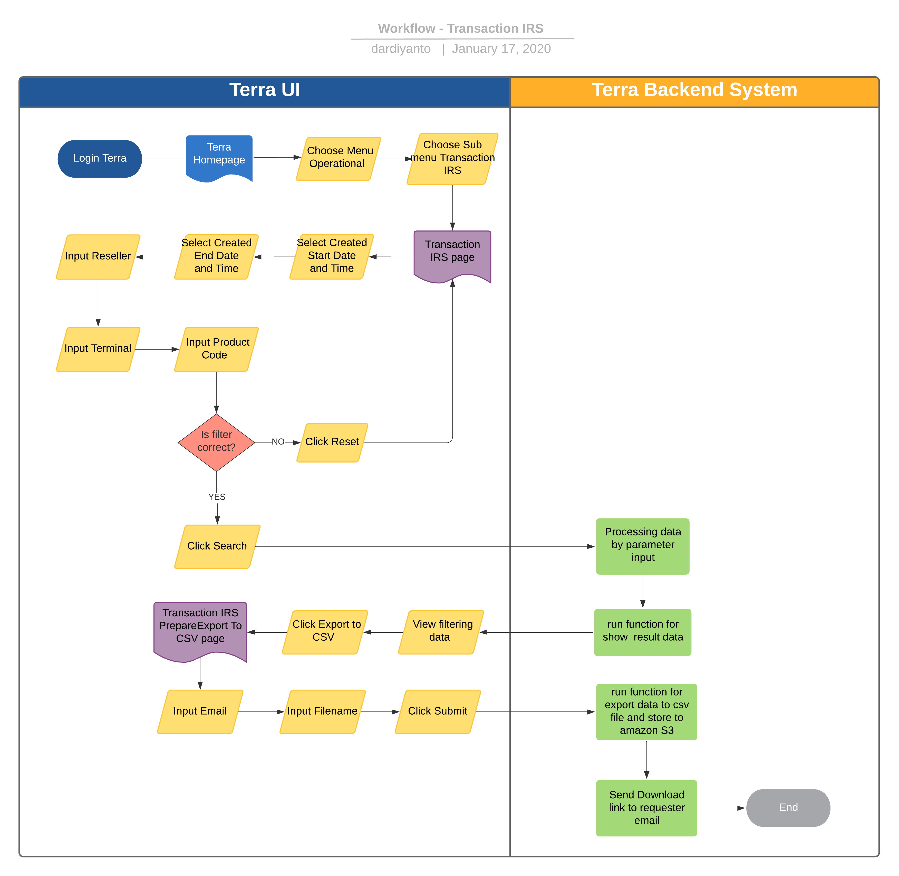

= IRS Transaction Terra

== Overview

IRS transaction adalah fitur _reporting_ di Terra yang digunakan untuk mengetahui _history transaction_ dari Kraken _reseller_ lainnya ke lokal _partner_ IRS.
Terdapat beberapa terminal yang bisa menjadi _biller_, diantaranya;

. TC 2 H2H
. CMS 2
. CMS 5
. CMS 6
. MP3 SUKABUMI PROD
. TRI KARAWANG
. Etc.

== User Story

|===
| Nama | Actor| Business Problem | Goal 

| IRS Transaction 
| OPS
| Kesulitan untuk tracking history transaction kraken dan pronghorn as partner ke biller lokal IRS 
| Bisa mengetahui history transaksi ke biller lokal untuk di analisa dan menjadi insight bagi team internal
|===

== Development Team

|===
| Position | Tim | Nama

| Product Owner
| Saiyo
| Bayu Setiawan

| Lead Data Engineer
| Saiyo
| Bayu Setiawan

| Data Engineer
| Saiyo
|

| System Analyst
|
|

| Quality engineer
|
|
|===

== Required Database and Table

Airavata Postgree

|===
| Scheema | Table | Description 

| irs_raw
| transaction 
| Menyimpan data transaksi IRIS 

|===

== High Level Diagram

image::../images-terra/terra-Arsitektur_diagram_-_imperium.png[Arsitektur Diagram Imperium]

== Workflow System

=== Fitur IRS Transaction Report

*Frontend process :*

. Login Terra
. Choose menu _'Operational'_
. Choose submenu -'Transaction IRS'_
. Select _'Created Start Date and Time'_
. Select _'Created End Date and Time'_
. Input _'Reseller'_
. Input _'Terminal'_
. Input _'Product Code'_
. Click _'Search'_
. Click _'Export to CSV'_
. Input email
. Input _'Filename'_
. Click _'Submit'_

*Backend process :*

. Pada saat _User_ klik sub menu _'Transaction IRS'_ maka akan diarahkan menuju page Transaction IRS
. Selanjutnya ketika _User_ selesai input filter parameter dan klik search maka akan me-_trigger_ function untuk mengexecute data based on filter parameter, sebagai source data transaksi nya menggunakan table _transaction_ dari schema _irs_raw_ mengguankan datalake di BigQuery.
. Setelah dataset yang kita inginkan selesai di proses maka akan ditampilkan pada UI Terra, selanjutnya _User_ klik button _export to CSV_ maka akan diteruskan ke page _transaction IRS prepare export data to CSV._
. Pada page _transaction IRS prepare export data to CSV_ _User_ harus menginput alamat email pribadi sepulsa untuk dikirimkan link hasil export data, dilanjutkan dengan klik button _Submit._
. Ketika _User_ klik button _Submit_ akan me-_trigger_ function untuk menjalankan job export dataset to csv file dan akan di store di Amazon S3.
Link download file nya akan dikirim ke email yang sudah di input oleh _User_.
