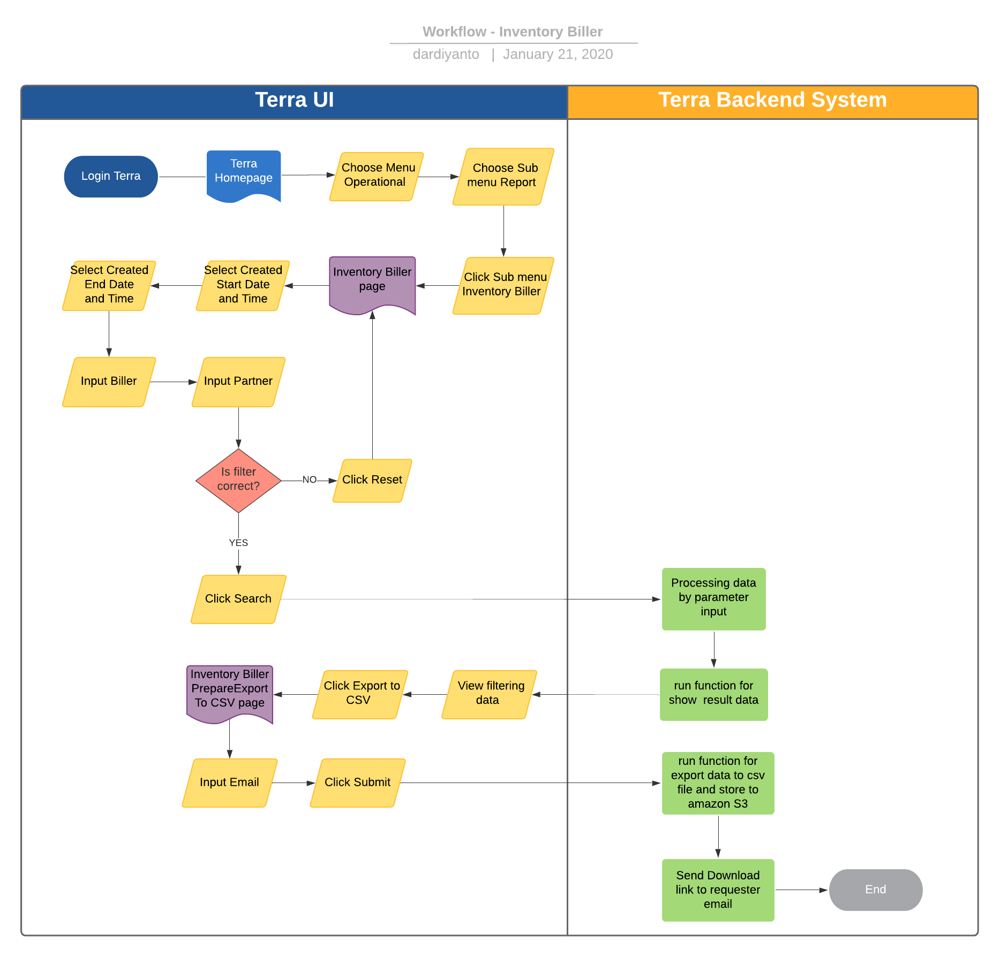

= Inventory Biller Terra

== Overview

Inventory Biller adalah fitur reporting di terra yang digunakan untuk mengetahui history deposit dan sisa saldo yang dimiliki partner2 di biller tertentu.
Berikut beberapa informasi yang ada di report Inventory Biller :

. id
. Biller
. Dompul Code
. Partner Name
. Denom
. Deposit
. Created

== User Story

|===
| Nama | Actor | Business Problem | Goal 

| Inventory Biller 
| OPS 
| Kesulitan untuk mengetahui historical data sisa deposit partner pada biller2 tertentu 
| Bisa mengetahui history sisa deposit partner pada beberapa biller untuk di analisa dan menjadi insight bagi team internal

|===

== Development Team

|===
| Position | Tim | Nama

| Product Owner
| Saiyo
| Bayu Setiawan

| Lead Data Engineer
| Saiyo
| Bayu Setiawan

| Data Engineer
| Saiyo
|

| System Analyst
|
|

| Quality engineer
|
|
|===

== Required Database and Table

Airavata Postgree 

|===
| Scheema | Table | Description 

| internal
| inventory_biller 
| Menyimpan data history deposit

| internal 
| Dompul
| Menyimpan data dompul code
|===

== High Level Diagram

image::../images-terra/terra-Arsitektur_diagram_-_imperium.png[Arsitektur Diagram Imperium]

== Workflow System

=== Fitur Inventory Biller Report

*Frontend process :*

. Login Terra
. Choose menu _'Operational'_
. Choose submenu _'Report'_
. Click submenu _'Inventory Biller'_
. Select _'Created Start Date and Time'_
. Select _'Created End Date and Time'_
. Input _'Biller'_
. Input _'Partner'_
. Click _'Search'_
. Click _'Export to CSV'_
. Input email
. Click _'Submit'_

*Backend process :*

. Pada saat _User_ klik sub menu _'Inventory Biller'_ maka akan diarahkan menuju page _'Inventory Biller'_ dan akan menjalankan _function_ untuk _select history_ deposit pada table _inventory_biller_ based on created date terbaru.
. Selanjutnya ketika _User_ selesai input filter parameter dan klik _'Search'_ maka akan me-_trigger_ _function_ untuk melakukan _execute_ data based on filter parameter, sebagai source data nya menggunakan table _inventory_biller_ dari schema _internal_ mengguankan datalake airavata postgree dan di joinkan ke table _dompul_ schema _internal_.
. Setelah dataset yang kita inginkan selesai di proses maka akan di show di ui terra, next step        nya user click button _export to CSV_ maka akan diteruskan ke page inventory biller _prepare export data to CSV._
. Pada page _Inventory Biller prepare export data to CSV_ user harus menginput alamat email pribadi sepulsa untuk dikirimkan link hasil export data, di lanjutkan dengan click button _submit._
. Ketika user click button _submit_ akan mentriggered function untuk menjalankan job export dataset to csv file dan akan di store di Amazon S3.
Link download file nya akan dikirim ke email yang sudah di-input oleh _User_.
