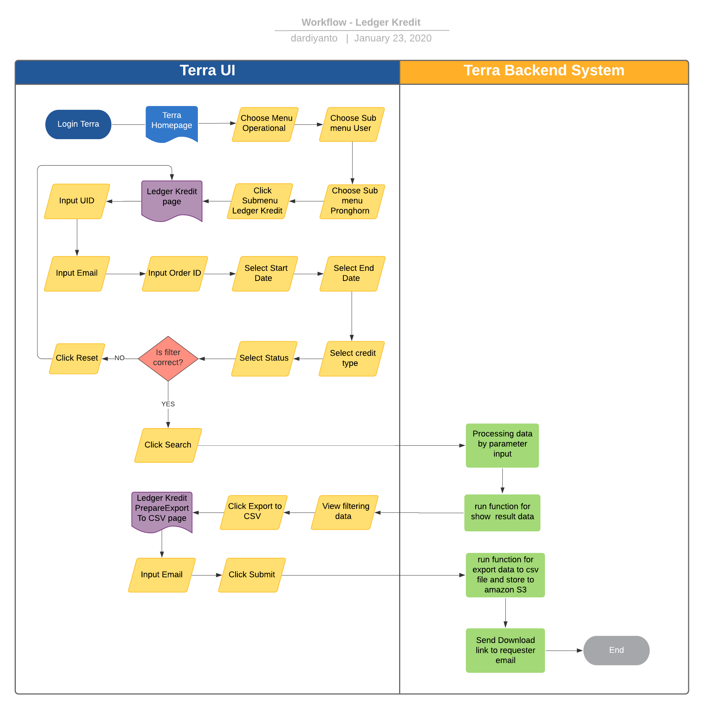

= Ledger Kredit Terra

== Overview

Ledger Kredit adalah fitur reporting pada terra yang digunakan untuk mengetahui history transaksi di ledger user pronghorn atau sepulsa.com (transaction, deposit & refund)

. Transaksi yaitu ketika partner melakukan pembelian product maka akan mengurangi nilai deposit
. Deposit yaitu ketika user melakukan deposito berupa sejumlah dana ke sepulsa credits Alterra maka akan menambah nilai deposit
. Refund atau pengembalian dana deposit apabila transaksi gagal atau terdapat kondisi yang membatalkan transaksi.

== User Story

|===
| Nama | Actor| Business Problem | Goal 

| Ledger Kredit  
| OPS 
| Kesulitan untuk tracking historical deposit sepulsa credits dari user ke alterra
| Bisa mengetahui history deposit dan last nominal deposit untuk insight team internal
|===

== Development Team

|===
| Position | Tim | Nama

| Product Owner 
| Saiyo
| Bayu Setiawan

| Lead Data Engineer 
| Saiyo 
| Bayu Setiawan 

| Data Engineer 
| Saiyo
|  

| System Analyst 
|
|

| Quality engineer 
|
|

|===

== Required Database and Table

Airavata Postgree 

|===

| Scheema | Table | Description

| pronghorn 
| userpoints_txn 
| Menyimpan data user points customer di sepulsa.com

| pronghorn
| users 
| Menyimpan data user pronghorn

| pronghorn 
| taxonomy_term_data 
| Menyimpan data credit type

|===

== High Level Diagram

image::../images-terra/terra-Diagram_-_Merge_Biller.png[Diagram Merge Biller]

== Workflow System

=== Fitur History Deposit Report

*Frontend process :*

. Login Terra
. Choose menu _'Operational'_
. Click sub menu _'User'_
. Click sub menu _'Pronghorn'_
. Click sub menu _'Ledger Kredit'_
. Input _'UID'_
. Input Email
. Input _'Order ID'_
. Select _'Start Date'_
. Select _'End Date'_
. Select _'Credit Type'_
. Select _'Status'_
. Click _'Search'_
. Click _'Export to CSV'_
. Input Email
. Click _'Submit'_

*Backend process :*

. Pada saat user klik sub menu Ledger Kredit maka akan mentrigger function untuk select activity ledger kredit terbaru pada table _userpoints_txn_ dan akan di show pada datatables di page Ledger Kredit.
. Selanjutnya ketika user selesai input filter parameter dan klik search maka akan mentriggered function untuk mengexecute data based on filter parameter, sebagai source data nya menggunakan schema pronghorn dari datalake airavata postgre, table yang digunakan adalah _userpoints_txn_ lalu akan di join dengan table _user_ dan _taxonomy_term_data_.
. Setelah dataset yang kita inginkan selesai di proses maka akan di show di ui terra, next step        nya user click button _export to CSV_ maka akan diteruskan ke page Ledger Kredit _prepare export data to CSV._
. Pada page _Ledger kredit prepare export data to CSV_ user harus menginput alamat email pribadi sepulsa untuk dikirimkan link hasil export data, di lanjutkan dengan click button _submit._
. Ketika user click button _submit_ akan mentriggered function untuk menjalankan job export dataset to csv file dan akan di store di amazon S3.
Link download file nya akan dikirim ke email yang sudah di input oleh user.
