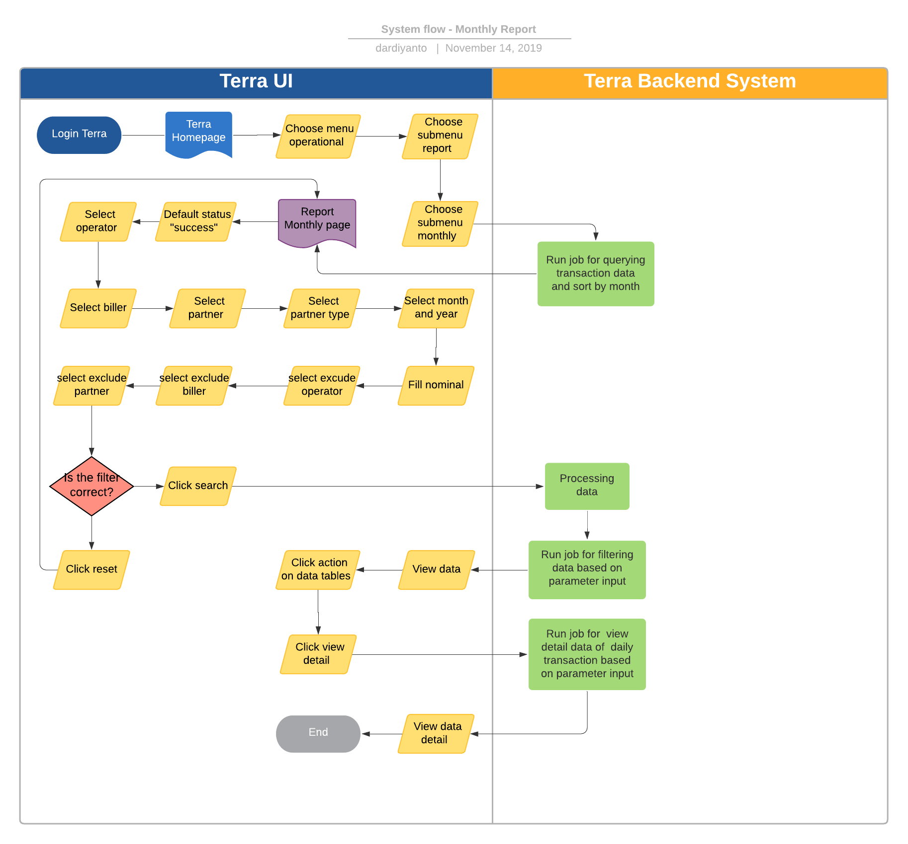

= Monthly Report Terra

== Overview

Monthly Report adalah sebuah fitur di terra yang digunakan untuk melihat summary penjualan bulanan all product dan membaginya ke dalam basket size.
Informasi yang ada dalam report ini antara lain

* Tanggal transaksi
* Total transactions
* Unique number
* Total Denom
* GMV
* COGS
* Basket Size

System ini sangat berguna untuk me-review performa transaksi alterra dengan range per bulan, dan report ini sifat nya occational based on request Corpoorate Strategic atau C-Level.

== User Story

|===
| Nama | Actor| Business Problem | Goal

| Daily Reports 
| OPS
| C-level ingin report summary transaksi per hari, dan tracking basket size.
Ops kesulitan untuk membuat report tersebut secara manual
| Memenuhi kebutuhan business untuk bisa me-review summary transaksi per hari dan tracking bazket size.
|===

== Development Team

|===
| Position | Tim | Nama

| Product Owner
| Saiyo
| Bayu Setiawan

| Lead Data Engineer
| Saiyo
| Bayu Setiawan

| Data Engineer
| Saiyo
|

| System Analyst
|
|

| Quality engineer
|
|
|===

== Required Database and Table

Airavata Postgree

|===
| Scheema | Table | Description

| Datawarehouse
| fact_bpa_biller_transaction
| Menyimpan detail data transaksi partner dari all platform (kraken1, krakenv2, dan krakenlite)
|===

== High Level Diagram

image::../images-terra/terra-Diagram_-_Merge_Biller.png[Diagram Merge Biller]

== Workflow System

Fitur Monthly Report

=== Fitur Daily Report

*Frontend process :*

. Login Terra
. Choose menu _'Operational'_
. Click sub menu _'Report'_
. Click sub menu _'Monthly'_
. Select _'Status'_
. Select _'Operator'_
. Select _'Biller'_
. Select _'Partner'_
. Select _'Partner Type'_
. Select _'Month and Year'_
. Fill nominal
. Select _'Exclude Operator'_
. Select _'Exclude Biller'_
. Select _'Exclude Partner'_
. Click _'Search'_
. Click _'Action'_ on data tables (for view detail)
. Click _'View Detail'_

*Backend process :*

. When user click submenu report '`monthly`' will triggered job for querying transaction data on table _fact_bpa_partner_transaction_ in schema '`_datawarehouse_`' for each date and grouping by month.
 ** Summary total transaction
 ** Summary total denom
 ** Summary GMV
 ** Summary COGS
 ** Calculate basket size ( Total transaction : price )

and show the result on datatables at page report _monthly_, sort by month in current year with descending format.

. Once user select needed filter and click search, backend system will running job based on parameter inputed using table _fact_bpa_partner_transaction_ , and will update the datatables on UI Terra.

. If user click button view detail on datatables, backend system will running function for showing detail total transaction all product package and grouping by partner.
