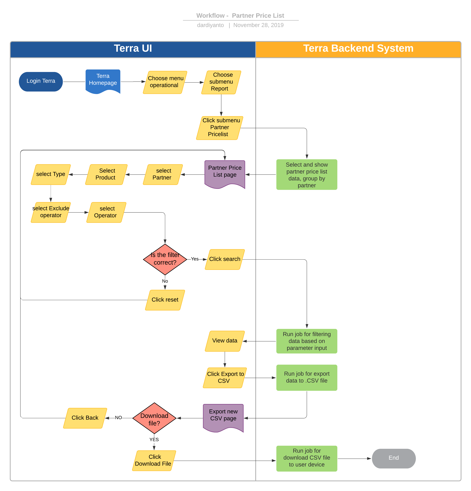

= Partner Price List Terra

== Overview

Partner Price List adalah salah satu fitur _reporting_ di Terra yang berguna untuk mengetahui harga jual _product_ ter-_update_ dari Alterra ke Partner, biasanya _report_ ini digunakan untuk _monitoring_ harga jual seluruh _product_ Alterra ke _partner_ karena masing-masing _partner_ mendapat harga yang berbeda.
Report ini juga digunakan _finance_ untuk memastikan harga _product_ yang akan difakturkan sudah sesuai dengan harga jual terbaru karena perubahan harga pada _product_ sangat sering terjadi karena beberapa faktor.

== User Story

|===
| Nama | Actor| Business Problem | Goal

| Partner Price list 
| OPS
| Kesulitan dalam _monitoring_ dan mendapatkan _reporting update_ harga jual terbaru ke _partner_ untuk _all product_ 
| Mampu memonitoring harga pembelian ke partner untuk seluruh produk.

|===

== Development Team

|===
| Position | Tim | Nama

| Product Owner
| Saiyo
| Bayu Setiawan

| Lead Data Engineer
| Saiyo
| Bayu Setiawan

| Data Engineer
| Saiyo
|

| System Analyst
|
|

| Quality engineer
|
|
|===

== Required Database and Table

Airavata Postgree

|===
| Scheema | Table | Description 

| public
| product_package_partner_biller
| Menyimpan data package product dan mp price product

|===

== High Level Diagram

image::../images-terra/terra-Diagram_-_Merge_Biller.png[Diagram Merge Biller]

== Workflow System

Fitur Partner Price List

 *Frontend process :*

. Login Terra
. Choose menu _'Operational'_
. Choose submenu _'Report'_
. Click sub menu _'Partner Price List'_
. Select _'Partner'_
. Select _'Product'_
. Select _'Type'_
. Select _'Exclude Operator'_
. Select _'Operator'_
. Click _'Search'_
. Click _'Export to CSV'_
. Click _'Dwonload'_

*Backend process :*

. Pada saat user klik sub menu _Partner Price List_ maka akan mentrigger function untuk select and show data partner price list di datatables UI terra grouping by partner.
. Selanjutnya ketika user selesai input filter parameter dan klik search maka akan mentriggered function untuk mengexecute data based on filter parameter, sebagai source data transaksi nya menggunakan table _product_package_partner_biller_ di schema _public_ dari _datalake_ _airavata postgree_
. Setelah dataset yang kita inginkan selesai di proses maka akan di show di ui terra, next ketika user click button _export to CSV_ maka akan di arahkan oleh backend system terra ke page _export new CSV ._
. Pada page _export new CSV_ user bisa mendownload file yang di inginkan dengan cara click link _download file_ maka akan mentrigger function untuk export file ke device user
. Atau bila user tidak ingin mendownload file yang sudah di proses sebelumnya bisa click link _back_ maka oleh backend system terra akan di arahkan kembali ke page _Partner Price List_
