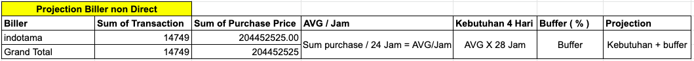
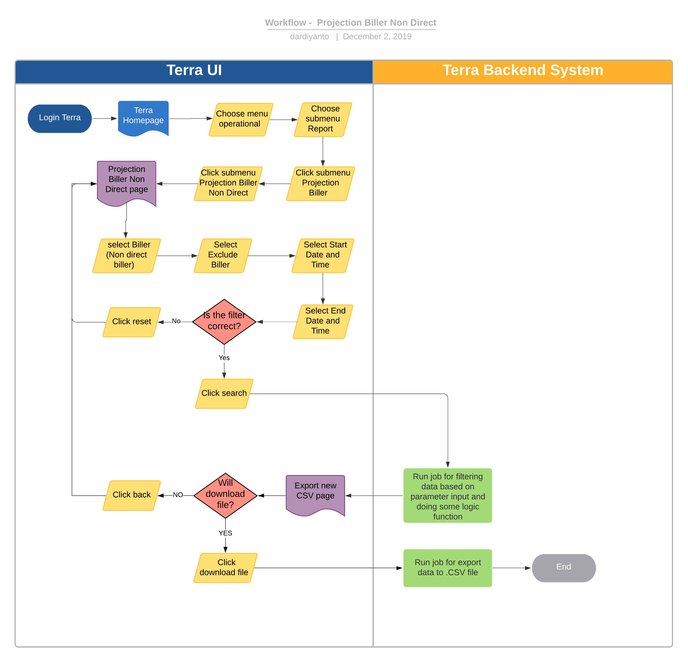

= Project Biller Non Direct Terra

== Overview

Projection Biller non Direct adalah salah satu fitur reporting di terra yang digunakan untuk mengetahui trend transaksi dr alterra ke biller dengan type non direct dan suggestion berapa jumlah yang harus di depositkan oleh alterra ke biller dalam range tanggal sesuai filter input dengan aturan yang sudah di tetapkan oleh team ops sebelumnya.
Berikut rule projection biller non direct :

== User Story 

|===

| Nama | Actor| Business Problem | Goal

| Projection biller direct
| OPS
| Selama ini OPS menghitung dan melakukan planning untuk deposit ke biller dengan type non direct biller secara manual, akan lebih efisien bila hal tersebut bisa di-automate di Terra
| Mampu mendapatkan laporan _projection biller_ secara otomatis dalam beberapa rentan waktu

|===

== Development Team

|===
| Position | Tim | Nama

| Product Owner
| Saiyo
| Bayu Setiawan

| Lead Data Engineer
| Saiyo
| Bayu Setiawan

| Data Engineer
| Saiyo
| Vera Rusmalawati

| System Analyst
|
|

| Quality engineer
|
|
|===

== Required Database and Table

Airavata Postgree

|===

| Scheema | Table | Description 

| krakenv2 
| transactions_flash
| Menyimpan data detai transaksi dari kraken v1 dan krakenv2

| internal 
| buffer_nominal
| Menyimpan data buffer yang di set oleh ops

|===

== High Level Diagram

image::../images-terra/terra-Diagram_-_Merge_Biller.png[Diagram Merge Biller]

== Workflow System

Fitur Projection Biller Non Direct

*Frontend process :*

. Login Terra
. Choose menu _'Operational'_
. Choose submenu _'Projection Biller'_
. Click submenu _'Projection Biller Non Direct'_
. Select _'Biller (non direct biller)'_
. Select _'Exclude Biller'_
. Select _'Start Date and Time'_
. Select _'End Date and Time'_
. Click _'Search'_
. Click _'Download File'_

*Backend process :*

. Pada saat user klik sub menu _Projection biller non direct_ maka akan diarahkan ke form input filter _projection biller non direct_.
. Selanjutnya ketika user selesai input filter parameter dan klik _search_ maka akan mentriggered function untuk mengexecute data based on filter parameter, berikut formula yang digunakan untuk mencari nilai projection biller;

 

 ** Pertama function akan select count transaction di range date tertentu dengan status transaksi yang sukses.
Sebagai source data transaksi nya menggunakan table transaction_flash di schema _krakenv2_ dari _datalake_ _airavata postgre_
 ** Summary purchase price dari transaction yg sudah di filter sebelumnya dengan data source yang sama
 ** Mencari nilai AVG / Jam dengan rumus, _AVG / Jam =  sum purchase / 24 Jam_
 ** nilai AVG yg sudah di dapatkan sebelumnya dikalikan 28 Jam untuk mendapatkan nilai _kebutuhan 28 Jam_
 ** Mencari nilai %buffer yg sudah di tentukan oleh OPS sebelumnya dan disimpan pada field _buffer_persen_ table _buffer_nominal_ di schema _internal_ airavata postgre
 ** Mencari nilai buffer % = _kebutuhan 28 Jam * buffer_persen_
 ** Mencari nilai projection, projection = _kebutuhan 28 Jam + buffer %_
 ** dalam report projection biller ada tambahan column notes untuk menandakan bahwa biller tersebut sudah di set atau belum nilai buffer nya
 ** Data hasil dari proses ini akan disimpan dalam bentuk file pada amazon S3

*notes :*

 ** Biller yang tidak memiliki buffer nominal maka akan di default 0 untuk _buffer nominal_ nya
 ** Biller yang tidak memiliki buffer persen maka akan di default 10% untuk buffer persen nya

. Setelah dataset yang kita inginkan selesai di proses maka akan di arahkan oleh backend system terra ke page _export new CSV ._
. Pada page _export new CSV_ user bisa mendownload file yang di inginkan dengan cara click link _download file_ maka akan mentrigger function untuk export file ke device user
. Atau bila user tidak ingin mendownload file yang sudah di proses sebelumnya bisa click link _back_ maka oleh backend system terra akan di arahkan kembali ke page _Projection biller non direct_
