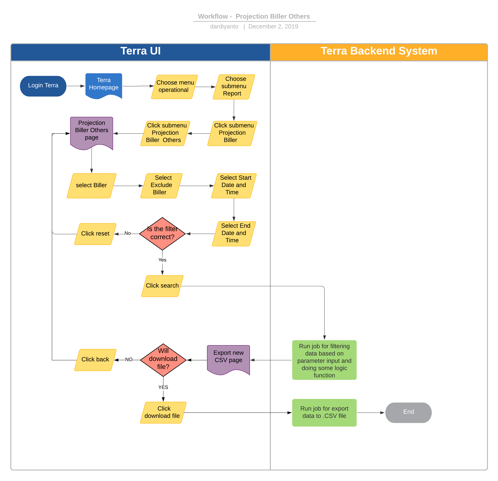
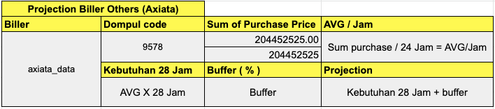
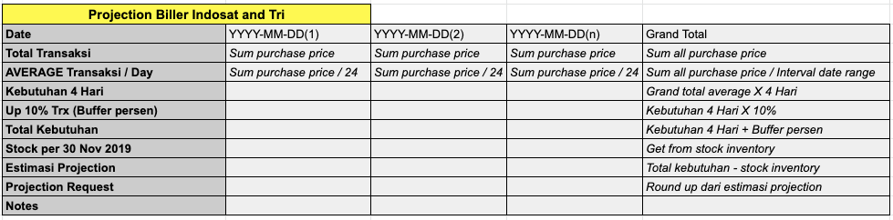
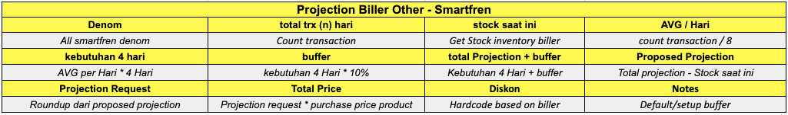

= Projection Biller Others Terra

== Overview

Projection Biller Direct adalah salah satu fitur reporting di terra yang digunakan untuk mengetahui amount transaksi dr alterra ke biller selain direct dan non direct biller serta suggestion berapa jumlah yang harus di depositkan oleh alterra ke biller tersebut dalam range tanggal sesuai filter input.

Contoh biller yang tercover ke dalam reporting ini adalah :

* Axiata
* Axiata Data
* Indosat
* Smartfren
* Tri

Setiap biller memiliki rule penghitungan projection biller yang berbeda-beda.

== User Story

|===
| Nama | Actor| Business Problem | Goal

| Projection biller others
| OPS
| Selama ini OPS menghitung dan melakukan planning untuk deposit ke biller secara manual, akan lebih efisien bila hal tersebut bisa di automate kan di terra
|===

== Development Team

|===
| Position | Tim | Nama

| Product Owner
| Saiyo
| Bayu Setiawan

| Lead Data Engineer
| Saiyo
| Bayu Setiawan

| Data Engineer
| Saiyo
| Vera Rusmalawati

| System Analyst
|
|

| Quality engineer
|
|
|===

== Required Database and Table

Airavata Postgree

|===
| Schema | Table | Description

| Krakenv2 
| Transactions_flash
| Menyimpan data detail transaksi dari kraken v1 dan krakenv2

| Datawarehouse
| Fact_bpa_biller_transaction
| Menyimpan data summary transaction dari initiative BPA

| internal
| buffer_nominal
| Menyimpan data buffer yang di set oleh ops

|===

== High Level Diagram

image::../images-terra/terra-Diagram_-_Merge_Biller.png[Diagram Merge Biller]

== Workflow System

Fitur Projection Biller Others

*Frontend process :*

. Login Terra
. Choose menu _'Operational'_
. Choose submenu _'Projection Biller'_
. Click submenu _'Projection Biller Others'_
. Select _'Biller'_
. Select _'Exclude Biller'_
. Select _'Start Date and Time'_
. Select _'End Date and Time'_
. Click _'Search'_
. Click _'Download File'_

*Backend process :*

. Pada saat user klik sub menu _Projection biller others_ maka akan diarahkan ke form input filter _projection biller others_.
. Selanjutnya ketika user selesai input filter parameter dan klik _search_ maka akan mentriggered function untuk mengexecute data based on filter parameter, Setiap biller memiliki cara penghitungan projection yang berbeda.

### A. Biller Axiata

Berikut formula yang digunakan untuk mencari nilai projection biller axiata pada report _projection biller others_:

 

 ** Pertama function akan select dompul code axiata untuk all partner dan summary purchase price dari transaksi yang sukses pada range date yang dipilih.
Sebagai source data transaksi nya menggunakan table fact_bpa_biller_transaction di schema _datawarehouse_ dari _datalake_ _airavata postgre_
 ** Mencari nilai AVG / Jam dengan rumus, _AVG / Jam =  sum purchase / 24 Jam_
 ** nilai AVG yg sudah di dapatkan sebelumnya dikalikan 28 Jam untuk mendapatkan nilai _kebutuhan 28 Jam_
 ** Mencari nilai %buffer yg sudah di tentukan oleh OPS sebelumnya dan disimpan pada field _buffer_persen_ table _buffer_nominal_ di schema _internal_ airavata postgre
 ** Bila buffer_persen nya blm di set maka akan di default menjadi 0
 ** Mencari nilai buffer % = _kebutuhan 28 Jam *  buffer_persen_
 ** Mencari nilai projection, projection = _kebutuhan 28 Jam + buffer %_
 ** dalam report projection biller ada tambahan column notes untuk menandakan bahwa biller tersebut sudah di set atau belum nilai buffer nya
 ** Data hasil dari proses ini akan disimpan dalam bentuk file pada amazon S3

### B. Biller Indosat dan Tri

Berikut formula yang digunakan untuk mencari nilai projection biller Indosat dan Tri pada report _projection biller others_:

 

 ** Step pertama function akan menjalankan perintah untuk summary purchase price dari total transaksi yang sukses pada range date yang dipilih di breakdown per tanggal.
Sebagai source data transaksi nya menggunakan table _fact_bpa_biller_transaction_ di schema _datawarehouse_ dari _datalake_ _airavata postgre_
 ** _Grand total transaksi = *summary purchase price all date*_
 ** AVERAGE Transaksi / Day = *_Summary transaksi per date / 24 Jam_*
 ** _Grand total average transaksi per Day = *summary all purchase price / Interval date range*_
 ** Kebutuhan 4 Hari = *_Grand total AVERAGE transaksi per day * 4 Hari_*
 ** Mencari nilai %buffer yg sudah di tentukan oleh OPS sebelumnya dan disimpan pada field _buffer_persen_ table _buffer_nominal_ di schema _internal_ airavata postgre
 ** Bila buffer_persen nya blm di set maka akan di default menjadi 10%
 ** Mencari nilai buffer % = _k**ebutuhan 4 Hari *  buffer_persen**_
 ** Total kebutuhan = *_Kebutuhan 4 Hari + up (n)% trx_*
 ** Step selanjutnya adalah cek stock inventory biller untuk tanggal tertentu
 ** Mencari nilai estimasi projection = *_Total kebutuhan - Stock inventory biller_*
 ** Projection request = *_Round up dari estimasi projection_*
 ** dalam report projection biller other ada tambahan column notes untuk menandakan bahwa biller tersebut sudah di set atau belum nilai buffer nya
 ** Data hasil dari proses ini akan disimpan dalam bentuk file pada amazon S3

### C. Biller Smartfren

Berikut formula yang digunakan untuk mencari nilai projection biller smartfren pada report _projection biller others_;

 

 ** Step pertama function akan menjalankan perintah untuk select count transaksi yang sukses untuk masing-masing denom dalam date range yang di input.
Sebagai source data transaksi nya menggunakan table _fact_bpa_biller_transaction_ di schema _datawarehouse_ dari _datalake_ _airavata postgre_
 ** Stock saat ini _= *Get from stock inventory biller*_
 ** AVG / Hari = *_Count transaksi per denom / 8_*
 ** Kebutuhan 4 Hari = *_AVG / Hari * 4 Hari_*
 ** Nilai %buffer sudah di tentukan oleh OPS sebelumnya dan disimpan pada field _buffer_persen_ table _buffer_nominal_ di schema _internal_ airavata postgre
 ** Bila buffer_persen nya blm di set maka akan di default menjadi 10%
 ** Buffer = _k**ebutuhan 4 Hari *  10%**_
 ** Total projection + buffer = *_Kebutuhan 4 Hari + buffer_*
 ** Proposed projection = *_Total projection - Stock inventory biller_*
 ** Projection request = *_Round up dari proposed projection_*
 ** Total price = *_Projection request * Purchase price per product_*
 ** Nilai diskon sudah di tentukan oleh biller dan di hardcode based on denom
 ** dalam report projection biller other ada tambahan column notes untuk menandakan bahwa biller tersebut sudah di set atau belum nilai buffer nya
 ** Data hasil dari proses ini akan disimpan dalam bentuk file pada amazon S3

. Setelah dataset yang kita inginkan selesai di proses maka akan di arahkan oleh backend system terra ke page _export new CSV ._
. Pada page _export new CSV_ user bisa mendownload file yang di inginkan dengan cara click link _download file_ maka akan mentrigger function untuk export file dengan type file CSV ke device user
. Atau bila user tidak ingin mendownload file yang sudah di proses sebelumnya bisa click link _back_ maka oleh backend system terra akan di arahkan kembali ke page _Projection biller others_
