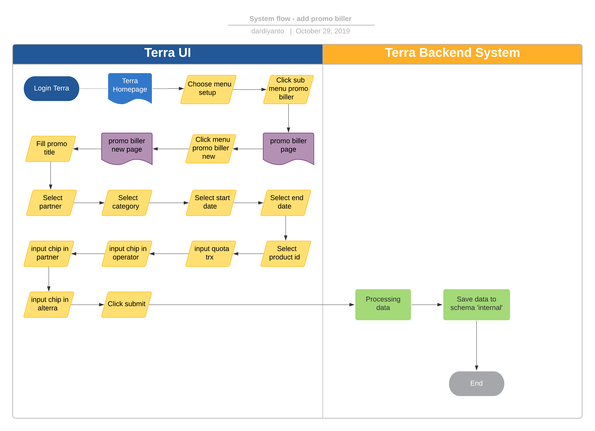
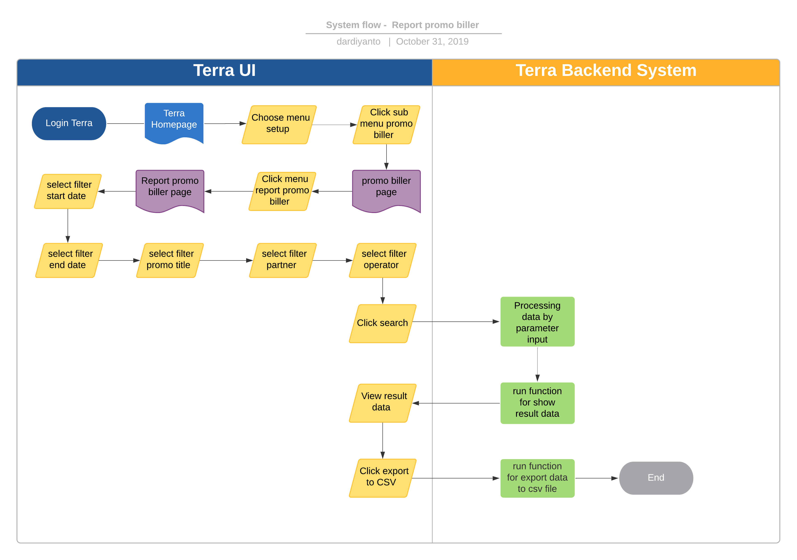

= Promo Biller Terra

== Overview

Promo Biller adalah salah satu fitur yang ada di dalam Terra berfungsi untuk me-_manage_ dan _monitoring_ promo _biller_ yang diinput langsung oleh tim Pps ke dalam sistem Terra dan datanya akan disimpan di datalake airavata schema '`internal`', output fitur ini berupa _report_ secara periodik yang isinya adalah transaksi sukses dengan _limit_ yang sudah ditentukan sebelumnya.

Requirement filter report yang dibutuhkan sebagai berikut :

* Start Date & End Date
* Promo Title
* Partner
* Operator

Berikut adalah data yang perlu di input oleh team ops :

* Promo title : diisi sesuai dengan nama promo yang sedang berlangsung
* Operator : Di isi operator atau biller apa yang menyelenggarakan promo
* Partner : diisi sesuai partner yang promo
* Product Type : diisi sesuai dengan product type promo
* Start & End date : diisi sesuai tanggal promo berlangsung
* Product source :

. Product id
. Quota promo
. Chip in operator
. Chip in partner
. Chip in alterra

== Development Team

|===
| Position | Tim | Nama

| Product Owner
| Saiyo
| Bayu Setiawan

| Lead Data Engineer
| Saiyo
| Bayu Setiawan

| Data Engineer
| Saiyo
| Vera Rusmalawati

| System Analyst
| Saiyo
| Dimas Ardiyanto
|===

== Database Schema

|===
| Schema | Table | Function

| Internal
| promo_billers
| Menyimpan data promo yang diinput tim OPS

| internal
| promo_transactions
| Menyimpan data transaksi dari platform kraken1 dan krakenv2 yang masuk ke dalam promo
|===

== Flow System

== Menambahkan Promo Biller Baru

*Frontend process :*

. Login Terra
. Choose menu _'Setup'_ > click sub menu _'Promo Biller'_
. Click _'Promo Biller New'_
. Fill promo title
. Select _'Partner'_
. Select _'Category (Product Category)'_
. Select _'Start date'_
. Select _'End Date'_
. Select _'Product ID'_
. Input _'Quota trx'_
. Input _'Chip in Operator'_
. Input _'Chip in Partner'_
. Input _'Chip in Alterra'_
. Click _'Submit'_ to save

*Backend process :*

. Ketika user klik save maka backend system terra akan menjalankan function untuk menyimpan data promo ke schema '`internal`' table '`promo_biller`' dan akan di update stock nya per 1 jam sekali.
. Dalam interval waktu 1 jam sekali backend system terra akan check transaksi ke data source (kraken1 dan kraken2) apabila terdapat transaksi yang sesuai dengan aturan promo maka transaksi tersebut akan terhitung sebagai transaksi yang menggunakan promo dan secara otomatis akan mengurangi kuota promo.

== Report Promo Biller

*Frontend process :*

. Login Terra
. Choose menu _'Setup'_ > click sub menu _'Promo Biller'_
. Click sub menu _'Report Promo Biller'_
. Select filter _'Start Date'_
. Select filter _'End Date'_
. Select filter _'Promo Title'_
. Select filter _'Partner'_
. Select filter _'Operator'_
. Click _'Search'_
. Click _'Export data to CSV'_

*Backend process :*

. Ketika user klik search maka backend system akan menjalankan function untuk select data based on parameter input dan show data ke datatables di UI terra.
. Lalu user akan klik export to CSV yang akan mentriggered function untuk mengextract data ke dalam bentuk CSV file.
