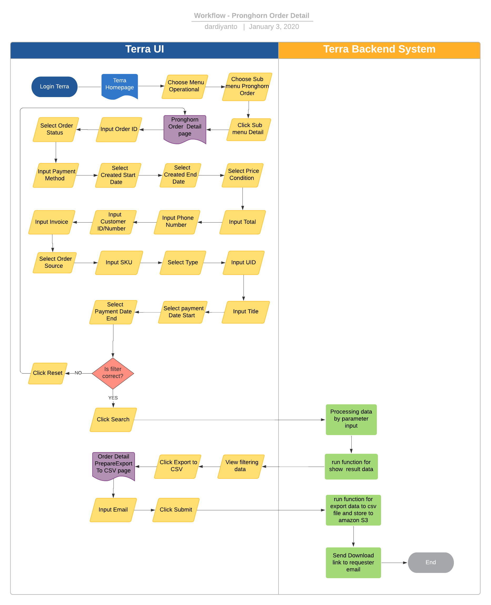

= Pronghorn Order - Detail

== Overview

Pronghorn Order List adalah salah satu fitur reporting di terra yang digunakan untuk mendapatkan data dan informasi detail order di pronghorn melalui front-end sepulsa.com.
Pada report ini satu Order ID akan di breakdown menjadi beberapa Line Item ID yaitu untuk pembelian product, admin fee, user credits, dll.
Beberapa informasi yang ada dalam report ini antara lain :

. Order ID
. UID
. Phone Number
. Customer ID/Number
. Order Status
. Order Created
. Order Changed
. Payment Date
. Line Item ID
. SKU
. Title
. Type
. Price
. Order Source
. Payment Method
. Instance ID
. Payment Label
. Amount

== User Stories

|===

| Nama | Actor| Business Problem | Goal

| Pronghorn Order Report Detil 
| OPS 
| Kesulitan untuk tracking history transaction di pronghorn sebagai partner ke kraken sebagai biller yang di order melalui FE sepulsa.com 
| Bisa mengetahui history transaksi dalam sistem pronghorn dan di analisa menjadi insight bagi team internal

|===

== Development Team

|===
| Position | Tim | Nama

| Product Owner
| Saiyo
| Bayu Setiawan

| Lead Data Engineer
| Saiyo
| Bayu Setiawan

| Data Engineer
| Saiyo
|

| System Analyst
|
|

| Quality engineer
|
|
|===

== Required Database and Table

Airavata Postgree

|===
 
| Schema | Table | Description

| Pronghorn 
| payment 
|

| Pronghorn
| payment_type 

| Pronghorn
| orders 

| Pronghorn
| order_line_item_detail 

|===

== High Level Diagram

image::../images-terra/terra-Diagram_-_Merge_Biller.png[Diagram Merge Biller]

== Workflow System

Fitur Pronghorn Order Detail

 

*Frontend process :*

. Login Terra
. Choose menu _'Operational'_
. Choose submenu _'Pronghorn Order'_
. Click sub menu _'Detail'_
. Input _'Order ID'_
. Select _'Order Status'_
. Input _'Payment Method'_
. Select _'Created Start Date'_
. Select _'Created End Date'_
. Select _'Price'_
. Input _Total_
. Input _Phone Number_
. Input _Customer ID/Number_
. Input _Invoice_
. Select _'Order Source'_
. Input _SKU_
. Select _'Type'_
. Input _UID_
. Input _Title_
. Select _'Payment Date Start'_
. Select _'Payment Date End'_
. Click _'Search'_
. Click _'Export to CSV'_
. Input email
. Click _'Submit'_

*Backend process :*

. Pada saat user klik sub menu _Pronghorn Order - Detail_ maka akan mentrigger function untuk select data transaksi terbaru pronghorn pada table _order_line_item_detail_ dari schema _pronghorn_ dan beberapa informasi detail lain nya dengan cara _join_ ke table _payment dan payment_type_ pada schema _pronghorn_ kemudian di sort berdasarkan tanggal transaksi terbaru lalu di show pada data tables di page _Pronghorn order - Detail_.
. Selanjutnya ketika user selesai input filter parameter dan klik search maka akan mentriggered function untuk mengexecute data based on filter parameter, sebagai source data transaksi nya menggunakan table _order_line_item_detail_ pada schema _pronghorn_ dari _datalake_ _airavata postgree_
. Setelah dataset yang kita inginkan selesai di proses maka akan di show di ui terra, next step nya user click button _export to CSV_ maka akan diteruskan ke page Pronghorn Order List _prepare export data to CSV._
. Pada page _Pronghorn Order Detail prepare export data to CSV_ user harus menginput alamat email pribadi alterra untuk dikirimkan link hasil export data, dilanjutkan dengan click button _submit._
. Ketika user click button _submit_ akan mentriggered function untuk menjalankan job export dataset to csv file dan akan di store di amazon S3.
Lalu dari backend system terra akan mengirim link download file ke email yang sudah di input oleh user.
