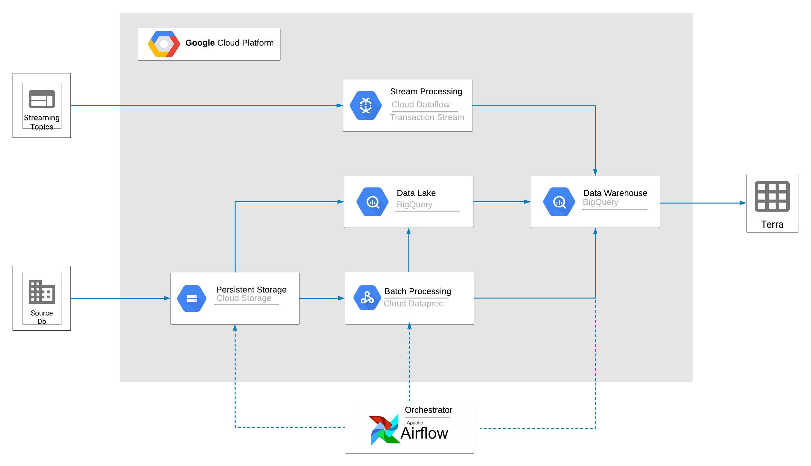
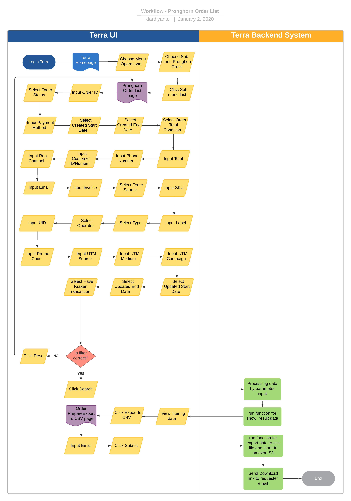

= Pronghorn Order - List

== Overview

Pronghorn Order List adalah salah satu fitur reporting di terra yang digunakan untuk mengetahui history transaksi di pronghorn yang di order melalui front-end sepulsa.com.
Beberapa informasi yang ada dalam report ini antra lain :

. User Id
. Unit Price
. Total
. Telepon
. SKU
. Label
. UID
. Email
. First Trx Date
. Operator
. Channel
. Order Source
. Purchase price
. Order Date
. Payment Method
. Payment label
. Etc.

== User Stories

|===
| Nama | Actor| Business Problem | Goal 

| Pronghorn Order List 
| OPS 
| Kesulitan untuk tracking history transaction di pronghorn yang di order melalui FE sepulsa.com 
| Bisa mengetahui history transaksi dalam sistem pronghorn dan di analisa menjadi insight bagi team internal
|===

== Development Team

|===
| Position | Tim | Nama

| Product Owner
| Saiyo
| Bayu Setiawan

| Lead Data Engineer
| Saiyo
| Bayu Setiawan

| Data Engineer
| Saiyo
|

| System Analyst
|
|

| Quality engineer
|
|
|===

== Required Database and Table

Airavata Postgree

|===
| Schema | Table | Description

| Pronghorn
| user 
|

| Pronghorn 
| payment 
|

| Pronghorn 
| payment_type 
|

| Pronghorn 
| orders 
|

| Krakenv2 
| transaction_flash
|

| Krakenv2 
| vw_product 
|

| Datawarehouse
| fact_pronghorn_user_first_data 
|

|===

== High Level Diagram

== Workflow System

 *Frontend process :*

. Login Terra
. Choose menu _'Operational'_
. Choose submenu _'Pronghorn Order'_
. Click sub menu _'List'_
. Input _'Order ID'_
. Select _'Order Status'_
. Input _'Payment Method'_
. Select _'Created Start Date'_
. Select _'Created End Date'_
. Select _'Order Total'_
. Input _Total_
. Input _Phone Number_
. Input _Customer ID/Number_
. Input _Reg Channel_
. Input Email
. Input Invoice
. Select _'Order Source'_
. Input _SKU_
. Input _Label_
. Select _Type_
. Select _Operator_
. Input _UID_
. Input _Promo Code_
. Input _UTM Source_
. Input _UTM Medium_
. Input _UTM Campaign_
. Select _Updated Start Date_
. Select _Updated End Date_
. Select _Have Kraken Transaction_
. Click _'Search'_
. Click _'Export to CSV'_
. Input email
. Click _'Submit'_

*Backend process :*

. Pada saat user klik sub menu _Pronghorn Order - List_ maka akan mentrigger function untuk select data transaksi terbaru pronghorn pada table _orders_ dari schema _pronghorn_ dan beberapa informasi detail lain nya dengan cara _join_ ke table _user, payment, payment_type_ pada schema _pronghorn,_ table _transactions_flash_ dan _vw_products_ pada schema _krakenv2,_ dan table _fact_pronghorn_user_first_data_ pada schema _datawarehouse_ kemudian di sort berdasarkan tanggal transaksi terbaru lalu di show pada data tables di page _Pronghorn order - List_.
. Selanjutnya ketika user selesai input filter parameter dan klik search maka akan mentriggered function untuk mengexecute data based on filter parameter, sebagai source data transaksi nya menggunakan table _orders_ pada schema _pronghorn_ dari _datalake_ _airavata postgree._
. Pada datatables di page _Pronghorn Order - List_ ada button _action_ di column ujung paling kanan, function yang ada di dalam nya yaitu :
 ** Edit
+
Ketika klik _edit_ maka akan di arahkan ke halaman admin sepulsa.com.
dan membutuhkan credential untuk melakukan proses edit.

 ** View Detail
+
Setelah klik V__iew Detail maka akan menampilkan detail dari order seperti ID, type, SKU, title, price, created, changed.__

 ** View Biller
+
Bila klik view biller maka akan menampilkan data transaction dan feedback dari biller, berikut datanya ID, Type, Created, Changed,	Status, Price, Remote TRX ID, Remote Product ID dan Message
. Setelah dataset yang kita inginkan selesai di proses maka akan di show di ui terra, next step nya user click button _export to CSV_ maka akan diteruskan ke page Pronghorn Order List _prepare export data to CSV._
. Pada page _Pronghorn Order List prepare export data to CSV_ user harus menginput alamat email pribadi sepulsa untuk dikirimkan link hasil export data, dilanjutkan dengan click button _submit_
. Ketika user click button _submit_ akan mentriggered function untuk menjalankan job export dataset to csv file dan akan di store di amazon S3.
Lalu dari backend system terra akan mengirim link download file ke email yang sudah di input oleh user.
