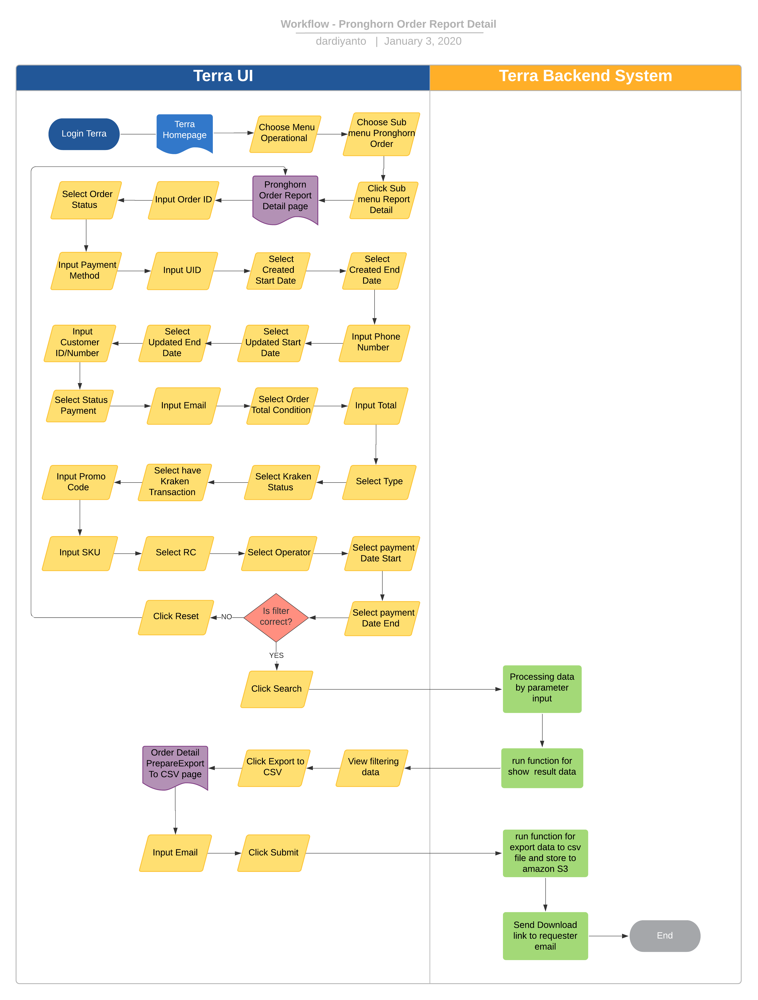

= Pronghorn Order - Report Detail

== Overview

Pronghorn Order Report Detail adalah salah satu fitur reporting di terra yang digunakan untuk mendapatkan data dan informasi historical transaction di pronghorn sebagai partner ke kraken sebagai biller melalui front-end sepulsa.com.
Beberapa informasi yang ada dalam report ini antara lain :

. Order ID
. UID
. Email
. Phone Number
. Customer ID/Number
. Order Status
. Order Created
. Order Changed
. Payment Date
. SKU
. Type
. Title
. Payment Method
. Instance ID
. Payment Label
. Status Payment
. Operator
. Response Code
. Promo Code
. Price
. Admin Fee
. Biaya Layanan
. Payment Code
. Coupon
. Credit
. Discount
. Selling Price
. Purchase Price
. Total
. Amount
. Selisih
. Kraken Trx ID
. Kraken Status
. Kraken Date
. Kraken Sell Price

== User Stories

|===
| Nama | Actor| Business Problem | Goal 

| Pronghorn Order Report Detail 
| OPS 
| Kesulitan untuk tracking history transaction di pronghorn sebagai partner ke kraken sebagai biller yang di order melalui FE sepulsa.com 
|Bisa mengetahui history transaksi dalam sistem pronghorn dan di analisa menjadi insight bagi team internal
|===

== Development Team

|===
| Position | Tim | Nama

| Product Owner
| Saiyo
| Bayu Setiawan

| Lead Data Engineer
| Saiyo
| Bayu Setiawan

| Data Engineer
| Saiyo
|

| System Analyst
|
|

| Quality engineer
|
|
|===

== Required Database and Table

Airavata Postgree

|===
| Scheema | Table | Description 

| Pronghorn
| user 
|

| Pronghorn 
| payment 
|

| Pronghorn
| payment_type 
|

| Pronghorn 
| orders 
|

| Pronghorn
| pronghorn.order_line_item_detail
|

| Krakenv2
| transaction_flash 
|

| Krakenv2 
| transaction 
|

| Public 
| orders 
|

|===

== High Level Diagram

image::../images-terra/terra-Diagram_-_Merge_Biller.png[Diagram Merge Biller]

== Workflow System

*Frontend process :*

. Login Terra
. Choose menu _'Operational'_
. Choose submenu _'Pronghorn Order'_
. Click sub menu _'Report Detail'_
. Input _Order ID_
. Select _'Order Status'_
. Input _Payment Method_
. Input _UID_
. Select _'Created Start Date'_
. Select _'Created End Date'_
. Input _Phone Number_
. Select _'Updated Start Date'_
. Select _'Updated End Date'_
. Input _Customer ID/Number_
. Select _'Status Payment'_
. Input _Email_
. Select _'Order Total Condition'_
. Input _Total_
. Select _'Type'_
. Select _'Kraken Status'_
. Select _'have Kraken Transaction'_
. Input _Promo Code_
. Input _SKU_
. Select _'RC'_
. Select _'Operator'_
. Select _'payment Date Start'_
. Select _'payment Date End'_
. Click _'Search'_
. Click _'Export to CSV'_
. Input email
. Click _'Submit'_

*Backend process :*

. Pada saat user klik sub menu _Pronghorn Order - Report Detail_ maka akan mentrigger function untuk select data transaksi terbaru pronghorn pada table _order_line_item_detail_ dari schema _pronghorn_ dan beberapa informasi detail lain nya dengan cara _join_ ke table _user, payment, payment_type_ pada schema _pronghorn,_ table _transactions_flash_ dan _transactions_ pada schema _krakenv2,_ dan table _kraken_trx_ pada schema _public_ kemudian di sort secara descending berdasarkan tanggal _Order Created_ dengan lalu di show pada data tables di page _Pronghorn order - Report Detail_.
. Selanjutnya ketika user selesai input filter parameter dan klik search maka akan mentriggered function untuk mengexecute data based on filter parameter, sebagai source data transaksi pronghorn menggunakan table _order_line_item_detail_ pada schema _pronghorn_ dari _datalake_ _airavata postgree._
. Setelah dataset yang kita inginkan selesai di proses maka akan di show di ui terra, next step nya user click button _export to CSV_ maka akan diteruskan ke page Pronghorn Order _Report Detail prepare export data to CSV._
. Pada page _Pronghorn Order Report Detail prepare export data to CSV_ user harus menginput alamat email pribadi sepulsa untuk dikirimkan link hasil export data, dilanjutkan dengan click button _submit_
. Ketika user click button _submit_ akan mentriggered function untuk menjalankan job export dataset to csv file dan akan di store di amazon S3.
Lalu dari backend system terra akan mengirim link download file ke email yang sudah di input oleh user.
