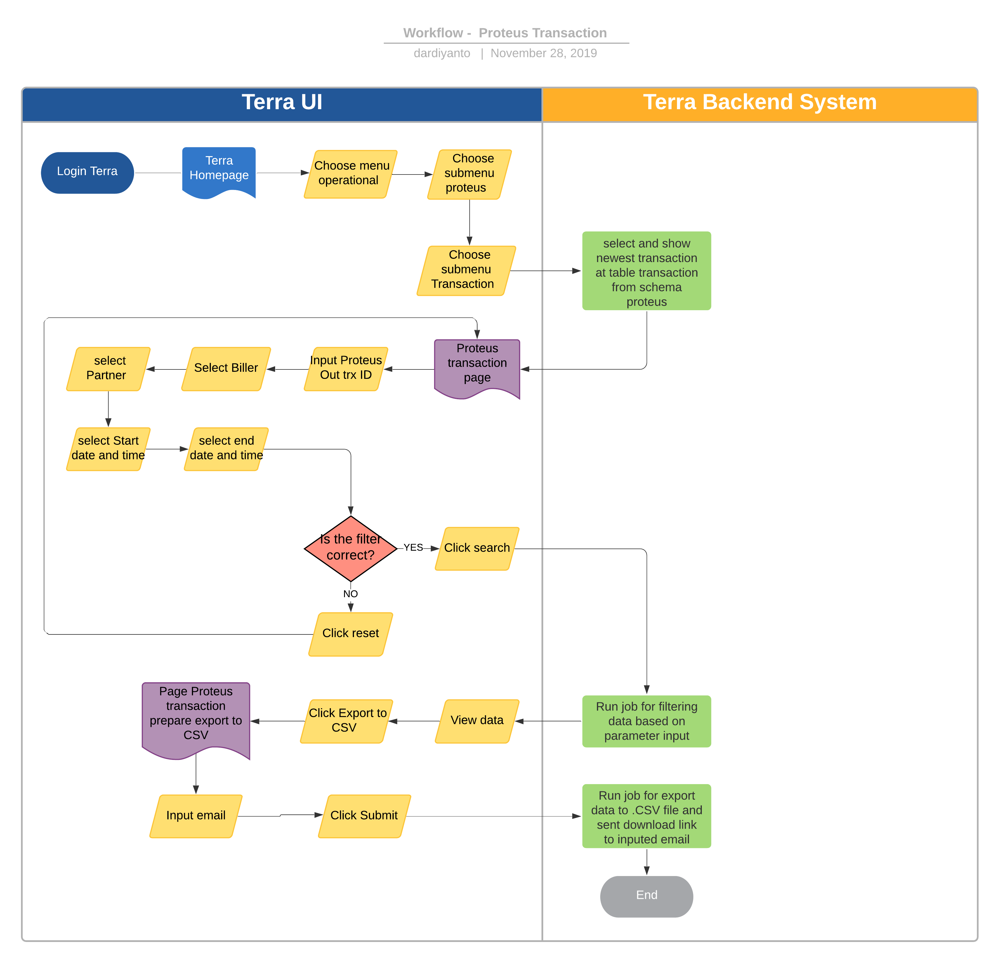

= Proteus Transaction

== Overview

Proteus Transaction adalah satu satu fitur reporting di terra yang digunakan untuk mengetahui history transaksi dari kraken dan pronghorn sebagai partner ke beberapa biller lokal yang dibantu oleh sistem proteus.
Di dalam sistem proteus ada beberapa biller lokal yang ready sebagai biller alterra, diantaranya;

. MP3 Karawang
. MP3 Sukabumi
. Prima Digital Indonesia
. Tri Karawang
. Tri Sukabumi
. Tsel Global
. Etc.

== User Story

|===
| Nama | Actor| Business Problem | Goal 

| Proteus Transaction
| OPS
| Kesulitan untuk tracking history transaction kraken dan pronghorn as partner ke biller lokal 
| Bisa mengetahui history transaksi ke biller lokal untuk di analisa dan menjadi insight bagi team internal

|===

== Development Team

|===
| Position | Tim | Nama

| Product Owner
| Saiyo
| Bayu Setiawan

| Lead Data Engineer
| Saiyo
| Bayu Setiawan

| Data Engineer
| Saiyo
|

| System Analyst
|
|

| Quality engineer
|
|
|===

== Required Database and Table

Airavata Postgree

|===

| Schema | Table | Description 

| Proteus 
| Transaction
| Menyimpan data transaksi dari kraken dan ponghorn ke biller lokal proteus 

|===

== High Level Diagram

image::../images-terra/terra-Diagram_-_Merge_Biller.png[Diagram Merge Biller]

== Workflow System

*Frontend process :*

. Login Terra
. Choose menu _'Operational'_
. Choose submenu _'Proteus'_
. Click sub menu _'Transaction'_
. Input _proteus out trx ID_
. Select _'Biller'_
. Select _'Partner'_
. Select _'Start Date and Time'_
. Select _'End Date and Time'_
. Click _'Search'_
. Click _'Export to CSV'_
. Input email
. Click _'Submit'_

*Backend process :*

. Pada saat user klik sub menu '`proteus - transaction`' maka akan mentrigger function untuk select transaksi terbaru di table _transaction_ dari schema _proteus_ dan akan di show pada datatables di page '`proteus - transaction`'.
. Selanjutnya ketika user selesai input filter parameter dan klik search maka akan mentriggered function untuk mengexecute data based on filter parameter, sebagai source data transaksi nya menggunakan schema _proteus_ dari _datalake_ _airavata postgree_
. Setelah dataset yang kita inginkan selesai di proses maka akan di show di ui terra, next step        nya user click button _export to CSV_ maka akan diteruskan ke page _proteus transaction prepare export data to CSV._
. Pada page _proteus transaction prepare export data to CSV_ user harus menginput alamat email pribadi sepulsa untuk dikirimkan link hasil export data, dilanjutkan dengan click button _submit_
. Ketika user click button _submit_ akan mentriggered function untuk menjalankan job export dataset to csv file dan akan di store di amazon S3.
Link download file nya akan dikirim ke email yang sudah di input oleh user.
