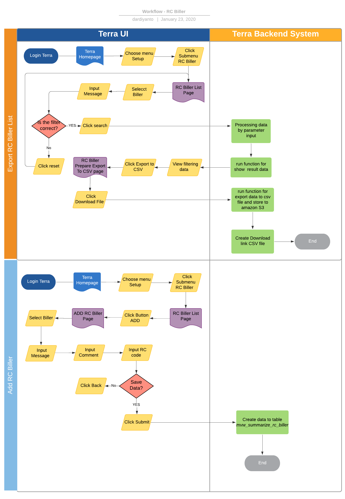

= RC Biller Terra

== Overview

RC Biller adalah fitur pada terra yang digunakan untuk mengklasifikasikan message transaksi dari biller menjadi code RC Biller agar lebih mudah di identifikasikan.
Berikut beberapa contoh Informasi RC biller yang ada di sistem Terra :

. Biller
. Message
. Comment
. RC
. Updted
. Updated By
. etc.

== User Story

|===
| Nama | Actor| Business Problem | Goal 

| RC Biller
| OPS
| Kesulitan untuk mengklasifikasikan message dari biller 
| Bisa mengetahui mengkategorikan feedback message transaksi dari biller untuk insight team internal

|===

== Development Team

|===
| Position | Tim | Nama

| Product Owner
| Saiyo
| Bayu Setiawan

| Lead Data Engineer
| Saiyo
| Bayu Setiawan

| Data Engineer
| Saiyo
|

| System Analyst
|
|

| Quality engineer
|
|
|===

== Required Database and Table

Airavata Postgree
|===

| Schema | Table | Description 

|mvw_summarize_rc_biller
|Menyimpan data RC Biller
|

|===

== High Level Diagram

image::../images-terra/terra-Diagram_-_Merge_Biller.png[Diagram Merge Biller]

== Workflow System

=== Fitur History Deposit Report

*Frontend process :*

. Login Terra
. Choose menu _'Setup'_
. Click submenu _'RC Biller'_
. Select _'Biller'_
. Input _Message_
. Click _'Search'_
. Click _'Export to CSV'_
. Click _'Download file'_

*Backend process :*

. Pada saat user klik sub menu RC Biller maka akan mentrigger function untuk select RC biller terbaru pada table _mvw_summarize_rc_biller_ dan akan di show pada datatables di page RC Biller.
. Selanjutnya ketika user selesai input filter parameter dan klik search maka akan mentriggered function untuk mengexecute data based on filter parameter, sebagai source data nya menggunakan schema  dari datalake airavata postgre, table yang digunakan adalah _mvw_summarize_rc_biller_
. Setelah dataset yang kita inginkan selesai di proses maka akan di show di ui terra, next step        nya user click button _export to CSV_ maka akan diteruskan ke page _RC Biller prepare export data to CSV._
. Pada page _RC biller prepare export data to CSV_ bila ingin download file user bisa click link download file.
. Ketika user click donwload file akan mentriggered function untuk menjalankan job export dataset to csv file dan akan di store di amazon S3 dan akan di download ke device yang digunakan user.
