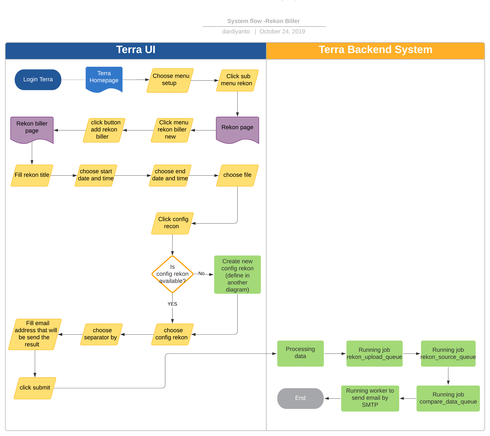
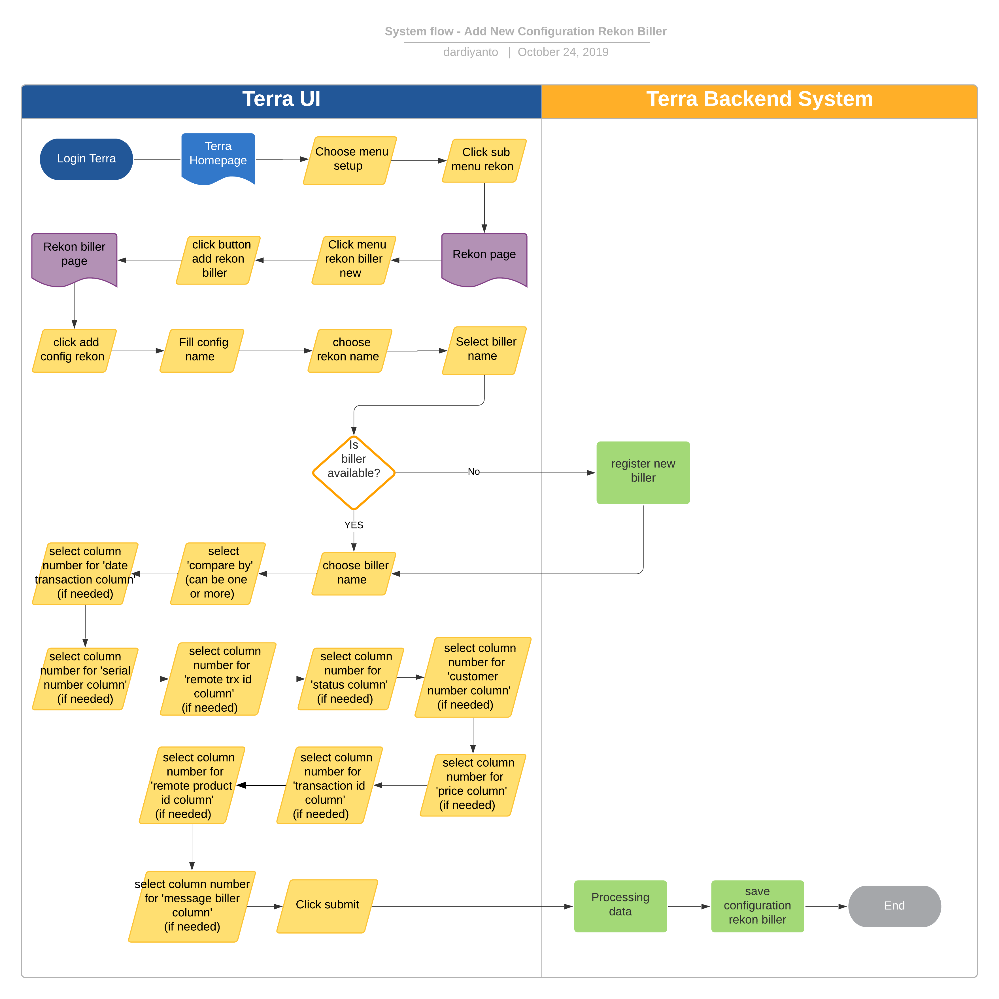

= Recon Biller Terra

== Overview

Rekon biller adalah salah satu fitur dari sistem Terra yang berfungsi untuk _automation_ rekon antara catatan penjualan produk dari _biller_ dengan catatan pembelian produk Alterra berdasarkan biller.

Saat ini ada beberapa grup _biller_ yang bisa direkon oleh Terra:

* Rekon Biller FastPay
* Rekon Biller MIP
* Rekon Biller Bukopin
* Rekon Biller Bakoel
* Rekon Biller Axiata Data
* Rekon Biller Axiata
* Rekon Biller PMB
* Rekon Biller Tri
* Rekon Biller Indosat
* Rekon Biller Parastar
* Rekon Biller PPS
* Rekon Biller Smartfren

== Development Team

|===
| Position | Tim | Nama

| Product Owner
| Saiyo
| Bayu Setiawan

| Lead Data Engineer
| Saiyo
| Bayu Setiawan

| Data Engineer
| Saiyo
| Vera Rusmalawati

| System Analyst
| Saiyo
| Dimas Ardiyanto
|===

== Database/Schema

|===
| Schema | Table | Function

| internal
| biller_rekon_data_master
| Menyimpan data hasil rekon

| internal
| biller_rekon_data_source
| Menyimpan data source yg akan di rekon

| internal
| biller_rekon_data_source_tmp
| Tabel ini digunakan untuk proses rekon

| internal
| biler_rekon_data_upload
| Menyimpan data upload yg akan di rekon

| internal
| biler_rekon_data_upload_tmp
| Tabel ini digunakan untuk proses rekon
|===

== Flow System

=== Rekon Biller

*Frontend process :*

. Login Terra
. Select menu _'Setup'_ > _'Rekon'_
. Click menu _'Rekon Biller New'_
. Click button _'Add Rekon Biller'_
. Isi _judul_ rekon untuk identifikasi
. Pilih _'Start Date and Time'_
 ** _Start Date and Time_ dari transaksi yang ingin direkon
. Pilih _End Date and Time_
 ** _Enddate and time_ dari transaksi yang ingin direkon
. Pilih file dari _Biller_
. Pilih _'rekon config'_ yang ingin digunakan
. Pilih _separator by_ (_Biller_ yang berbeda terkadang menggunakan _separator_ berbeda pada file transaksi yang dikirim ke Alterra)
. Tulis alamat email yang akan dikirimkan hasil rekon _biller_
. Klik _'Submit'_

*Backend process :*

Pada saat user _submit task_ rekon _biller_, maka akan diproses oleh _backend system rekon engine_ berdasarkan parameter yang diinput.

. Running job rekon_upload_queue

Job ini menjalankan perintah untuk menginsert data transaksi dari file yang di upload ke dalam datalake schema '`internal`' table '`biller_rekon_data_upload`' dan table '`biller_rekon_data_upload_tmp`', prosesnya dibagi per 20 data.
Kedua table tersebut memiliki fungsi berbeda yang mana table '`biller_rekon_data_upload`' digunakan untuk menyimpan historical data rekon biller yang di upload, sedangkan table '`biller_rekon_data_upload_tmp`' menyimpan data sementara hanya untuk keperluan rekon saja setelah itu akan di delete secara otomatis.

. Running job rekon_source_queue

Job ini menjalankan perintah untuk insert data transaksi dari schema source di datalake ke schema '`internal`' table '`biller_rekon_data_source`' dan table '`biller_rekon_data_source_tmp`', prosesnya dibagi menjadi per 10 data.
Table temporary ini sama fungsinya dengan '`biller_rekon_data_upload_tmp`' hanya menyimpan data sementara saja untuk keperluan rekon biller setelah itu akan di delete secara otomatis.

. Running job compare_data_queue

Job ini menjalankan perintah untuk comparing data table '`biller_rekon_data_upload_tmp`' dengan '`biller_rekon_data_source_tmp`' dari hasil comparing tersebut akan di summary dan disimpan pada table 'biller_rekon_data_master' yang nanti akan menjadi source table untuk di view oleh UI terra dan akan di sent oleh worker SMTP ke alamat email yang di input oleh user ketika submit report.

== Menambahkan Rekon _Biller_ Baru

*Frontend process :*

. Login Terra
. Pilih menu _'Setup'_ > klik submenu rekon
. Klik _add config rekon_
. Isi nama _config_
. Pilih nama rekon (_rekon type_)
. Pilih nama biller (Jika belum ada di dalam _list_, tim Data akan mendaftarkan nama _biller_ baru ke sistem Terra)
. Pilih '`compare by`' (Ini bisa jadi satu atau lebih parameter)
. Pilih nomor kolom untuk  '`date transaction column`' (_For defining which field in data upload will be compare to the data source_)
. Pilih nomor kolom untuk '`serial number column`' (_For defining which field in data upload will be compare to the data source_)
. Pilih nomor kolom untuk '`remote trx id column`' (_For defining which field in data upload will be compare to the data source_)
. Pilih nomor kolom untuk '`status column`' (_For defining which field in data upload will be compare to the data source_)
. Pilih nomor kolom untuk '`customer number column`' (_For defining which field in data upload will be compare to the data source_)
. Pilih nomor kolom untuk '`price number column`' (_For defining which field in data upload will be compare to the data source_)
. Pilih nomor kolom untuk '`remote product id column`' (_For defining which field in data upload will be compare to the data source_)
. Pilih nomor kolom untuk '`message biller column`' (_For defining which field in data upload will be compare to the data source_)
. Klik _submit_

*Backend process :*

. Ketika user men-_submit_ _new rekon biller config_, maka _backend system_ Terra akan menjalankan fungsi untuk menyimpan data _config_ ke schema '`internal`' table '`process_rekon_config`', yang nantinya akan digunakan ketika menjalankan rekon _biller_.
